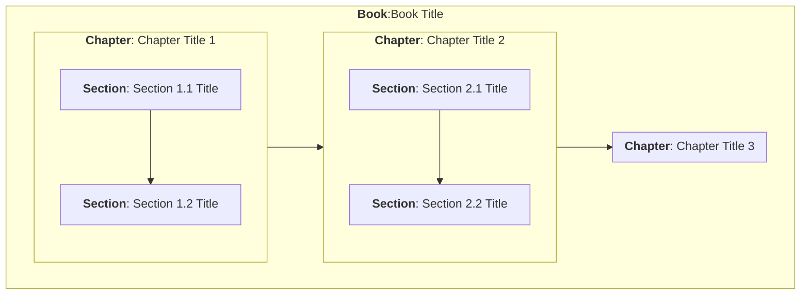

# Domains and Contexts
 
## The Holonic Dilemma

When describing a document, there is a clear and simple containment principal, one in which a page contains sections with titles, each section contains various divisions, which are in turn broken down into paragraphs and eventually typographic sub-elements. This is a model (specifically a document object model) that is familiar to most people, and generally works because documents (especially web pages) are historically nested in a model that extends outwards to books, series, collections, libraries, and so forth, and can be generalized more appropriately as a __containment model__ (A contains B in a sequential manner).

The sequential manner part is important because a sequence is itself a construct - either a set of rules that indicate how one item within the sequence is prioritized compared to another, or a linked data structure in which elements are connected by links. Narrative structures are actually linked lists, where one item is intrinsically linked to a following item, if one exists.

Containment models are natural hierarchies. That is to say, an item is either an item in a sequence with ordered siblings, or the item contains such a sequence as children. This is the working definition of a hierarchy, in fact.

The HTML containment model can be thought of as a structural framework in which text blocks are contained as terminating elements. If the delimiting structure is removed, there is still a mostly cohesive narrative sequence of text. In HTML and its close cousin XML, each containment block can additionally contain metadata (attributes) that describes in various ways the content of the subtree based on the element in question, or the element itself if it is a terminating node.


This kind of containment model is intuitive when the whole structure is self-contained, meaning that the contents of the each element is wholly contained within that element. Such elements are called __holonic elements__, meaning that any given element is treated as a distinct thing within a container, while it simultaneously has an interior graph (child elements specific to the element).

Thus, in the above graph, Chapter 1 (a `<chapter>`) is a thing relative to it's parent `<book>` element, but is a container of things (here `<section>` elements). As a consequence, this individual `<chapter>` is considered to be a _holonic element_.

This issue of entities that nonetheless can also be treated as containers of other entities is a very common dilemma in modeling. In languages such as XML, those things which define a particular elements's properties relative to an immediate containing property are known as __attributes__, and are typically treated as a bag of properties. 

Such properties usually include identifiers, references, position and orientation (locations), annotative metadata such as labels or descriptions, and frequently variables that are reflective of the state of the entity.

The above diagram can be represented in XML as follows:

```
<Book id="Book:Book1" title="Book 1">
    <Chapter id="Chapter:Book1-Chapter1" title="Chapter 1" order="1">
        <Section id="Section:Section1-1" order="1"/>
        <Section id="Section:Section1-2" order="2"/>
        <Section id="Section:Section1-3" order="3"/>
    </Chapter>
    <Chapter id="Chapter:Chapter2" title="Chapter 2" order="2">
        <Section id="Section:Section2-1" title="Chapter 2, Section 1" order="1"/>
        <Section id="Section:Section2-2" title="Chapter 2, Section 2" order="2"/>
        <Section id="Section:Section2-3" title="Chapter 2, Section 3" order="3"/>

    </Chapter>
    <Chapter id="Chapter:Chapter3" title="Chapter 3" order="3">
        <Section id="Section:Section3-1" title="Chapter 3, Section 1" order="1"/>
    </Chapter>
</Book>
```
In this case, the declaration of an element such as Chapter is also closely coupled with its definition (the subelements of that element). Note that the name of the element name is usually a class (Book, Chapter, Section) and the instance identifier for that resource is contained in the `id` attribute of that resource. Also, an order attribute has been added to indicate the location relative to its container.

It is possible to decompose this description into individual entities:
```
<Book id="Book:Book1" title="Book 1">
    <Chapter ref="Chapter:Book1-Chapter1" title="Chapter 1" order="1"/>
    <Chapter ref="Chapter:Chapter2" title="Chapter 2" order="2"/>
    </Chapter>
    <Chapter ref="Chapter:Chapter3" title="Chapter 3" order="3"/>
    </Chapter>
</Book>

<Chapter id="Chapter:Book1-Chapter1" title="Chapter 1" order="1">
    <Section ref="Section:Section1-1" order="1"/>
    <Section ref="Section:Section1-2" order="2"/>
    <Section ref="Section:Section1-3" order="3"/>
</Chapter>
<Chapter id="Chapter:Chapter2" title="Chapter 2" order="2">
    <Section ref="Section:Section2-1" title="Chapter 2, Section 1" order="1"/>
    <Section ref="Section:Section2-2" title="Chapter 2, Section 2" order="2"/>
    <Section ref="Section:Section2-3" title="Chapter 2, Section 3" order="3"/>
</Chapter>

<Chapter id="Chapter:Chapter3" title="Chapter 3" order="3">
    <Section ref="Section:Section3-1" title="Chapter 3, Section 1" order="1"/>
</Chapter>

<Section id="Section:Section1-1" title="Chapter 1, Section 1">
    <Para ref="Para:Para1-1-1" order="1">This is the first paragraph</Para>
</Section>

<Section id="Section:Section1-2" title="Chapter 1, Section 2"/>

<Section id="Section:Section1-3" title="Chapter 1, Section 3"/>

<Section id="Section:Section2-1" title="Chapter 2, Section 1"/>

<Section id="Section:Section2-2" title="Chapter 2, Section 2"/>

<Section id="Section:Section2-3" title="Chapter 2, Section 3"/>

<Section id="Section:Section3-1" title="Chapter 3, Section 1"/>

<Para id="Para:Para1-1-1">This is the first paragraph</Para>

```
There are several key things to note about this code listing. Each base element is given as a __declaration__ with an `id` attribute that indicates that this is a contextual definition. Every element within this block in turn is a _reference_: it has a `ref` attribute rather than an `id` attribute.

What this means is that the same element can be used in two ways - as a way of identifying a given resource and as a way of showing a potential subgraph, something called a *__context__* in Spatial Web terms.

## Domains and Contexts in the Spatial Web

In HTML, there is essentially only one context for a given element, consisting of the child elements for that context. In HSML, on the other hand, contexts are somewhat more complex, and are tied into the notion of domains.


> A __domain__ is a conceptual entity such as a place, an agent, an intellectual property, a structure, an organization or a thing (among others). 

> A __context__ is a closed system, or graph, that contains various entities and that can be linked to other contexts. It is always associated with a domain, and a single domain may have multiple contexts.


## Contexts, Domains, and the 
A context can be thought of as a system of concern. Because domains frequently are associated with places, the two are often conflated, but they serve different purposes. A place is one particular state within a hyperspace of such states, while the context is typically associated with a place in another context. The place is an entity, the context is the system referred to by the entity and containing other entities. As such it can be thought of as a bounding space for closed models.

Significantly, a single entity may have multiple associated internal domains. For example, if Place: Planet:Earth is a Place, one domain may be the domain of countries on the Earth, the second, the domain of airports and routes, a third domain may be the supply chain network for a specific global company.

 Such domains can be thought of as overlays on the same place (or other entity) resource. For instance, for a given building, one domain overlay shows the rooms of that building along with their occupants, a second shows the electrical system for that building, the third the plumbing system, and the fourth, an augemented reality reference of interesting things that happened historically within that building.

 Typically places connect (via links) to other places, but such links can exist between the same place in different domains. For instance, the electrical, plumbing, walls, and tenancy domains might let you switch between each view of the same room in effect by moving to the same place in each domain. 
 
 Similarly, if you are standing in a town square, you can iterate through domains over time to see the evolution of that town square over hundreds of years.

## Domains as Closed Graphs

A domain is a closed graph. This means that it is a restricted, limited set of assertions about spatial web entities that nonetheless completely describe a particular domain of interest. Note that this is not necessarily a semantic description - the specific implementation here is irrelevant from the perspective of the conceptual model.

Because there are multiple 


