# Universal Domain Graph (UDG) Design

## Requirements

| Section | Requirement | Sections | Source | Status |
| --- | --- | --- | --- | --- |
| 1.2.1 | Enable discovery of virtual representations of physical entities | [Representations](https://www.notion.so/Representations-1fc40ac3a1e880ce9e8bf6df04da6192?pvs=21), [HSQL](https://www.notion.so/HSQL-1fc40ac3a1e880efbfd6e5ad819b025f?pvs=21) | [5.2.3.2.2](https://www.notion.so/IEEE-UDG-Requirements-1fa40ac3a1e8802cbca5f503e627a391?pvs=21) |  |
| 1.2.2 | Enable discovery of physical and virtual entities via discovery services | [Entity Registries](https://www.notion.so/Entity-Registries-1fc40ac3a1e88035950cc7a2ab4009b3?pvs=21), [Annotations](https://www.notion.so/Annotations-1fc40ac3a1e88023812aeb50c2de5af8?pvs=21) | [5.2.3.3.2](https://www.notion.so/IEEE-UDG-Requirements-1fa40ac3a1e8802cbca5f503e627a391?pvs=21) |  |
| 1.2.3 | Validate SWIDs generated using SWID Method | [UDG SWIDs](https://www.notion.so/UDG-SWIDs-and-IRIs-1fc40ac3a1e88022a7e4c536d8f5a056?pvs=21) | [6.3.3.4](https://www.notion.so/IEEE-UDG-Requirements-1fa40ac3a1e8802cbca5f503e627a391?pvs=21) |  |
| 1.2.4 | Include Spatial Web registration service | [Entry Registries](https://www.notion.so/Entity-Registries-1fc40ac3a1e88035950cc7a2ab4009b3?pvs=21) | [6.3.3.4](https://www.notion.so/IEEE-UDG-Requirements-1fa40ac3a1e8802cbca5f503e627a391?pvs=21) |  |
| 1.2.5 | Register all SWIDs in Spatial Web Registry | [Entry Registries](https://www.notion.so/Entity-Registries-1fc40ac3a1e88035950cc7a2ab4009b3?pvs=21) | [6.3.3.4](https://www.notion.so/IEEE-UDG-Requirements-1fa40ac3a1e8802cbca5f503e627a391?pvs=21) |  |
| 1.2.6 | Enable domain verification and validation | [Entry Registries](https://www.notion.so/Entity-Registries-1fc40ac3a1e88035950cc7a2ab4009b3?pvs=21) | [6.3.3.4](https://www.notion.so/IEEE-UDG-Requirements-1fa40ac3a1e8802cbca5f503e627a391?pvs=21) |  |
| 1.2.7 | Support flexible SWID generation | [Entry Registries](https://www.notion.so/Entity-Registries-1fc40ac3a1e88035950cc7a2ab4009b3?pvs=21) | [6.3.3.4](https://www.notion.so/IEEE-UDG-Requirements-1fa40ac3a1e8802cbca5f503e627a391?pvs=21) |  |
| 1.2.8 | Ensure SWID uniqueness | [UDG SWIDs](https://www.notion.so/UDG-SWIDs-and-IRIs-1fc40ac3a1e88022a7e4c536d8f5a056?pvs=21) | [6.3.3.4](https://www.notion.so/IEEE-UDG-Requirements-1fa40ac3a1e8802cbca5f503e627a391?pvs=21) |  |
| 1.2.9 | Maintain SWIDs in Registry | [Entry Registries](https://www.notion.so/Entity-Registries-1fc40ac3a1e88035950cc7a2ab4009b3?pvs=21) | [6.3.3.4](https://www.notion.so/IEEE-UDG-Requirements-1fa40ac3a1e8802cbca5f503e627a391?pvs=21) |  |
| 1.2.10 | Maintain resilient operations | [**UDG and HSTP**](https://www.notion.so/UDG-and-HSTP-1fc40ac3a1e88011aa18e39a6557dfc3?pvs=21) | [6.3.4.9](https://www.notion.so/IEEE-UDG-Requirements-1fa40ac3a1e8802cbca5f503e627a391?pvs=21) |  |
| 1.2.11 | Provide distributed operations | [**UDG and HSTP**](https://www.notion.so/UDG-and-HSTP-1fc40ac3a1e88011aa18e39a6557dfc3?pvs=21) | [6.3.5.3](https://www.notion.so/IEEE-UDG-Requirements-1fa40ac3a1e8802cbca5f503e627a391?pvs=21) |  |
| 1.2.12 | Provide seamless domain interactions | [**UDG and HSTP**](https://www.notion.so/UDG-and-HSTP-1fc40ac3a1e88011aa18e39a6557dfc3?pvs=21) | [6.3.5.3](https://www.notion.so/IEEE-UDG-Requirements-1fa40ac3a1e8802cbca5f503e627a391?pvs=21) |  |
| 1.2.13 | Implement registration processes | [Node Registry](https://www.notion.so/The-UDG-Node-Registry-1fc40ac3a1e880688beddbce64a17471?pvs=21) | [6.3.5.3](https://www.notion.so/IEEE-UDG-Requirements-1fa40ac3a1e8802cbca5f503e627a391?pvs=21) |  |
| 1.2.14 | Enable varied access methods | [**Agents, Security and Credentials**](https://www.notion.so/Actors-and-Agents-1fc40ac3a1e8809588dfc00f5ba9a4de?pvs=21) | [6.3.5.3](https://www.notion.so/IEEE-UDG-Requirements-1fa40ac3a1e8802cbca5f503e627a391?pvs=21) |  |
| 1.2.15 | Register and manage ACTIVITIES | [UDG Activities](https://www.notion.so/UDG-Activities-1fc40ac3a1e88086b23bd4fe3e97d361?pvs=21) | [6.4.4.8](https://www.notion.so/IEEE-UDG-Requirements-1fa40ac3a1e8802cbca5f503e627a391?pvs=21) |  |
| 1.2.16 | Record HSML ACTIVITIES | UDG Activities | [6.4.4.8](https://www.notion.so/IEEE-UDG-Requirements-1fa40ac3a1e8802cbca5f503e627a391?pvs=21) |  |
| 1.2.17 | Support high-performance networking | [UDG State Management](https://www.notion.so/UDG-State-Management-1fc40ac3a1e880a6932ecb44e15e116e?pvs=21) | [7.1.3](https://www.notion.so/IEEE-UDG-Requirements-1fa40ac3a1e8802cbca5f503e627a391?pvs=21) |  |
| 1.2.18 | Enable automatic node discovery | [Node Registry](https://www.notion.so/The-UDG-Node-Registry-1fc40ac3a1e880688beddbce64a17471?pvs=21) | [7.1.3](https://www.notion.so/IEEE-UDG-Requirements-1fa40ac3a1e8802cbca5f503e627a391?pvs=21) |  |
| 1.2.19 | Scale to internet level | [Node Registry](https://www.notion.so/The-UDG-Node-Registry-1fc40ac3a1e880688beddbce64a17471?pvs=21) | [7.1.3](https://www.notion.so/IEEE-UDG-Requirements-1fa40ac3a1e8802cbca5f503e627a391?pvs=21) |  |
| 1.2.20 | Include Spatial Index Servers | [Hyperspace](https://www.notion.so/HyperSpace-1fc40ac3a1e88073baabdb1c94038473?pvs=21), [Entity Registries](https://www.notion.so/Entity-Registries-1fc40ac3a1e88035950cc7a2ab4009b3?pvs=21) | [7.2.2](https://www.notion.so/IEEE-UDG-Requirements-1fa40ac3a1e8802cbca5f503e627a391?pvs=21) |  |
| 1.2.21 | Manage entity updates | [UDG and HSTP](https://www.notion.so/UDG-and-HSTP-1fc40ac3a1e88011aa18e39a6557dfc3?pvs=21) | [7.2.2](https://www.notion.so/IEEE-UDG-Requirements-1fa40ac3a1e8802cbca5f503e627a391?pvs=21) |  |
| 1.2.22 | Manage rapid entity changes | [UDG and HSTP](https://www.notion.so/UDG-and-HSTP-1fc40ac3a1e88011aa18e39a6557dfc3?pvs=21) | [7.2.2](https://www.notion.so/IEEE-UDG-Requirements-1fa40ac3a1e8802cbca5f503e627a391?pvs=21) |  |
| 1.2.23 | Manage slow-changing entities | [UDG and HSTP](https://www.notion.so/UDG-and-HSTP-1fc40ac3a1e88011aa18e39a6557dfc3?pvs=21) | [7.2.2](https://www.notion.so/IEEE-UDG-Requirements-1fa40ac3a1e8802cbca5f503e627a391?pvs=21) |  |
| 1.2.24 | Handle consensus latency | [**Agents, Security and Credentials**](https://www.notion.so/Actors-and-Agents-1fc40ac3a1e8809588dfc00f5ba9a4de?pvs=21) | [7.2.2](https://www.notion.so/IEEE-UDG-Requirements-1fa40ac3a1e8802cbca5f503e627a391?pvs=21) |  |
| 1.2.25 | Implement specified use cases | [UDG and HSTP](https://www.notion.so/UDG-and-HSTP-1fc40ac3a1e88011aa18e39a6557dfc3?pvs=21), [Representations](https://www.notion.so/Representations-1fc40ac3a1e880ce9e8bf6df04da6192?pvs=21) | [7.4.2](https://www.notion.so/IEEE-UDG-Requirements-1fa40ac3a1e8802cbca5f503e627a391?pvs=21) |  |

1. UDG shall enable discovery of the virtual representation of physical entities. Source: [5.2.3.2.2](https://www.notion.so/IEEE-UDG-Requirements-1fa40ac3a1e8802cbca5f503e627a391?pvs=21)
    - *The UDG system provides for a number of different representations of both physical and virtual entities and domains. This will be covered in the section **Representations**.*
2. UDG shall enable discovery of physical and virtual entities via discovery services. Source: [5.2.3.3.2](https://www.notion.so/IEEE-UDG-Requirements-1fa40ac3a1e8802cbca5f503e627a391?pvs=21)
    - *This is a multipart problem. Public entities will be identified within a set of spatial web registries, broken down by category, location, or similar systems. **(Entity Registries)**. Individual SW Nodes (SWNodes) may reference these entities, and may also annotate them. Entity annotations are only available if users have the relevant access to these separate SWNodes).  Cf. **Annotations**.*
3. UDG shall validate SWIDs generated using SWID Method prior to issuance, e.g., assess uniqueness. Source: [6.3.3.4](https://www.notion.so/IEEE-UDG-Requirements-1fa40ac3a1e8802cbca5f503e627a391?pvs=21)
    - *Any SWNode may generate SWID nodes (typically following a specific syntax) that includes a UUID identifier component. cf. **UDG SWIDS***
4. UDG shall include a Spatial Web registration service for Public and Top domains. Source: [6.3.3.4](https://www.notion.so/IEEE-UDG-Requirements-1fa40ac3a1e8802cbca5f503e627a391?pvs=21)
    - *All public and top domains will be part of the **Entity Registries,** which are specfic SWNodes that incorporate registration services. Private entities and domains are issued through the respective SWNode, but are not necessarily registered.*
5. UDG shall, for audit purposes, register all SWIDs related to all public and top domains in a Spatial Web Registry. Source: [6.3.3.4](https://www.notion.so/IEEE-UDG-Requirements-1fa40ac3a1e8802cbca5f503e627a391?pvs=21)
    - See **Entity Registries**.
6. UDG shall enable verification and validation services for domains prior to their registration. Source: [6.3.3.4](https://www.notion.so/IEEE-UDG-Requirements-1fa40ac3a1e8802cbca5f503e627a391?pvs=21)
    - See **Entity Registries**
7. UDG shall support the generation of SWIDs one at a time, such as for Top Domains, or generate many at a time, such as for Public Domains. Source: [6.3.3.4](https://www.notion.so/IEEE-UDG-Requirements-1fa40ac3a1e8802cbca5f503e627a391?pvs=21)
    - See **Entity Registries**
8. UDG shall ensure SWID uniqueness. Source: [6.3.3.4](https://www.notion.so/IEEE-UDG-Requirements-1fa40ac3a1e8802cbca5f503e627a391?pvs=21)
    - See **UDG SWIDs**
9. UDG shall ensure that SWIDs are maintained in the Spatial Web Registry. Source: [6.3.3.4](https://www.notion.so/IEEE-UDG-Requirements-1fa40ac3a1e8802cbca5f503e627a391?pvs=21)
    - See **Entity Registries**
10. UDG operations shall be resilient to inconsistencies in relationships between nodes and in the content of nodes. Source: [6.3.4.9](https://www.notion.so/IEEE-UDG-Requirements-1fa40ac3a1e8802cbca5f503e627a391?pvs=21)
    - In general, the responsibility for the consistency of the graph within a SWNode will reside primarily for the host of the node, though certainly the UDG specification will offer mechanisms to test and compare entity representation between nodes. See **UDG and HSTP**
11. UDG shall provide for distributed operations of the UDG including propagation of changes and consistency. Source: [6.3.5.3](https://www.notion.so/IEEE-UDG-Requirements-1fa40ac3a1e8802cbca5f503e627a391?pvs=21)
    - See **UDG and HSTP**
12. UDG shall provide Spatial Web Domain interactions that are seamlessly managed and integrated. Source: [6.3.5.3](https://www.notion.so/IEEE-UDG-Requirements-1fa40ac3a1e8802cbca5f503e627a391?pvs=21)
    - See **UDG and HSTP**
13. UDG shall implement Spatial Web Domain registration processes as defined in clause [6.3.6](https://www.notion.so/IEEE-UDG-Requirements-1fa40ac3a1e8802cbca5f503e627a391?pvs=21). Source: [6.3.5.3](https://www.notion.so/IEEE-UDG-Requirements-1fa40ac3a1e8802cbca5f503e627a391?pvs=21)
    - A Spatial Web Node is registered in a manner similar to that used by DNS, as specifically covered in **Node Registry**
14. UDG design and procedures shall enable a range of methods for accessing the UDG from basic, open access to UDG access services with enhanced value in accord with economic exchange, e.g, fee, advertising, etc. Source: [6.3.5.3](https://www.notion.so/IEEE-UDG-Requirements-1fa40ac3a1e8802cbca5f503e627a391?pvs=21)
    - UDG makes use of a role based ACL system that enables multiple levels of access and interface visibility See **Agents, Security and Credentials**
15. UDG shall provide the capability to register and manage ACTIVITIES that are associated with AGENTs, reflecting their capabilities and permissions. Source: [6.4.4.8](https://www.notion.so/IEEE-UDG-Requirements-1fa40ac3a1e8802cbca5f503e627a391?pvs=21)
    - ACTIVITIES are defined with respect to roles, and have their own specific SWID identifiers. A CONTRACT is a specific entity that identifies a AGENT ROLE with an associated binding to the relevant PERSON to perform an ACTIVITY. When the CONTRACT is executed, a REPORT is created and persisted indicating the outcome of the contract. See **UDG Activities**.
16. UDG shall keep a record of HSML ACTIVITIES that were executed as part of a Contract, providing a history of the Activity, verification of the execution of the Activity, and enabling the tracking of the Activity’s progress. Source: [6.4.4.8](https://www.notion.so/IEEE-UDG-Requirements-1fa40ac3a1e8802cbca5f503e627a391?pvs=21)
    - See **UDG Activities**
17. UDG shall be designed to operate with communication network performance where bandwidth ranging from hundreds of gigabits per second to several terabits per second (i.e. having latency in the sub-millisecond range). Source: [7.1.3](https://www.notion.so/IEEE-UDG-Requirements-1fa40ac3a1e8802cbca5f503e627a391?pvs=21)
    - This is implementation specific and is outside the scope or purview of this project. See **UDG State Management**.
18. UDG shall provide mechanisms for automatic discovery of nodes, and their properties and capabilities as well as the means to access them. Source: [7.1.3](https://www.notion.so/IEEE-UDG-Requirements-1fa40ac3a1e8802cbca5f503e627a391?pvs=21)
    - The master Node Registry contains a primary list to registered nodes in the Spatial Web Network. Each Node also contains a cache of existing nodes as node records within the UDG graph that can also include subdomain nodes that are not formally registered. These follow the same credentialling mechanism. See **Node Registry**
19. UDG shall support the ability to accommodate an increasing number of connectivity endpoints, reaching internet scale. Source: [7.1.3](https://www.notion.so/IEEE-UDG-Requirements-1fa40ac3a1e8802cbca5f503e627a391?pvs=21)
    - See **Node Registry**.
20. UDG shall include Spatial Index Servers that make maps ranging from simple SQL indexes to graph-based databases to widely adopted and standard spatial indexing services which deliver spatial indexing. Source: [7.2.2](https://www.notion.so/IEEE-UDG-Requirements-1fa40ac3a1e8802cbca5f503e627a391?pvs=21)
    - The UDG supports a mechanism to specific the characteristics of a given **Hyperspace** through the Unit interface, with publicly available Units contained in the Unit Registry. This includes mechanisms for linking to external servers for resolution of indexed-based hyperspace metrics (see **External Services**). The Place Registry ****is an **Entity Registry** that provides Atlas and Gazeteer functionality.
21. UDG shall manage entity replication and update with consideration of how quickly the entities are changing. Source: [7.2.2](https://www.notion.so/IEEE-UDG-Requirements-1fa40ac3a1e8802cbca5f503e627a391?pvs=21) 
    - Entities are created, modified, and deprecated through the HSTP interfaces (entities in general are not replicated). This process is covered in **UDG and HSTP**. Note that the latency of the Spatial Web System will be a function of the implementation of that system on any given node, and as such is out of scope of this particular project.
22. UDG shall manage rapidly changing entities using a peer-to-peer methodology between Spatial Severs, managed by cloud instance(s), but bound by spatial CONTRACTs stored in a DLT Spatial Domain. Source: [7.2.2](https://www.notion.so/IEEE-UDG-Requirements-1fa40ac3a1e8802cbca5f503e627a391?pvs=21)
    - As with #21, the specific latency of a given system will be a fairly complex function of graph speed, network latency, complexity of queries, processor throughput and so forth, and as such is out of scope of this particular specification (see **UDG and HSTP** for details about these issues). Private entities that “move” between different servers (such as a character moving from one game-world to another) will use HSTP to communicate the state change, with the old entity being deprecated and a new entity with associated metadata being created from one system to another. See **Entity and Domain Transfer**.
23. UDG shall manage slow-changing cross-ledger entities and CONTRACTs on a distributed ledger. Source: [7.2.2](https://www.notion.so/IEEE-UDG-Requirements-1fa40ac3a1e8802cbca5f503e627a391?pvs=21)
    - See **Entity and Domain Transfer**. Please note, in general, no information is lost on a given node, it is only deprecated or deactivated.
24. UDG System may incur latency when achieving consensus. Source: [7.2.2](https://www.notion.so/IEEE-UDG-Requirements-1fa40ac3a1e8802cbca5f503e627a391?pvs=21)
    - In general, credentials will be cached on each SWNode within a separate secured graph on that node (not part of the domain graph) in order to significantly reduce latency. See **Security and Credentials**.
25. UDG shall implement the use cases: [7.4.4](https://www.notion.so/IEEE-UDG-Requirements-1fa40ac3a1e8802cbca5f503e627a391?pvs=21), and [7.4.11](https://www.notion.so/IEEE-UDG-Requirements-1fa40ac3a1e8802cbca5f503e627a391?pvs=21). Source: [7.4.2](https://www.notion.so/IEEE-UDG-Requirements-1fa40ac3a1e8802cbca5f503e627a391?pvs=21)
    - All domains make use of an update process that takes a parametric bundle (with credentials but without specific identifiers) and maps them to an HSML structure stored within the graph cf. **UDG and HSTP**) . This bundle will vary from domain to domain, which means that there is a discovery mechanism in place that provides the requisite properties as a JSON encoded SHACL file. This process will then generate the relevant subgraphs in the UDG Node and return a REPORT containing the node identifier and displayable information for that domain or entity. See **Representations**

[Entity Registries](https://www.notion.so/Entity-Registries-1fc40ac3a1e88035950cc7a2ab4009b3?pvs=21)

[Representations](https://www.notion.so/Representations-1fc40ac3a1e880a792f5d5a20a47a48f?pvs=21)

[Annotations](https://www.notion.so/Annotations-1fc40ac3a1e88023812aeb50c2de5af8?pvs=21)

[UDG SWIDs and IRIs](https://www.notion.so/UDG-SWIDs-and-IRIs-1fc40ac3a1e88022a7e4c536d8f5a056?pvs=21)

[**UDG Node Architecture**](https://www.notion.so/UDG-Node-Architecture-1fc40ac3a1e880438df4c3d3823e1170?pvs=21)

[UDG and HSTP](https://www.notion.so/UDG-and-HSTP-1fc40ac3a1e88011aa18e39a6557dfc3?pvs=21)

[**Actors and Agents**](https://www.notion.so/Actors-and-Agents-1fc40ac3a1e8809588dfc00f5ba9a4de?pvs=21)

[UDG Activities](https://www.notion.so/UDG-Activities-1fc40ac3a1e88086b23bd4fe3e97d361?pvs=21)

[UDG State Management](https://www.notion.so/UDG-State-Management-1fc40ac3a1e880a6932ecb44e15e116e?pvs=21)

[The UDG Node Registry](https://www.notion.so/The-UDG-Node-Registry-1fc40ac3a1e880688beddbce64a17471?pvs=21)

[External Services and Channels](https://www.notion.so/External-Services-and-Channels-1fc40ac3a1e8809ab6b3d08c0c440b0f?pvs=21)

[**Entity and Domain Transfer**](https://www.notion.so/Entity-and-Domain-Transfer-1fc40ac3a1e880a6984bed9b34258df8?pvs=21)

[HyperSpace](https://www.notion.so/HyperSpace-1fc40ac3a1e88073baabdb1c94038473?pvs=21)

[HSQL](https://www.notion.so/HSQL-1fc40ac3a1e880efbfd6e5ad819b025f?pvs=21)

## Spatial Web Node Design

This section focuses primarily on the broad scope of the spatial web node system and how it interacts with the UDG. 

A spatial web node is the abstraction of a long running application (the node daemon) that connects to other spatial web nodes to provide information about specific HSML domains or the structures that support them, communicating over the HSTP protocol. 
Like most modern web applications, a spatial web node can support both a server that maintains state of a domain graph model and provides stateful content (as HSML) and a client that can render that HSML in a form that a service or user can understand. The state of the domains is maintained within a specially design ___domain graph___ (currently built on top of a semantic RDF knowledge graph, though this likely will be hidden as an abstraction).

The node is controlled by a specific daemon (or persistant process) called the Spatial Web Node Manager (indicated by the swnode.d process). The precise implementation of the node will vary, but at least to start with, it will usually run on a specific port (or more likely sets of ports) on a given machine.

The role of the node daemon is to orchestrate the node's various activities, as shown in the following listing:

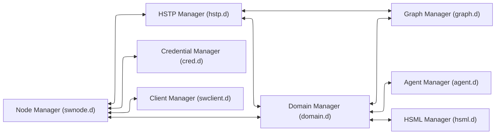

## Spatial Web Managers

### HSTP Manager

This handles message routing from both external agents (users) and from other spatial web nodes, taking in HSTP based messages carrying HSML and payloads and transmitting HSTP responses back to users or (through the onboard client) to other nodes. These messages are generally sent to the domain manager, rather than executed directly. (Note, this is different from the current implementation, though the primary change will likely just be which system handles these executions).
### Domain Manager 

The domain manager has a number of roles:
    * generates a domain thread from a domain template and populates it with appropriate agents, things and places. 
    * works with the system clock (an internal tick) to invoke the activities on that thread of the relevant agents, which in turn is used for autonomous and semi-autonomous agents working in a state graph system,
    * translates HSTP messages into UDG notifications for autonomous agents.
    * manages inter- and intra-agent communication within domains
    * determines whether the domain has reached critical states (such as an end state in a simulation)
    * communications with the node domain graph to read and update state within the graph.
    * passes relevant map responses (entity streams) back to the hstp manager.
### Graph Manager 

The graph manager is a low level service that interacts directly with the graphs within the node in order to provide an abstraction layer for graph management. It performs a number of functions.
    * Translates HSQL query requests and updates into the implementation specific requests of the current graph technology. This exists primarily to ensure that there are no explicit dependencies upon the underlying graph store.
    * Provides a mechanism to add multiple external graphs to the current graph so that they can be queried as if they were a single graph. This is what is known as a federated graph (and it is currently just specific to RDF, but that may change). Such a graph doesn't necessarily scale well towards a large number of nodes (>100), but it can be very useful when building a domain that scales across multiple machines. By separating the graph manager from the domain manager, it becomes possible for the domain manager on one machine to work with multiple nodes simultaneously without having to go across hstp.
    * Graph replication. Replicating a graph (while something of an edge case) is easy enough to accomplish at the graph layer; RDF has global identifiers, and as such a graph can be replicated by simple serialisation into any RDF format. Record deduplication is similarly straightforward, as RDF is specifically built to work on an index format such that multiple resources with the same URI automatically to the relevant ntuple index. This is one of the many reasons that RDF is recommended from the graph layer.

### HSML Manager 

HSML is used to describe the state of domains within the graph, but it is also used to indicate activities, frames of activity over time, conditional expressions and contexts, both within the domains and within HSTP messages containing relevant changes and credentials. The HSML process is used in conjunction with the domain managers to provide indications of how entities change. It is not necessarily a daemon, but instead exists primarily as an interpreter that can then pass information off toe domain manager to implement, generally through the graph manager interface.

### Agent Manager 

Things within domains are agents. An agent can be thought of as something that is capable of change within a domain, with the most prominant such change being a change of motion within some phase space, or a change of state. The agent manager performs a number of roles.
    * The domain manager typically manages the the "tick" of the system clock and its dissemination to the various agents. The agent manage is what interprets the messages of the domain to any given agent.
    * Agent may be passive (they can only be activated by activities from other agents), active (they are capable of action independent of other agents), or inactive (they do not receive messages except for messages to activate in either passive or active mode). The inactive state exists primarily to reduce the number of cycles that a given agent requires for processing if not necessary.
    * The agent manager handles moving an agent from place to place, either through linking or through replication across domains over spatial web node boundaries. If linking between such boundaries (typical, for instance, accross affiliated nodes that have similar domain constraints), then the agent manager will freeze an agent (make it inactive and hidden) on one machine, and will then replicate the agent on a different spatial web node, or updating the existing history of the agent to an existing proxy on a different node.
    * Agents maintain an internal state history, the mechanisms for which are TBD, through the interface of the agent manager (there may be a history manager that specifically handles that operation, again TBD)

### Credential Manager 

The credential manager handles the creation of SWIDs on agents, places, and domains, as well as caching credentials from external hstp invocations, in effect acting as the wallet for the various domains within the node. This will typically be a proxy for various types of accredidation and verification mechanisms. Full implementation TBD.

### Client Manager. 
This is a low level __command line interface__ for text-based communication with a spatial web node. Every node supports some kind of CLI interface and may support others (multimodal chat, 2 or 2 1/2 D maps, 3D environments, animations, and so forth).

## Distributed Graphs

There are two distinct methods that can be used for querying the state of a domain within a spatial web node: [___HSTP Node Queries___](#hstp-node-queries) and [___UDG Graph Query___](#udg-graph-queries). Both of these work on the [___Domain Graphs___](#domain-graphs) for a given node, but do so in very different ways.

### Domain Graphs

The __Domain Graph__ for a given node consists of a semantic graph that represents all of the domains along with the relevant definition files (schema files) and relevant scripts (activities and policies). This domain graph is currently represented using RDF (the Resource Description Framework), though it is possible that this may be replaced by other graph description languages in the future.

A domain is controlled by one and only one domain manager on a spatial web node, and a domain does not extend beyond that node.  This makes it possible to effectively manage containment and synchronicity, as well as to ensure that the same active agent does not appear on multiple services node servers at the same time.

### HSTP Node Queries

An HSTP Node query is typically sent from a client or another spatial node, and it usually queries the state of a given domain or set of domains (or updates that state through an interface call). Such queries represent the majority of calls in the spatial web, and are usually bounded by credentials that determine whether a given querant (an external agent) can in fact get specific information about the domain from the perspective of that domain.

Node queries are often sent to a cluster of different nodes simultaneously, where there is no guarantee that the nodes in question are even in the same network. Such queries get back maps - descriptions of a given node limited by the permission layers and scope of the querant that provide a view of relevant and available items in each domain. It should be noted that such node queries are usually expressed as HSQL, and consequently are filtered prior to being executed in the native query format of the graph.

Such queries can also be submitted to other nodes from a given node as a form of forwarding, though there is an upper bound as to how deep such queries can be, using the HSTP messaging envelope to indicated where the resulting response(s) should be sent.

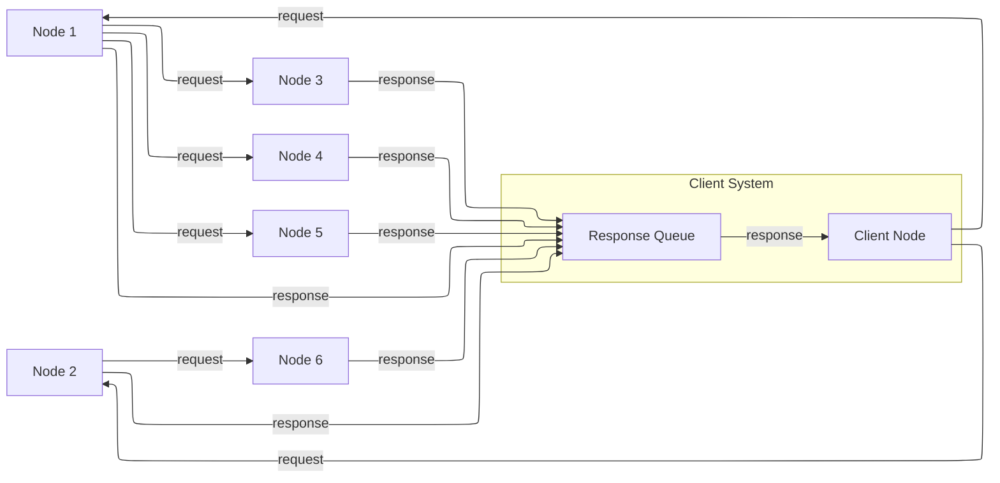

In the diagram, a client node sends out a query to nodes 1 and 2, which in turn both sends a query to node 3,4,5 and 6. Each node then sends its response a response queue to the client. It should be noted that in such a query, there is no guarantee of order; the nodes return responses when they have completed the query. The response queue exists to determine whether all items have either returned a response or indicated that they have timed out, and if necessary to transform the response into a form that the client can use.

Just as every node has a client manager, every node also has a response queue, which contains response messages sent over hstp through hsml channels.

Again, it's worth stating that the HSTP Node query ONLY talks to domains within a the node, though it can parameterize requests to just get one specific agent within a domain, and it never communicates directly with the domain graph.

### UDG Graph Queries

Each domain graph contains a wealth of information, but much of it should not, for one reason or another, be directly exposed to a query. This is where graph queries come in.

A __UDG Graph Query__ is a query that is made through the graph manager, typically in the native language for that graph, and then accessible via a named query or update. This query communicates with the full graph that is accessible to the node.

The HSML for the domain includes soft links to dependent graphs, called SERVICES. A __Service__ is a graph endpoint that can be queried directly from within the graph language as if it was a specialized named graph (this is supported by most modern RDF forms). Once defined, such graphs are otherwise undistinguishable from normal queries, save that they may have intrinsic latencies. Such endpoints do not necessarily need to be spatial web nodes, they just need to be able to serialize content.

This implies that a spatial web dependent node may need to expose a graph endpoint independent of the node itself. In the current implementation, this would be a SPARQL or SPARQL Update endpoint, but this isn't necessarily a requirement.

The dependent UDF graph neighborhood, unlike the SW Node query neighborhood, is linear - you attach a dependent graph to the independent node, but it's not a multi-tier peer-to-peer network.

Additionally, there are security risks that you have working with UDG Graph Queries that you don't have working with node queries, as these DO have access to information that is not protected by credentials. As a consequence, USG Graph Queries are considered to be accessible only to the domain or node authority, but not to most users or external agents.

### Combining the Two

There is no reason why you cannot have both node queries and UDG queries in the system. For instance, you can add multiple dependent graphs to the primary graph in a given domain so that they can distributed across multiple machines. You can then perform a node domain query on the federated distributed graph, treating it as if was a single large graph that just happens to span more than one node. Moreover, there is no formal requirement that a graph extension is a spatial web node, only that it have the appropriate endpoints for graph access. 

This approach will likely actually be the norm, especially for large scale domains such as multi-user role playing games, simulations, tours, and large scale IoT systems. If there are common resources (such as schemas, taxonomies, scripts and so forth), then these might be contained in a separate graph server node that is then attached to the primary graph but used by multiple spatial web nodes at once (what's called a shared node). 

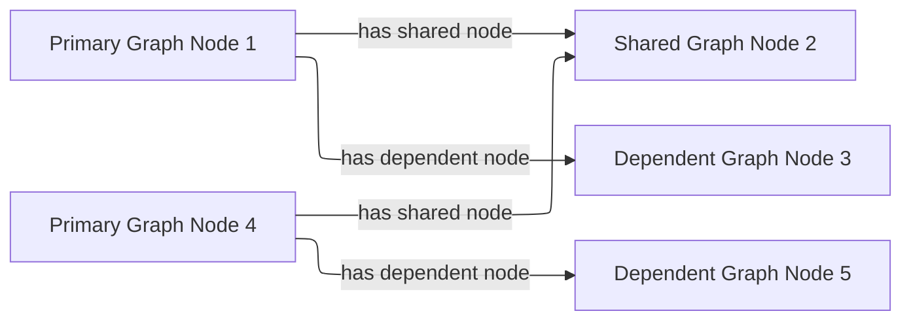
In the above illustration Node 2 is a shared node between node 1 and node 4.

Dependent nodes are also called content nodes, in that they are able to store content that may not necessarily be HSML specific. _Note that while a spatial web node can also expose a graph endpoint interface, content nodes that do not also have a node manager are not considered spatial web nodes per se._

### Registering Dependent Graph Nodes

Graph and Content Nodes can be registered in one of three ways. 

#### Static Registries
The first is a static registry, where links to the nodes (typically as html links) are stored in the active graph for the node itself. These are "permanent" graph nodes, in that they are automatically linked when the spatial web node boots up or reboots. These are typically shared nodes, graph registries, taxonomies, code modules or similar content. 

#### Domain Graphs

A domain can similarly attach an additional graph when it first starts up through the domain manager. Such graphs are only accessible within the scope of the domain, and when the domain is disinstantiated, the connection to the graph is lost. Domain graphs are especially useful when you have a lot of domain specific content in a graph, such as taxonomy information, narrative lore, and so forth. As with static registries, the connections are endpoints, meaning that he specific internal implementations are unimportant, meaning that such domain graphs could be knowledge graphs, databases, LLMS and so forth. Note that, as with static registries, write access to these resources will be system dependent.

#### Activity Graphs

An activity graph is a graph endpoint that is invoked dynamically based upon a specific algorithm, and is usually used to pass data from external processes to internal processes (though if the graph is read/write it can also be used to update external content). Activity graphs are parametrically invoked and are transient.

### Named Queries and Security Considerations

Graph extensions are, by their very nature, insecure, primarily because they exist outside of the scope of the credentialling system utilized by hstp. As a consequence, most hstp queries will likely be invoked via a particular name, with parameters passed as a dictionary to the graph manager. This will likely be passed in a manner similar to MCP or the OpenAPI format. 

At no time should HSTP directly call the system graph query language; it should always go through some kind of hosted proxy (the graph manager). There are several reasons for this:
* This provides an operational security layer, making it possible to validate an incoming request before performing the query both from a functional and permissions standpoint.
* The invocations better match the declarative visibility principle - an agent can only "see" a given activity if it has the relevant credentials to do so.
* This keeps operational and sensitive data hidden from hacking through HSTP, and it ensures that output can be transformed into "clean" versions that removes such sensitive information before it gets sent back as part of a response.

Named queries and mutations are defined within activities at various scopes. Any query on a domain, for instance, would in turn invoke a graph query that is specific to that domain, and may be customed to refer to a particular agent (or agent(s)) or place(s) in the system. It's worth noting that the domain itself has access to all aspects of the graph, including the agents and places within the domain.

### Understanding Graph Queries

Graph queries are somewhat different from traditional data structures. In a normal query, you typically pass an identifier (or some descriptive metadata), and return a document or a list of identifiers (with metadata) to documents.

In a graph query, however, there are typically two different kinds of query. The first is similar to a search result - a table consisting of fields of value. This is very much akin to a SELECT query in SQL, and this form is useful for generating reports and maps. For instance, given the current architecture, the following query retrieves a list of all of the agents in a given domain (here, a list of people in a given building)

```sparql
# Sparql

SELECT (?personLabel as ?Person) (?roomLabel as ?Room) 
WHERE {
    ?person a Class:Person .
    ?room a Class:Room.
    ?person rdfs:label ?personLabel .
    ?room rdfs:label ?roomLabel .
    ?room Place:hasAgent ?person .
    ?domain Domain:hasAgent ?person .
    ?domain Domain:hasPlace ?room . 
} order by ?Room ?Person

```

This generates a table:

| Person |  |
|--|--|
|Jane Doe|Room 101|
|Karen Free|Room 101|
|Bill Barnes|Room 103|
|Alice Nims|Room 205|
|Michel Thrush|Room 207|
|Stephen Blain|Room 302|
|Leeane Hardin|Room 302|

In this case, the select statement reads labeled properties from the WHERE statement, which in turn matches assertions in the graph, resulting in a subgraph.

```turtle
# Turtle
Agent:JaneDoe a Class:Person ;
    rdfs:label "Jane Doe" ;
    .
Place:Room101 a Class:Room ;
    rdfs:label "Room 101" ;
    Place:hasAgent Agent:JaneDoe, Agent:KarenFree ;
    . 
Place:Floor1 a Class:Floor ;
Place:contains Place:Room101, Place:Room102,
    Place:Room103, Place:Room104 .

Place:ApartmentBuilding1000 a Class:Building ;
    Place:contains Place:Floor1, Place:Floor2,
        Place:Floor3 .

Domain:ApartmentScenario_123 a Class:Domain ;
    Domain:hasAgent Agent:JaneDoe, Agent:KarenFree, ... ;
    Domain:hasPlace Place:Room101, Place:Room102,
     Place:Room103, ... ;
    .
... 
```

Construct statements can then be used with the same WHERE statement to generate the subgraphs as Turtle, RDF/XML or JSON-LD, along with additional metadata. 


```sparql
# Sparql

CONSTRUCT {
    ?person ?personP ?personO.
    ?room ?roomP ?roomO.
    ?domain ?domainP ?domainO.
}
WHERE {
    ?person a Class:Person .
    ?person ?personP ?personO.
    ?room a Class:Room.
    ?room ?roomP ?roomO.
    ?person rdfs:label ?personLabel .
    ?room rdfs:label ?roomLabel .
    ?room Place:hasAgent ?person .
    ?building a Class:Building .
    ?building Place:contains+ ?room .
    ?domain Domain:hasAgent ?person .
    ?domain Domain:hasPlace ?room .
    ?domain ?domainP ?domainO. 
} order by ?Room ?Person

```

This will give you the graphs of ALL of the domains with all of the agents in all of the places in each domain, where the agents are people, and the places are rooms.

Most SPARQL queries are constraint queries - they limit the facets so that rather than dealing with a potentially huge graph, you are dealing only with constrained subgraphs. For instance, if you only wanted rooms that are in a specific building, in a certain domain, you could parameterise the query to constrain the query. 

For instance, you can use the above query and set the variable `?building` to the IRI `<Place:ApartmentBuilding1000>`. This would give you all occupied rooms in _Apartment Building 1000_ across all domains that contain that apartment building.

The same query, however, could also take as an argument the `?person` variable with value `<Person:JaneDoe>`. Since there should only be one active agent in the spatial web with this identifier, this will also tell you what apartment building, floor, and room that particular agent is located in.

This is an important point, because it means that the results of a query will be dependent upon a linear dictionary of named variables and values passed to the query. This flexibility makes SPARQL queries much more powerful than their SQL counterparts, especially when you can also use inferencing to determine the relationships between structures. This dictionary is called a ___Query Context___.

### Named Queries, Mutations, and Metadata

A SPARQL query is a script that can be stored, assigned a given name (IRI), retrieved, and evaluated wih a given context. Because the query has an IRI, it can also store metadata, including descriptions about what kind of query context it takes, taxonomy classification for identifying the utility of that query, and determination about the fitness of this query compared to others. Additionally, the script in question can be _mutational_ - it can change the state of the graph, not just for one particular entity, but all entities that satisfy the query context.

In the RDF graph description, the mutational capabilities are a part of SPARQL Update, which can update the graph dynamically. At the simplest level, this can be used to change multiple states for a given entity simultaneously, in effect locking the graph to mutational changes outside of the scope of its own graph update. This makes such updates ___transactional___ in nature, a key requirement for ___data consistency___. If an update fails, the graph is returned to its previous state.

This extends to external services as well. If an external update __service__ (such as to an IoT device) fails to complete, then this failure will propagate through the query, and any changes made by the update service will be rolled back. 

The association of metadata with a given named query or update is significant, because it plays a big role in __discovery__. The domain manager can interrogate all of the agents within its scope, checking the metadata associated with the agent, its place within the domain, and its current state. Similarly, the domain can maintain its own metadata based upon the general domain taxonomy (covered in its own section).

The specific mechanism for adding metadata to an entity is still under discussion, but likely will be of the form Entity:hasTopic.

### Directory Domain and Home Places

A spatial web node can identify a particular domain that serves as it's directory domain. If no domain is specified by an hstp request, this will be the default domain. This domain is designed to provide a directory or catalog of the domains that are accessible to a given external agent based upon their credential profile, and also provides mechanisms to "sign in" if this is required to change the domains that they see.

Similarly, within every domain, there is the option of specifying a home place. This is where agents are positioned when they first "enter" a given domain, if no domain is otherwise specified. In simple scenarios (such as the smart room scenario), there may be only one place in the domain, but in more complex scenarios (especially those representing tours or rpgs), this home place typically also serves the role of establishing context and backstory for the agent, providing instructions for interacting with the domain, and identifying pertinent "destinations". 

### Agents Are Not Domains, They Have Domains

One of the long-standing debates within the spatial web working group has been the distinction between a domain and an agent, what is frequently referred to as the holonic paradox. A smart city, for instance, is both a domain (a context in which agents interoperate) and an agent (a thing that has changeable state but can be treated as a distinct entity). 

Ultimately, this distinction can be thought of as a distinction between __external state__ - the state of an entity as perceived by the environment - vs. __internal state__, which is the state of the components that make up that thing relative to one another.

_For purposes of modeling_, all entities have external (extrinsic or percieved) state, however, not all entities necessarily have internal (or intrinsic) state, _within the model_. 

> The physical world does not, of course, have such a natural division; the viscera of a person, for instance, is still in the same "reality" as the outer form of that person, and that reality extends from the largest scales of the universe to the smallest quarks. However, the virtual world does not have that same constraint, and as such it is usually preferable to create holistically contained models that handle relevant aspects of the system in question.

What this means in practice is simple. All domains are effectively bound to agents as the "inside" of some thing is still connected to that thing. If you were to create an internal model of yourself, that domain's interactions would likely have some reflection in your external state. The boundary between external state and internal state is an interface. If you have a stomach ache, your expression (one aspect of that interface) will be sour and pained.

By this same reasoning, in the spatial web, the distinction between the domain where an entity is an agent and the domain representing the internal state of that entity is a form of link. If I have a special scanner that shows your insides, what you are seeing is a ___map___ of the "insides" domain through that link. 

> Note again that this is different from reality. An MRI uses a magnetic field sensor coupled with strong magnets to generate and interpret the internals of a person, but an endoscopy actually creates an agent (the camera end of a fiber optic cable) that invades that domain. In the virtual world, on the other hand, the camera becomes a part of the internal domain but acts as an interface to create a map or view of the internal domain to display within the context of the external domain.

This relationship can be seen as follows:

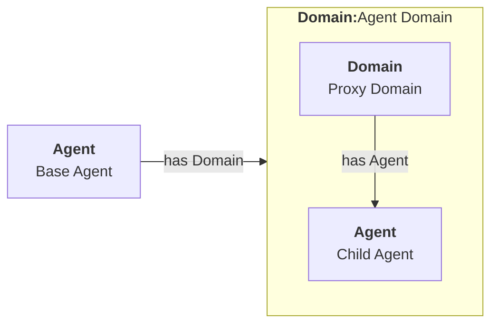

In this case, the agent has a property called `hsml:hasDomain`. This points to a named graph, with the name being the IRI for the agent's domain. Within the named graph, there exists a proxy domain (probably a blank node), that acts as the representative of the base agent within the subordinated domain graph.

The named graph represents a ___Markov Boundary___. 

One final point before digging into links. In theory, an agent can have multiple domains that represent different aspects or systems for that agent. So long as the domains are completely independent, this is an effective strategy, but if two domains are descriptive of the same system, then either these domains need to be linked together in some way or the internal domain needs to model all of these potentially interrelated subsystems.

### Spatial Web Addresses

In the Spatial Web, there is a distinction between a Spatial Web Identifier (SWID) and a ___Spatial Web URL___ (here, proposed as __SWURL__). The SWID provides an address to a credential that verifies the existence of that resource, but does not in fact identify where a resource is within the spatial web. This makes it far more difficult to create a linking system as such credentials are not necessarily guaranteed to be within the same indexing system.

___Addressing__ and ___credentialing__ serve two different functions. A __spatial web resource locator__ (or SWURL) identifies where a given resource is located on the spatial web. The address typically will identify a spatial node (the physical system where the resource is located) coupled with an identifier for that resource on that machine.

A SWAD does not make any guarantees by itself about the verifiability of the address (this is the role of the SWID), nor does it identify the resource semantically. Instead, the SWURL is a label that locates the resource on the web itself.

Just as a resource has a SWID, it also has a SWURL. The SWURL is a ___local name___ that is assigned to the resource in question, utilizing HTTP naming conventions. A resource may have more than one SWAD, or none. If a resource has no SWURL, then the SWURL defaults to the portion of the SWID after the "did:swid:" method. If a resource has multiple SWRLs, then any of these can be used to reference that resource.

The UGD.d resolves local SWRLs and returns the resource in question, but only after it verifies credential access for that resource via its SWID, returning an Unverified Access Error if the resource fails its credential check.

For instance, if the spatial web node has a SWURL of:

```
https://mySmartRoom.com:8200
```

with 8200 indicating the port number where the hstp.d daemon is located (there is no port specifically dedicated to the spatial web, but it would be a good idea to be thinking about this), then resources that are defined on that node (such as domains, agents, scripts, etc.) can be further accessed by normal http qualification methods, such as:

```
https://mySmartRoom.com:8200#agent-light-123
```

If done with a content type of `application/hsml+json`, this would retrieve an HSML description giving the relevant details of the resource in JSON-LD (not necessarily the internal one-to-one encodings - the internal graph exists not for commonality but for state management). If the content type is `text/html` then what gets returned is a summary of that resource or system in an HTML format, and so forth. 

Internally, this same entity is represented as a graph, quite possibly one given as a blank node:

```
# Turtle
prefix hsml: <http://spatialwebfoundation.org/hsml#>
prefix rdfs: <http://www.w3.org/2000/01/rdf-schema#> .
prefix swid: <did:swid:>
@base: <https://mySmartRoom.com>

[] a hsml:Agent;
    hsml:swid swid:3195A951EF1109 ;
    hsml:swrl <#agent/light-123> ;
    rdfs:label "Light 123" ;
    .

```

The notation <#agent/light-123> for the swrl is indicative that (at least in RDF) this is an IRI fragment relative to the containing spatial web node.

A __blank node__ is a node that has an IRI that is defined within a graph, but is not defined globally. This structure makes it possible within Turtle to write something like:

```
# Turtle
prefix hsml: <http://spatialwebfoundation.org/hsml#>
prefix rdfs: <http://www.w3.org/2000/01/rdf-schema#> .
prefix swid: <did:swid:>
@base: <https://mySmartRoom.com>

[] a hsml:Domain ;
    hsml:swid swid:EA519DEFFC1235 ;
    hsml:swrl <#domain/lightRoomScenario> ;
    hsml:hasAgent [
        a hsml:Agent;
        hsml:swid swid:3195A951EF1109 ;
        hsml:swrl <#agent/light-123> ;
        rdfs:label "Light 123" ;
        ]  .

```

The domain and agent SWRLs in this scenario then resolve to:

```
    # Domain SWURL
    <https://mySmartRoom.com#domain/lightRoomScenario>
    # Agent SWURL
    <https://mySmartRoom.com#agent/light-123>
```

Every spatial web node has a distinct base, and for the most part, resources are defined relative to those nodes. This is a bit of a departure from the normal best practices for the semantic web, but the distinction here is that most spatial web resources are effectively local to their nodes. Because a given resource can have multiple SWRLs, this also implies that most references will be indirect - "give me the (graph) node that has this SWURL", just as one would say "give me the (graph) node that has this SWID".

One other key point - the spatial web does not recognize URL parameters being passed as part of a GET request - if you need to pass parameters, these should be passed as the body of a POST request. This keeps the address space clean, makes it easier to validate incoming requests, and is more consistent with regards to semantic web principles.

#### Home Domains

There is a chicken and egg situation with regard to whether a given Spatial Web Node can be considered an agent or a domain. To get around this, there is a specific exception to the idea that all agents exist on places within domains. There is assumed to be on a given spatial web node a designated Home Domain that is explicitly stated to be associated with the node itself. It's "agency" in this particular case is the action of the node daemons, with specific capabilities. When a spatial web node is first set up, this home domain/agent holds the configuration metadata for the node itself, as well as any credentials that are specific to the node.

Put another way, ___from the standpoint of the UDG, the Spatial Web Node is a domain, with an implicit super agent___. The mechanics of this are still to be determined.

### Links

Links are fundamental to the World Wide Web. The behavior of a link in that context is simple - it indicates a new URL (a place) that the user agent goes to in a specific domain, whereupon it retrieves the document associated with that address.

In the Spatial Web, links are more powerful and varied. At its core, a link associates a SWURL for a resource with an activity. For instance, one of the most common kinds of links is a ___portal link___ that is applied to a given link (styled as a door or other kind of portal), that causes the activating agent (such as a player character in a game) to move to a different, specified place:

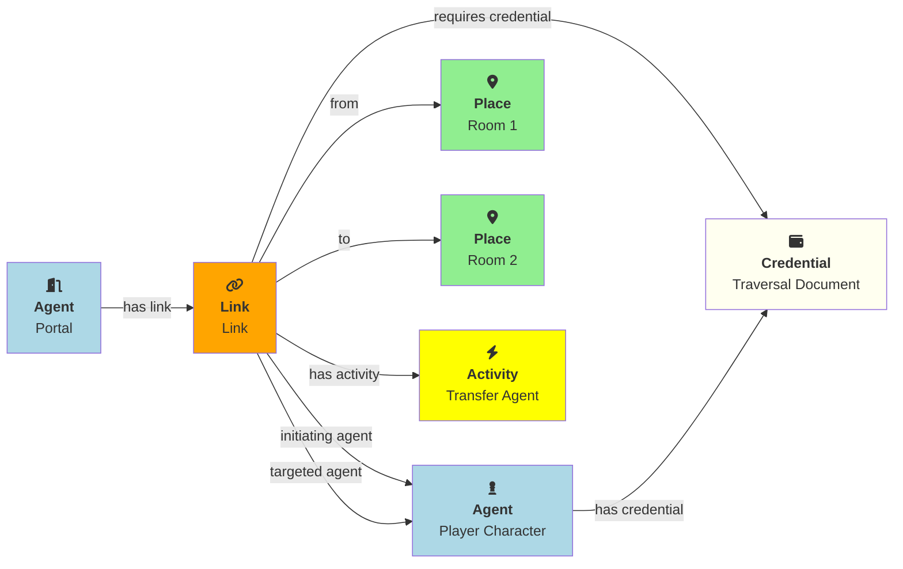

In this particular case, 

This behavior is not all that different with the spatial web, but such links are more complex as they are more contextual, and as such can be broken down into different types of behaviours. Some of these are given as follows: 

#### Subsystem or Holonic Links

An internal state link describes the connection between an agent and its subsystem domains. Such links are usually indicated in the interface by some form of common icon or identifier, with a corresponding icon when within the subsystem indicating a link to the super-domain for that agent. As with all links, traversing the link will take you to the subdomain in question, while traversing the inverse link will take you back to the superdomain.

A ___place___ in this case is treated as an agent. That is to say, if an agent is located on a given place, and that place has a subdomain that provides a higher level of detail or a portion of the overall hyperspace of the domain, then clicking on the holonic link will take you to sub-place domain.

For instance, a given planet domain may have multiple places that represent the countries of that planet. Clicking on the country icon will change the active domain for that user to the country in question, which may then display different place markers indicating active cities or regions, and will also indicate a super-icon that will take the agent back to the relevant country. Note that the icons in question may reflect some relevant information about the country in its visualization, and the `about` display for that country can also provide summary metadata - another form of map.

This points to the fact that most links have two distinct modes - a selection mode that is used to indicate the resource is of interest (bringing up metadata), and an activate mode that causes the shift of the agent from the source to the target link. In a GUI, this may be represented as a single click vs. a double click, but these are implementation specific.

#### Portal Links

Places are agents that represent specific locations rather than people, characters, bots, etc. They are all part of the same domain and generally just handle movement within the domain. A good example of a place to place movement is in the Street View mode of Google maps, where, depending upon your orientation, you will see several icons indicating movement is possible to a different place in the same scope.

Places, consequently, can be thought of as a necessary kludge - they allow for changing perspective while still being part of the same security and activities context, and they play a significant role in tours, wizards, educational systems and other use cases.

A place link is essentially a __portal__ that will take an agent from one place to another within the domain. Such links are topological rather than topographical, in that such links are not necessarily dependent upon contiguity or geometry. 

Portals may be one, two or multi-sided, and, as with all links, access may be constrained by the requirement that the initiating agent has access to a cryptographic key in order to activate the link. Such keys may be associated with dedicated agents in a Bag relationship.

Portals can exist between places in different domains, even if those domains aren't nested. For instance, in a conquest game there are natural boundaries and fords that exist between different domains within distinct but affiliated spatial web nodes. In general, each domain will require that the agent have an affiliate key in order to enter into that domain, and the domain manager will be responsible for managing the replication (and disabling) of agents moving from one system to another across SW Node boundaries.

#### Bag Links

One common use case in the spatial web occurs when one agent (say a truck) acts as a transport for another agent (such as a package). The container in this case places the contents onto a Bag Place - part of the container's domain that can be thought of as the "Bag of Holding" for that container. The carrying capacity for that bag can be determined individually for that particular place (it may be by weight, by volume, by insurability, or by some even more exotic measure)

Each carried agent in turn has a specific credential key that can serve as a key to a portal (or other linked agent). These are connected to the carrier agent through a bag link. In effect the carrier can "borrow" the key of the carried item.

A carryable agent in that case can be "picked up" by the carrier agent and thus removed from the place within the active domain into the bag place in the carrier's domain. Even if the carrier moves to a new domain, the carried object stays associated with the carrier's internal domain "bag". The carried agent can be used by the carrier to activate a portal or similar Thing agent.

> It is worth noting here that activation of a bag item _may_ also cause the item to expire, in essence, being removed from the bag upon use. Additionally, a carried item may be transferred to another agent or "dropped" into the current place. That has obvious implications for both supply chain scenarios and e-commerce scenarios, where a specific virtual item is "sold" to another agent, and its use in role playing games should be self-evident.

#### Agent-to-Agent Links and Channels

A link can also connect two or more agents. Again in its simplest form, such a link can allow for "teleportation" of one agent to the location of the other, but outside of specialized games, this is likely an edge case. However, a much more critical use case is connecting one agent that is in effect a camera (a sensor array) with another agent that is a display or monitor. This will usually be accomplished via a channel (it is arguably whether a link and a channel are related, though there is some overlap). 

One particular mechanism that may be worth thinking about in agent-to-agent communication is the use of a filter acting on a channel to limit it to a small subset of properties on an entity's state vector. For instance, one such channel may be a message property that could be periodically polled. As this message property changes, this would be reflected across the channel to all subscribers to that channel (this may be analogous to Scott's LENS concept)

This could also be used to monitor the value of a given set of properties such as position, temperature, funds, or emotional state. Since in many cases, these values may be computed rather than intrinsic, this provides a light-weight mechanism for determining relevant state without needing to know the internal mechanisms for that agent.

#### Button or Selector Links

If no Activation handler is specified for the link, then the activity will be dependent upon the type of agent doing (and receiving the invocation). However, if an activation handler is available as part of the activations for that link, then the presented handler will be invoked first, and the option to propagate the event to its default afterwards can be controlled by the handler. These are called button or selector links, and in essence they represent a significant component in the form interface for the given entity.

#### Architecture of Links

A link transmits the following information to the domain manager:

* initiator of the link
* recipient of the link
* target of the link
* type of link (if known)
* time and place of the link
* periodicity
* duration

Once this is received by the domain manager, it uses the context determined by these parameters to determine other necessary metadata. These are then passed to the link's activation handler (or the defaults relevant by type) to perform the associated link action.

Links can be set up by the domain designer via the periodicity property as one of singleton (the link is only activated once) or periodic (the link is invoked across a given channel periodically until either the link is terminated or the channel's time-to-live (TTL) is exceeded). Once the link completes, it will either be reset (the default) or it will be expired (for links that expire upon use).

This operation is handled by the domain manager. Note that in fully autonomous operations, open links simply cause the agent to reset to the new place (and domain, if this changes, without UX involvement. However, key activation still requires the relevant credentials.


### Agent State Descriptors

> Within a given domain, all that is known about an agent is what can be determined by its external state. 

This is an important statement because it is the agentic equivalent to the principle of ___encapsulation___ in programming. The domain that an agent is in represents the environment and the space of all things that the agent can interact with. It does not, from the domain perspective, make any difference what mechanism drives the agent - whether a human being, an external AI, a chatbot, a data feed, an internal autonomous entity or even magic. All that the rest of the agents within that domain "know" is that from the outside, there is a black box controlling the agent.

This state description is fundamental to a given entity conceptually. A building and a vehicle, for instance, both have certain properties that are intrisic to existing within space (position, orientation, scale, etc.), but others which are very different (a building typically does not, or at least should not, have a velocity). The operant work here is _typically_ - a houseboat, for instance, is both a vehicle and a building. 

An object effectively is both a discrete agent and a domain of subcomponents, with the activity of each agent sending a message to the internals (the domain specific part) concerning the desired outcode of the external state of that agent. The external state also reflects changes to the internal configuration within the agent's subdomain.

This leads to an interesting conclusion. A domain does not intrinsically have a state. Rather, the (external) state of the agent that represents the domain is _calculated_ based upon the states of the sub-agents after they have performed specific activities within that agent's doimain.

For example, consider an agent that represents a room, and that room has four lights within that room. Each light can be turned on or off. The total intensity of the light within the room will then be considered to be the sum of the intensity of each light (in reality, this equation becomes considerably more complex), with the base state of the room being the illumination in the room when none of the lights are turned on.

The illumination of the room as an entity is not determined externally. Rather, it is a byproduct of the agents within the room domain.

This can be extended beyond a single numeric value. For instance, suppose that you wanted to determine the illumination at any point in the room. One possible approach to this is to perform a calculation parametrically depending upon where the "probe" agent is located. However, this approach places a great deal of onus on real time calculations, while the domain itself likely only changes when the underlying agents change in some way.

An alternate (and preferred) approach is to divide the domain into multiple places (such as square or hexagonal tiles) and for each place, determine the ambient light at that particular place. Then update the intensity field of the external state dictionary as a dictionary or similar container, with each place identifier then serving as an individual label for the intensity for that place. The higher the number of tiles, the greater the fidelity of the simulation, while at the same time, minimizing the amount of computation necessary at query time.

This approach, using the subordinate entities in the subdomain of the agent to maintain internal state, means that you should not need to maintain two separate state mechanisms. This has a lot of implications:

* You can create generic agents within a subdomain to hold and manipulate the super-agent. This is very much analogous to HTML Forms, XML Forms, and React or Vue on the web. That is to say, you may have subordinate agents that represents a position marker, a text or text block field, a selector from multiple potential values, a radio control, a gauge, tabs, and so forth.
* The advantage to this approach is that it makes generating activities fairly easy, to the extent that you can essentially shift into the subdomain to control these subcomponents (and establish computational updates of the state vector) as a way of building interfaces (this can be thought of as performing getters and setters on the model to control/query the subordinate state).
* The external state model of the agent then represents the relevant information about the agent that can be readily queried without needing to specifically understand the substructure inherent within the agent itself.
* These structures can be established via SHACL at definition time, with default configurations that can then be customized as need be.


### What Is The State Dictionary

The current convention is to call this set of states a ___hyperspace___. The recommendation here is that a hyperspace identifies the set of all valid places within a given domain, while the __state dictionary__ consists of a dictionary that identifies the relevent properties for the agent.

There are three approaches that can be taken with regard to such a dictionary, and they each have implications.

#### Subclassing of Agents

In this approach, the properties are added directly to the agents through inheritance. This makes the most sense semantically, as the sum of properties effectively define the class of the agent (for instance a Traffic Light class). Here, the properties exposed are defined in SHACL, which can also be used to then iterate over these properties. This approach works best when properties may be complex or multivalued (as the light intensity approach above illustrates).

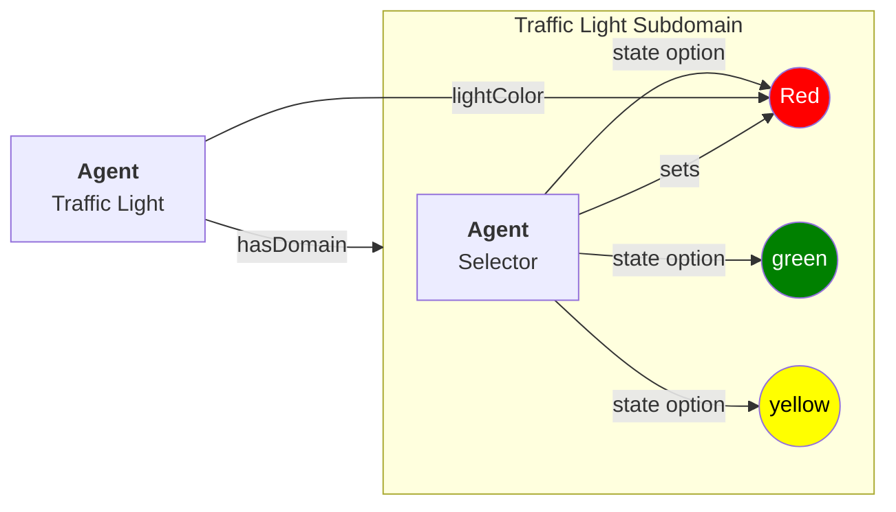

#### Separate State Container

This approach puts the state dictionary in a separate node attached to the agent. This makes it harder to define as a SHACL node, even if it may seem a little easier conceptually to understand.

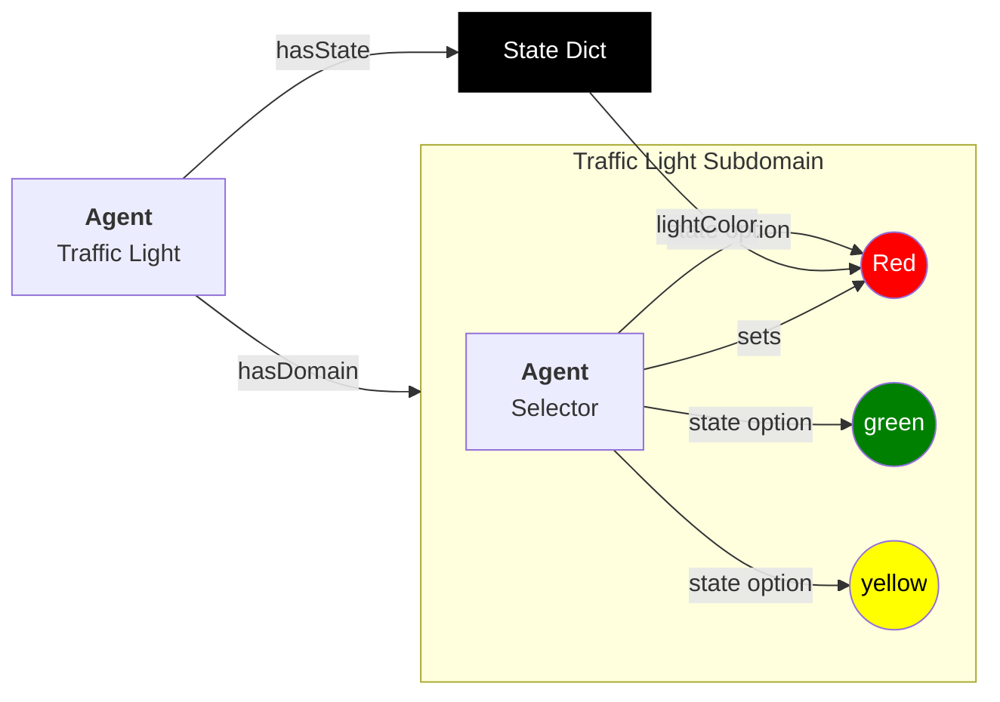

#### Feature Set

A feature set is similar to a dictionary in some respects, but very different in others, and is used primarily for machine learning processing utilizing tensor multiplication. In such a feature set, all of the potential states of a given facet make up a set of features, with a numeric float from 0 to 1 indicating both the presence of and intensity of a given fact and vacet value. For instance, the property `emotionalState` (the facet) may have potential values (facet values) indicating the extent to which the model exhibits that particular value:

| facet | facet value | intensity |
|--|--|--|
|emotional state|happy|0.3|
|emotional state|sad|0.7|
|emotional state|angry|0.75|
|emotional state|bored|0.2|
|physical state|comfortable|0.3|
|physical state|hungry|0.6|
|physical state|tired|0.7|

This approach can be thought of as similar to taking a survey where you are asked a question (the facet) that establishes a particular value (the facet value) and are asked to indicate on a scale from 1 to 10 how much you agree with this particular state. It is also something that is used in similarity analysis and machine learning, usually by indicating frequency of a particular token or set of tokens within a document or portion of a document, meaning that it works well in LLMs and vector stores.

The advantage to this approach is that you can do similarity analysis on the resulting vector, which can then be used to identify moving closer to a given endstate. The disadvantage here is that you have to compute the vectors for all potential states, meaning that if states (facets + facet values + intensities) change, you have to recompute these dynamically. Computing these also requires that you have a number of different embedding algorithms based upon what kind of information is being kept.

It's worth pointing out here, however, that a property can contain a feature set as a datacube, which is a tensor representation with associated metadata, or as a JSON representation of the same thing. In this particular case, each dimension of the datacube represents a particular facet, each facet value a property, and each feature value as a normalized scalar. From this, generating the corresponding feature set as JSON becomes trivial. This becomes true of OLAP represenations a as well.

#### Tensors, Datacubes, Time Series and Graphs

OLAP has been presented as an alernative to utilizing semantic graphs. In an OLAP approach, you create n-dimensional hypercubes, with each dimension representing a property (facet) and each value in then property representing a facet value. In a relatively high dimensional OLAP cube, you can consequently represent different "slices" of the information space.

At a basic level, a graph can be represented as an OLAP cube with relatively sparse dataset values. This makes joins relatively efficient, but it doesn't necessarily work well once you need to do things with those joins. This means that if you have a graph that is predominantly read only and static, storing it an OLAP cube may be more efficient, but for updates or complex queries, it is dramatically less efficient. Given that the spatial web is constantly being updated, this means that OLAP cubes by themselves are not all that well suited for use within the spatial web, though they may be used as a mechanism for certain types of graph containers.

However, there are ample cases where a property of a given agent may hold a datacube, which is a representation of a complex data set that may be the result of a computation or data access from an external resource. This can be stored using the W3C datacube specification or some other similar specification, and may very well represent time series or other independent tensors. These are not, technically, a part of HSML, though datacubes can be defined for work using SHACL.

#### Symbolic Active Inferencing, Factor Graphs and Reification

Active Inferencing makes use of factor graphs that determine probabilistic weights of action based upon Bayesian analysis, and plays a significant role in Agent systems.

A factor graph can be seen as a transition across a state diagram. For instance, in a traffic light scenario, one property that will be present in the domain is the traffic density. When the density is heavy in both directions (assuming an intersection), then the interval and timing of each red and green state will be approximately the same, but if the density in one direction is significantly higher than it is in the other, then the traffic light will change the frequency of the light in either direction, giving more preference to the heavy roadway. In the case where there is no traffic in one direction, then the light never turns green for the opposite route.

These can be represented as Bayesians, with behavior determined largely upon a decision tree that's dynamically weighted. The weightings for this can be set up by the use of either modeling or, more likely through rdf-star based reification. A reification is a statement about a statement, and in this particular case can be used to establish a context in which a given set of conditions are true. This is one potential implementation of a Factor Graph. 

In this particular case, multiple reifications on the property sets of a particular agent with weightings can be set up in the graph, that can then be evaluated through a query mechanism on the reified graph to determine the best course of action given a starting scenario (state dictionary). This can in turn generate a working named graph that can walk through successive states to achieve a specific objective, using the principle of minimization of free energy to determine fitness.

This section to be expanded in future releases.

## The UDG Taxonomy

The __UDG Taxonomy__ is a taxonomy designed to augment discovery within the spatial web by providing common concepts and definitions for agents and, by extensions, domains.

### The hsml:hasTopic property

The UDG Taxonomy can be thought of as the thesaurus for the Spatial Web. Each term in that thesaurus provides an adjective or noun that identifies some characteristic of a given agent.

 For instance, an agent that is intended to be a proxy for a car in a smart city scenario may be identified by a number of such characteristics: the vehicle's _make_, _model_, and _trim_, its _carriage designation_ (a sedan, sports car, SUV, light truck), its _primary and secondary external and internal colors_, its _engine type_ (internal combustion engine, diesel, electric, hybrid, hydrogen-powered) and so forth. A building may be classified by _purpose_, _construction method_, _zone classification_, etc. A robot may be given by its _purpose_, _ambulatory status_, _activation level_, etc.

Each of these terms are used primarily as mechanisms for classification, and are considered as __categories__, with each particular enumeration in turn considered a __topic__. The `hsml:hasTopic`, `Place:hasTopic` and `hsml:hasTopic` properties in HSML takes zero or more topics as arguments.

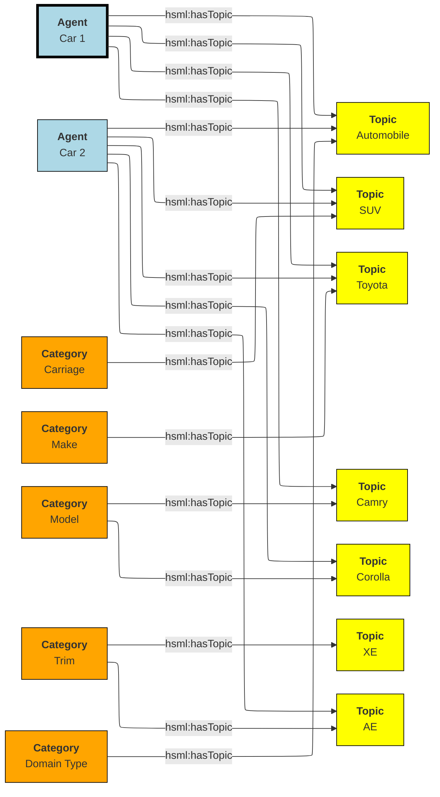

The power of the UDG taxonomy is in its ability to cluster agents by topic, mediated by category. For instance, car 1 and car 2 are both of the same make (Toyota) but of different models (Camry vs. Corolla) and trims. They are also of the same "domain Type" of automobile. Note that domain type here is not privileged, it is simply one more category that agents can be in, though a fairly broad category.

### The `hsml:hasConstraint` Property

Some times there are interdependencies between topics. For instance, the Corolla and the Camry are two different models produced by Toyota, and another car company will not produce those same models. Similarly trim provides variants for a given car model.

These relationships are called __constraints_, which is a relationship indicating that one topic is dependent upon another. This changes the diagram somewhat:

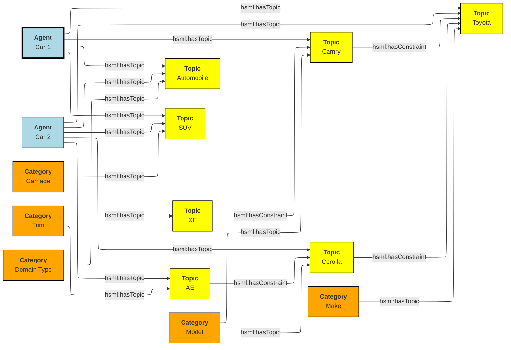

### Places with `hsml:hasTopic` and `hsml:hasConstraint`

Places can be defined in a similar manner. For instance, a place may be a country, city, planet, river, lake, sea, township, etc., Each of these are `geoFeature` topics, though these may be subclassed.

For instance, Vancouver, British Columbia, Canada, and North America are all places, they are connected as follows:

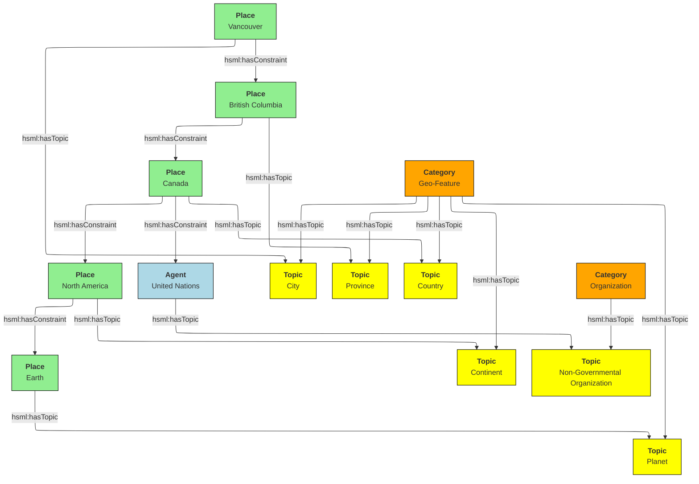
In this case, while these are all geoFeatures, Vancouver is a city while Canada is a country. Significantly, the implicit structuring (Vancouver is a part of Canada) becomes simply a constraint relationship here, albeit one that can be exploited for reasoning purposes. Furthermore, Canada might also be in another constraint relationships with an organization of countries (such as NAFTA or the United Nations), so the hierarchy here is a hierarchy of topics, and is actually more mereological than strictly hierarchical.

### Domains with `hsml:hasTopic` and `hsml:hasConstraint`

The topics and constraints of a domain are the same as the topics and constraints of the associated super-agent that binds that domain. 

### Topics vs. States

At first glance, topics and state properties would appear to be similar - one could express topics as states, though they serve somewhat different purposes. A state typically associates a facet value with a normalized value indicating the strength of that value, while a topic typically is a binary relationship used for classification exclusively (you could say that a state property is a topic with a value of either 0 or 1, not something in between).

Moreover, topics tend to be relatively stable once assigned to an agent or place. This makes them useful for classification, and discovery. For instance, while it is possible to identify the state of a traffic light as being red or green, this value is likely to change regularly between queries. However, it's designation as a traffic light is very much unlikely to change. meaning that if you look for traffic lights on a given node, you will likely get all such agents.

Discovery on a given spatial web node then becomes a matter of querying the node for desired topics. Note that the topics can include synonyms (analogous to `skos:altLabel`) that can be compared to the base topic labels for mapping to the respective node. Moreover, multiple language versions of the same topic can be provided in order to match in different languages.

Note that topics can be used for state variables. In that particular case, however, they won't necessarily participate in search unless they are also incorporated as hsml:hasTopic objects.

### Taxonomies and Schemas with Domains

A taxonomy is a data structure that defines the topics that are relevant to that domain. The predicate `hsml:hasCategory` identifies the categories that are defined within the domain (and is a property of the hsml:Domain class). Each category in turn identifies one or more topics that are associated with that category. Because domains are named graphs, the categories defined are local to that domain.

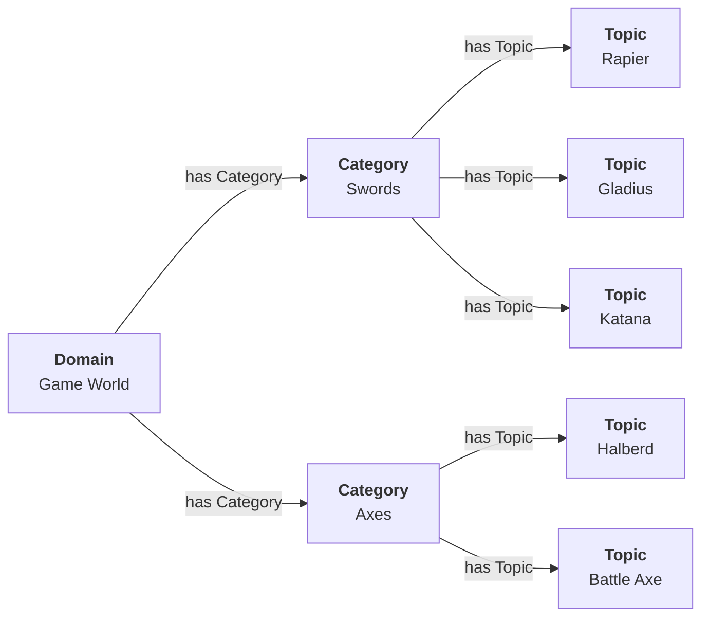

### Importing Taxonomies and Schemas

The predicate `hsml:includeDomain` is an instruction to add the graph of the indicated domain as part of the graph search, and is applied to the hsml:Domain object. This makes it possible to import external taxonomies and schemas into an existing domain. This has a lot of utility, in that it means that a domain can be defined that contains common taxonomy and schema definitions which can then be used within another domain.

Typically, a spatial web node will contain a primary domain that contains many of the core concepts, structures, and places and common agents that may be used within the majority of domains on that node. This can be imported into any given domain, providing a common framework for terms. In general, this is like a link in that the SWURL for the resource is passed. This is then interpreted by HSML (through the graph.d engine) to add this as resource into the active graph for the domain.

This can also be done across node boundaries. A __resource repository__ is a domain server that contains various entity resources that may be used across the entirety of the spatial web. By working from these common repositories, entities such as common places, frequently defined agents, taxonomy terms, and so forth can be referenced within a domain, while staying up to date.

Note that because of latency considerations, there are times where it may be more advantageous to autoload an external domain's contents permanently onto a given spatial web node. The `hsml:importDomain` is similar to the `hsml:includeDomain` but copies the imported domain content to the server directly, rather than referencing them from an external server. This creates an internal domain, and requires that you specify both the external SWURL and the internal name:

```
[] a hsml:Domain ;
    hsml:swurl <#domain/ExternalTaxonomy>
    hsml:importDomain <https://myExternalResources.com#domain/externalTaxonomy> . 
    .
```

When this is interpreted by the hsml parser, it will retrieve the subgraph from the external domain and load it into the graph as a named graph with associated local-name SWURL. This may frequently be done from packages that are loaded in initially, and that may be periodicallly refreshed.

The primary difference between `hsml:includeDomain` and `hsml:importDomain` is that `hsml:includeDomain` creates a domain extension from the external system that is always up to date but that may have higher latency (and is not actually stored on the same node as the including domain), while the `hsml:importDomain` creates a local copy of the external graph in the calling graph. This graph may be out of date but that has much lower latency.

An example of an included domain would be a hotel that had a number of guest rooms, each of which were in their own domain (which may or may not be on the same spatial web node). An example of an imported domain would be one that incorporated a taxonomy that is commonly used by other domains but that also does not change frequently and may be heavily referenced.

Another way of thinking about imports vs. includes is that an import is essentially a cache of one domain within another, while, an include is a temporary reference. 

Note also that in both cases, the node server MUST have the relevant credentials to load in the external domain. Otherwise this statement will fail and an error message will be sent to the error channel.

### Repositories, Registries

A __repository__ is a spatial web node that contains commonly utilized taxonomies, schemas, agents, activities, and other resources. A __registry__, on the other hand, is a way of registering the locations of specific spatial web nodes and their associated resources. The spatial web nodes, then would make use of the same DNS registry that HTTP and HTTPS uses, with the additional caveat that access would be moderated by credentials.

The Spatial Web Foundation should be responsible for maintaining core repositories, especially places, taxonomic concepts, activity components and schemas. This is a common requirement, and while others can and will create their own definitions, they can use spatial web concepts to provide core provenance and structure.

The Spatial Web Foundation should also be responsible for a Spatial Web Registration Authority (SWRA). The purpose of such a registry is to provide a clearinghouse for identifying and classifying public domains, using the Spatial Web UDG Taxonomy (and the corresponding hsml:hasTopic and related predicates) to help to identify relevant content.

When a Spatial Web Node is registered with SWRA several things happen:

* The ipv6 address of the node server is registered, along with a web domain name and (if different from the default) a port. The SWRA registry can also register the relevant IP addresses.
* A SW domain on a SW node can be assigned a public SWRA credential that indicates that the domain in question is a part of the SWRA network (similar networks can be established with different sets of credentials).
* Periodically, the spatial web node can send an update of all domains on that node that have the relevant credentials. This include any metadata (topics) that are associated with the domain. Note that these domains provide access points to other domains that may not necessarily be transmitted to the registry. As such they should be seen as starting points for various domain activities. Not all domains on a node need (or should) be so registered.
* Registries that issue their own credentials create __affiliation networks__. For instance, a given company that produces lines of IoT devices with associated HSML interfaces may end up providing an affiliation network of all nodes that make use of these devices, and as such share common domain and agent interfaces, taxonomies, structures and so forth. Similarly, a multi-system role playing game may set up an affiliation network where each node hosts one or more domains in that particular universe, with the ability for agents to move from one node to another through the use of supported credentials in that affiliation network. 
* A SW Node (and associated domains) can be part of multiple affiliation networks. For instance, a federal government may provide a core affiliation network for its member states, each both sharing resources and providing information, as well as identifying what other nodes are part of that affiliation.
* Both a repository and a registry are spatial web nodes. What differentiates them is primarily whether they have the additional functions of registration and whether they permit sharing within one or more affiliate networks. This are additional modules that can be added on to the base functionality of the spatial web node.
* Moreover, a spatial web node can be both a repository and a registry. 

### Affiliation Networks

An __affiliation network__ is a network of spatial web nodes which shares common resources, taxonomic classifications and typically a common registry. The registry serves as the hub of the network, identifying membership in the affiliation network as well as providing a mechanism for discovery within that network.

One of the roles of a registry is to issue and affiliation credential. This credential serves as a way of verifying that nodes within the network are in fact part of that network, and provide permissions that spatial web clients need to have in order to access certain features.

For instance, a group of universities in a given region may establish an affiliated network. This means that each university effectively agrees to abide by specific taxonomies as a way of organizing information, provides common set of activities for performing such tasks as transferring students between universities, enrolling in classes, and so forth, and will often allow students and faculty from one university to access resources or get consistent grading at other universities within the affiliation.

This is accomplished through a "university league" credential which is issued when the node is added to the network. When a student registers to a given node, their user agent (the software client they interact with) within the system receives a corresponding private key credential that both makes the user a resource in the system and provides them access to that system.

This serves a number of functions. For instance, an administrator can perform an affiliation level search for a given student, faculty member, class, or program (among many other things), either by ID or by attributes. A student can register with another university within the affiliation to take a class remotely, or can even sign up to and use remotely controlled laboratories stations (such as observatory time at a telescope or participation within a collaborative concert). A teacher can make available resources such as books or training videos from protected repositories to all of her students.

In this particular case, the registry serves to identify those domains within the network of nodes of affiliated members that may contain the desired resources. When a query is made in the broader context of the affiliation, each of these affiliated nodes are then queried in turn and return the associated links to those resources as a structure (analogous to an RSS or Atom type structure) that are then collated by the calling domain.

Note that the nodes in these affiliated networks are not (typically) graph extensions. A graph extension expands the active domain graph of a given node and is normally secured, because it exposes all resources within that graph. An affiliation query, on the other hand, is a request for information (typically links but also maps) from other nodes in the affiliated network. 

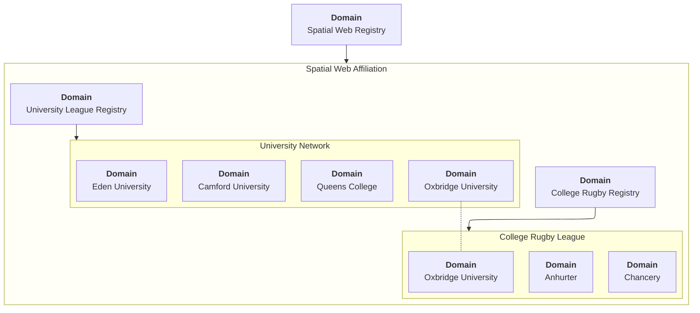

Here, Oxbridge University is part of two affiliation networks - a university network and a rugby league network. 

### Places

A __place__ is a specialized form of agent that represents a particular bounded region with a domain. The set of all places inside of a domain identifies the __hyperspace__ of that domain.

Note that a place is a conceptual entity, not necessarily just a geophysical one. The role of a place is to indicate _where_ a particular agent performs a specific activity within a given domain, and an agent will always be connected to a place, though the specific place may change from one domain to the next.

Within this context, a _tour_ can be thought of as the navigation of an agent through various places within a given domain. The specific mechanisms for how that agent moves from place to place are abstracted out in HSML, which is not necessarily a high fidelity representation of the physical world. What is important is only that the agent has moved from one operational context to another.

As mentioned, a place is itself an agent, and is an abstraction. For instance, suppose that you were representing a field hospital in a wartime setting. This is a place - it is where agents perform activities - but it is not necessarily fixed in space. When you say, "I am going to Field Hospital #4077", for instance, what you are indicating is that you are going to a place but the specific location of that place will vary over time.

This becomes especially important when dealing with vessels or platforms of various sorts. A cruise ship is a place, but its position will vary. That ship, in turn, can be decomposed (in its own subdomain) into multiple decks, rooms and cabins, each of which are also places.

Two critical points to note:

* A domain can have just a single place. If there is no particular need to indicate changes in spatial focus, then only one place is needed.* An agent may specify a location on its associated place, in either ___absolute___ or ___relative____ terms.
    * An __absolute location__ is one given by an absolute coordinate system such as h3 or wgs-84, and assumes an orthogonal vector system used for specifying position, orientation and/or extent. This is typically used for larger scale domains, such as those on a planet. It may also be a custom tiling system where each tile has a specific address.
    * A __relative location__ is a little more complicated to define, and is strictly speaking Euclidean. In this particular case, the domain identifies a set of places within it and associates each place with an orthogenal vector, along with one place that's an origin vector (a point). These places are markers, with n + 1 markers where n is the desired dimension, and n = 0 represents the origin. Once these are defined, any place can be defined relative to the corresponding coordinate system. Note, these do not necessarily need to be cartesian - you can set a 2D space as (r,θ), for instance.

One advantage of using relative coordinates is that it can be used to simplify modeling of smaller structures. For instance, suppose that you wanted to model an apartment. You can set this up as follows:

```
[] a hsml:Domain ;
    hsml:swid did:swid:ACE11921CD587AF245 ;
    hsml:swurl <#domain/standardApartment-ACE11921CD587AF245>
    hsml:hyperspace (_:origin _:x-axis :y-axis);
    hsml:hasPlaces _:livingRoom, _:kitchen, _:bedroom, _:bathroom ;
    hsml:hasHomePlace _:livingRoom ;
    .
_:origin a hsml:Place ;
    hsml:hasLocation (0 0) ;
    hsml:hasUnits <#concept/units/feet> ;
    .
_:x-axis a hsml:Place ;
    hsml:hasLocation (1 0) ;
    hsml:hasUnits <#concept/units/feet> ;
    .

_:y-axis a hsml:Place ;
    hsml:hasLocation (0 1) ;
    hsml:hasUnits <#concept/units/feet> ;
    .

_:livingRoom a hsml:Place ;
    hsml:hasLocation (0 0) ;
    hsml:hasExtent (12 8) ;
    hsml:hasTopic <#concept/Room> ;
    hsml:hasAgent [
        # door from LR to Kitchen
        a hsml:Agent ;
        hsml:hasTopic topic:Door ;
        hsml:hasLocation (12 4);
        hsml:hasLink [
            hsml:hasTarget _:kitchen ;
        ] , [
        # door from LR to Bedroom
        a hsml:Agent ;
        hsml:hasTopic topic:Door ;
        hsml:hasLocation (6 8) ;
        hsml:hasLink [
            hsml:hasTarget _:kitchen ;
        ]

    ],[
        # a person agent standing in to the living room
        a hsml:Agent ;
        hsml:swurl <#agent/JaneDoe> ;
        hsml:hasTopic topic:Person, topic:Woman ;
        hsml:hasLocation (7,3) ;
    ].

_:kitchen a hsml:Place ;
    hsml:hasLocation (12 0) ;
    hsml:hasExtent (6 8) ;
    hsml:hasTopic <#concept/Room> ;
    hsml:hasAgent [
        # door from Kitchen to LR
        a hsml:Agent ;
        hsml:hasTopic topic:Door ;
        hsml:hasLocation (12 4);
        hsml:hasLink [
            hsml:hasTarget _:livingRoom ;
        ]
    ]
    .

_:bedroom a hsml:Place ;
    hsml:hasLocation (0 8) ;
    hsml:hasExtent (10 8) ;
    hsml:hasTopic <#concept/Room> ;
    hsml:hasAgent [
        # door from LR to Bedroom
        a hsml:Agent ;
        hsml:hasTopic topic:Door ;
        hsml:hasLocation (6 8) ;
        hsml:hasLink [
            hsml:target _:livingRoom ;
        ], [
        # door from Bedroom to Bathroom
        a hsml:Agent ;
        hsml:hasTopic topic:Door ;
        hsml:hasLocation (10 12) ;
        hsml:hasLink [
            hsml:hasTarget _:bathroom ;
           ]
        ]
    .

_:bathroom a hsml:Place ;
    hsml:hasLocation (10 8) ;
    hsml:hasExtent (8 8) ;
    hsml:hasTopic <#concept/Room> ;
    hsml:hasAgent [
        # door from Bedroom to Bathroom
        a hsml:Agent ;
        hsml:hasTopic topic:Door ;
        hsml:hasLocation (10 12) ;
        hsml:hasLink [
            hsml:hasTarget _:bathroom ;
           ]
        ]
    .
```

This can be interpreted as follows:

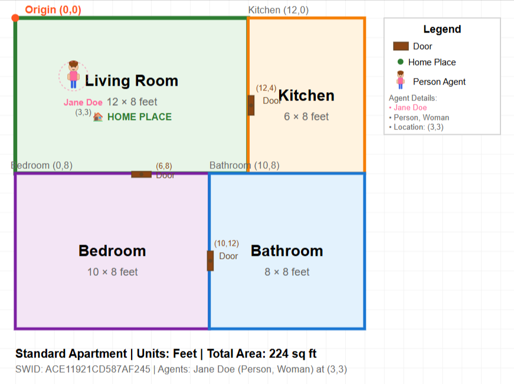

Several key points:
* _None of this has been normalized yet within the working group, so may change._
* The () notation indicates an ordered linked list, which is used for any ordered sequence of items in RDF.
* The use of the blank node (underscore notation) is to create local identifiers rather than global identifiers, and will be replaced by system scope identifiers when loaded into the graph.
* Hyperspace here is identified by three places - an origin and two orthogonal vectors. 
* Units are treated as conceptual entities in the taxonomy and are defined at the level of the spatial web node. If units are not included, then the default is an undifferentiated unit. 
* The domain identifies the active places within the system (coordinate axes are usually not included as they don't normally take active agents).
* Each place has a location that identifies where it is relative to either a global coordinate system or a custom (relative) system.
* Agents are attached to places via the hsml:hasAgent predicate. In this particular case, the agents are doors with attached links that allow for transit between two rooms. Note that the door or portal agents have locations within the local coordinate system (and can have extents, though they are not necessary here). There is an additional icon showing a person and their current position within the apartment. 
* The `hsml:hasExtent` predicate identifies the boundaries of a place. Note that such boundaries may be multi-dimensional in nature, and may be specified in a number of different ways. The `hsml:hasTopic` predicate can be used to clarify how this boundary is expressed, as indicated in the section [Extending Entities](#extending-entities).

### Maps, Icons and Representations

A __map__ has a very general meaning in HSML: it is a ___representation___ of a domain. A domain is a restful entity - it has an internal representation within the associated graph- but for a number of reasons the graph that gets produced when a request is made about a domain or other entity will likely not be identical to the internal graph, but will rather be a computed graph (as JSON-LD or similar structure).

There are three alternative approaches that can be taken with regard to representation. 

#### Thin Client (Declarative - Wave 1)

This was the original approach taken with the web from about 1993 to the early 2000s. In this case, HTML was the declarative language that defined the structure of a web document, and while there was a limited amount of interaction via scripting (Javascript arrived in December 1995), for the most part the client experience tended to vary from browser to browser. Significantly, it should also be noted that most documents were comparatively small and self contained, meaning that all of the state of that document could be transmitted as a single message.

#### Thick Client (Imperative - Wave 2)

This approach had its heyday from about 2005 to around 2022, and primarily involved the increasing use of Javascript to build applications of increasing complexity, while at the same time, building on increasing standardization on both core functionality (e.g., ECMAScript) and the increased modularization of defineable web components. In general, this approach works best for a clearly defined client - the browser page in effect acting as a platform for development of specialized clients.

#### Thin Client Streaming (Declarative - Wave 3?)

This is the rise of the chat interface - in essence a continuous stream of information that emerges as part of the prompt/response pattern inherent with LLMs and GenAI systems. This approach shifted the interface from being primarily static and fixed to one that reflected a continuous update, and has since shifted into a multimodal design pattern involving just-in-time editors being launched to create or edit objects that are generated as artifacts.

Ideally, the spatial Web should support all three of these modalities. There are two aspects that are important in all of these, however. First is the fact that the Spatial Web is temporal in nature as well as spatial - a typical application will not make one query against a particular system, but more than likely will continuously ask for changes in the state of that system. In essence, a connection is stateful, reporting the state of a system repeatedly until it is told not to. At the same time, there is a compelling use case for providing a historical rendition of a given domain or agent as it changes over time.

This implies that the third case - streaming - will like be a major use case, which is actually one of the key advantages of using RDF. A typical interchange in this scenario may be as follows:

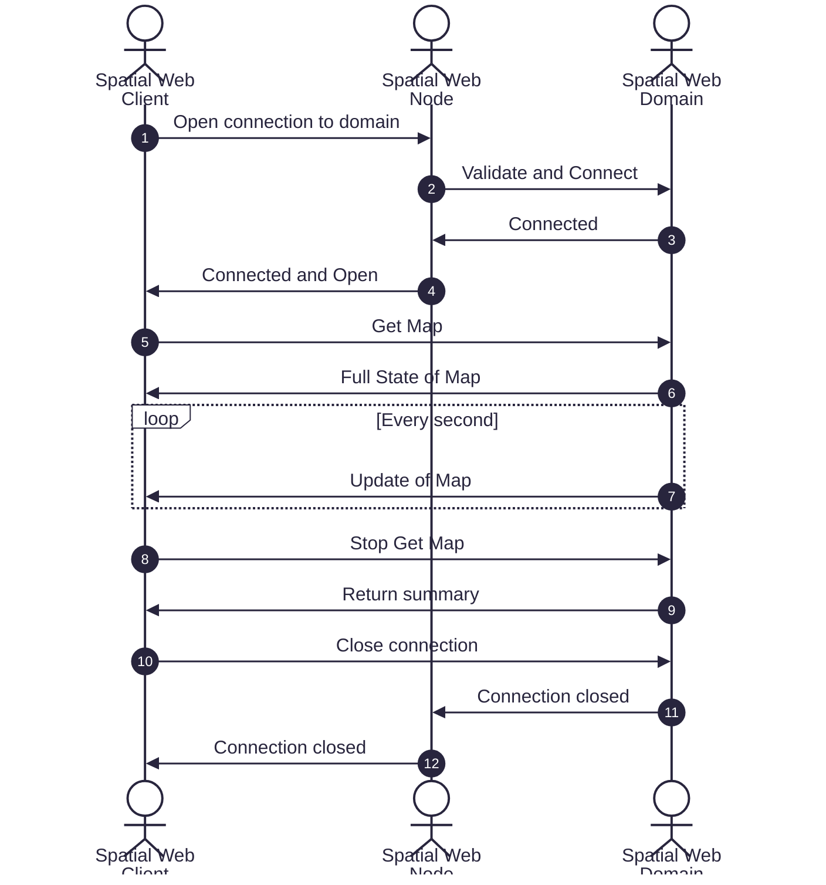
In this particular case, the user requests an hsml:Map object (not currently defined) which can be represented as a JSON instance or Turtle stream that gives the current state of the domain, then periodically a delta indicated a state change. For the apartment as an example, the map would indicate the full state of the map domain as given above (assuming the user has the correct permissions). Thereafter, 
the domain will send messages along the lines of:

```
<<__:JaneDoe hsml:hasLocation (7,3) >> hsml:message [ hsml:status hsml:DeleteNode;
hsml:time "2025-08-04T09:10:11"^^xsd:dateTime ;
].
<<__:JaneDoe hsml:hasLocation (8,4) >> hsml:message [
hsml:status hsml:AddNode;
hsml:time "2025-08-04T09:10:11"^^xsd:dateTime ;
].

```
where _:JaneDoe resolves to the internal identifier for the agent, and <<>> indicates a reifier for the statement.

To summarize, the client requests that the Spatial Web Node opens a connection to a domain, handing back the channel key for that domain to the client for direct communication. Once the key is open, the client requests a map (i.e, descriptive representations) that gives the relevant queried context for the domain in question as a structure, then, as the environment changes, provides updates to the map indicating when resources have changed.

When the client sends a message to stop, the server will stop the update and generate a new whole map that reflects the state of the domain at the end of the run.

Note that this process can be interspersed with commands to the representative agent within the domain. The commands coming from the client do not directly change the state of the domain. Rather they indicate to the domain that the agents should be directed to change their configuration to either achieve the goal or determine that they can't achieve the goal. An internal loop then manages the updates to the graph to set the relevant changes in state within the various agents in the domain.

Note that this approach can also work well when you have multiple agents that are interacting in the same domain, driven by different external clients (or internal autonomous agents).

### Icons

The Spatial Web by itself is not meant as a vehicle for transmitting imagery or 3D models, but because what it does generate are descriptions of physical systems, it is frequently desireable to have some way of indicating to a spatial web client how it should represent the entity in a map or projection. This is the role of icons, as represented by an `hsml:Icon` entity.

An __icon__ is an entity with a reference to either an internal or external media source, likely in the form:

```
[] a hsml:Place ;
     hsml:topic <#concept/Countries/Canada>
     hsml:hasIcon [
        hsml:href <#images/maps/Canada.jpg> ;
        hsml:hasMediaType <#concept/mediaTypes/Image> ;
     ] .
[] a hsml:Agent ;
     hsml:topic <#concept/People/JaneDoe>
     hsml:hasIcon [
        hsml:href <#images/icons/JaneDoe.jpg> ;
    ] .
[] a hsml:Agent ;
     hsml:topic <#concept/Building/EiffelTower>
     hsml:hasIcon [
        hsml:href <#images/icons/EiffelTower.png> ;
        hsml:hasMediatype <#concept/mediaType/Image>
    ], [
        hsml:href <#models/icons/EiffelTower.obj> ;
        hsml:hasMediatype <#concept/mediaType/3DModel>
    ] .
```

The `hsml:href` is a pointer to the media resource in question, while `hsml:mediaType` indicates which media type it is used. This may be inferred based upon the extension in the href resource if this is known (as in the second example). The media type is used primarily to indicate to the user client how the resource should be displayed.

For instance, in the third example, you have an agent representing the Eiffel Tower in Paris, France. If the user client is a 2D browser, then this may be represented as a transparent PNG file on top of a map. On the other hand, if the client is a 3D browser, this may be represented using the EiffelTower.obj 3D model.

Icons can maintain positional and orientation information appropriate to the entity. The goal with such icons is not necessarily to provide a precise representation or rendering, but rather to provide to the user agent a way of constructing an approximate representation to indicate symbolic relationships.

Note that a given entity may include both an icon and a link. The link is an abstraction on the entity, not the icon.

### Extending Entities

While the Spatial Web makes use of core classes such as Domain, Place, or Agent, the use of a traditional class mechanism for identifying different kinds of entities breaks down quickly when dealing with the sheer number of potential classes that could be created.

To compensate for this, and to better work within the domain framework, a SHACL framework is defined that can identify nodes contextually using topics and state dependencies. For instance, suppose that you wanted to add a property to a given country called population. In this case, a property node can be added via SHACL.

```
[] a hsml:Domain ;
    hsml:hasShape [
        a sh:NodeShape ;
        sh:targetClass hsml:Place ;
        sh:property [
            a sh:PropertyShape ;
            sh:path ex:population ;
            sh:nodeKind sh:Literal ;
            sh:datatype xsd:nonNegativeInteger;
            sh:minOccurs 0 ;
            sh:maxOccurs 1 ;
        ],[
            a sh:PropertyShape ;
            sh:path hsml:hasTopic ;
            sh:nodeKind sh:IRI ;
            sh:class hsml:Topic ;
            sh:value <#concept/Country> ;
        ]
     ] .
```
In this case, the domain holds the shape definitions via the `hsml:hasShape` property, and when the domain is instantiated, this provides information to the system about how the given property or properties are implemented. 

For instance, in this particular case, the place (a country) is defined with a property `ex:population` as well as a second property `hsml:hasTopic`. The first is considered valid if it has a nonNegative integer (and is an optional parameter), the second is considered valid if the hsml:hasTopic property has the value <#concept/Country>. If either of these are not true for the place, then the structure generates an error for the shape.

Within the graph, then, this would be applied to the Canada place node as follows:

```
[] a hsml:Place ;
    hsml:swid did:swid:0CANADA ;
    hsml:swurl <#country/Canada> ;
    hsml:hasTopic <#concept/Country> ;
    ex:population 32159219 ;
    .
```

This makes it possible to add any number of properties to entities within the domain in question, as well as to set constraints that more accurately specify things such as topicality or state configurations.

Note that common shapes can be bound specifically to reference domains and included or imported, as specified in the section [Importing Taxonomies and Schemas](#importing-taxonomies-and-schemas).

### Security and Credentials

A central part of the Spatial Web is the use of secure credentials in order to maintain ___surety___ within the web, where __surety__ can be defined as the verification that an assertion being made about a particular entity was valid.

Surety is made possible through the use of credentials that can be issued both by spatial web nodes that identify that specific resources have been created by that node, as well as assertions made by external authorities that a given agent has the relevant credentials to perform specific activities pursuant to a contract.

The mechanism that binds these credentials is the __Spatial Web Identifier__ (or __SWID__), which is a specific key that references a credential ___within___ the Spatial Web Node. This key is a ___decentralized identifier___ (or __DID__) according to the [W3C DiD Specification](https://www.w3.org/TR/did-1.0/). All DiDs issued by a spatial web node are further considered to have a SWID method that indicates that such credentials follow the Spatial Web standard (D3.3.1). The specific format for such credentials is still being worked out.

#### Credential Stores and Addresses

The __credential.d__ daemon is responsible for both the issuance of SWIDs as well as the resolution of SWIDs. It is _recommended_ that each Spatial Web node maintains a specific cache of credentials that are issued by it as part of the domain graph architecture, with the SWIDs then being treated as identifiers by the system to those credentials.

A credential in this particular case can serve primarily as a passthru reference to an external DiD that has a specific issuer that can be resolved within the internal SW Credential structure, and which utilizes a separate addressing mechanism (such as https) to identify the location of the issuing server _if that server is not the current spatial web node_.

A SWID is ___not___ a ___Spatial Web URL___ (__SWURL__). The SWID serves to either identify the credential within the current Spatial Web Node or, through reference, to point to the location of an issuing server, while the SWURL provides an address (a ___Uniform Resource Locator___ or ___URL___) to a resource within the broader spatial web network, which in turn may have a SWID to its relevant credential.

The D3.3.1 specification indicates that all entities must have SWIDs. This perforce indicates that all entities must have credentials. It should be noted that not all credentials issued by the spatial web nodes _must_ be cryptographically secure, though this may be a requirement imposed within a future specification.

#### Credential Issuance

A Spatial Web node is able to issue credentials to all entities that it creates. When that entity, such as a domain or agent, is created within the domain graph for the node, the SW Node will issue a cryptographically bound SWID that is associated with that entity and that consequently provides surety for the existence of that entity throughout the entity's life span.

Moreover, when an entity undergoes a material change, such as an agent moving from one domain to another which necessitates the creation of an additional proxy between those domains, then a new credential is issued indicating the change of "ownership" of that entity, along with a pointer indicating the previous owner (in effect forming a transitive chain). Such SWID transfers act, in effect, as a chain of custody for the resource.

One key point - an entity is always bound to its spatial web node. The flipside to this is that ___each spatial web node issues its own SWIDs___. Put another way, there is no centralized authority for the issuance of SWIDs on resources. Instead, to find a given entity, you use the SWURL for that entity to locate it in the Spatial Web, then you validate that the entity is as stated based upon its credential on the indicated node.

Additionally, additional credentials can be bound to the same SWID, a key point in making contracts work. These are typically tied into activities and norms and often require multiple different SWID holders to create a contract with its own SWID that binds the activities of agents together as specified by the boundaries of the contract itself. This work is still under development.

#### Credential Revocation and Registries

Just as the Spatial Web Node is the issuer of a credential, so too can it revoke a particular credential to indicate that the credential is no longer valid. Note that Spatial Web Nodes can also issue credentials indicating membership by other spatial web nodes within an affiliated network for which it acts as a registry.

This in turn means that revocation of a given spatial web node from a given affiliation network is never accomplished by that node, but rather by the affiliation holder, unless the registry node is also part of the affiliation network (ie, is self registering).
> __Editor Note__: It may be that a given registry is explicitly not a part of its own affiliation network. This is still to be determined, as it has implications on what a registry node can support.

Because a spatial web node has its own implicit home domain, a node can be removed from a network by revoking the credentials of the home domain for that machine. The machine is still findable via a URL, but the lack of credentials mean that the request for data can't validate (it will send back an error across hstp indicating the data won't validate).


