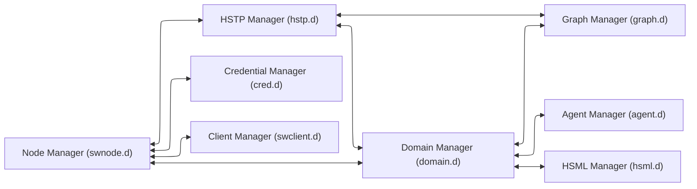
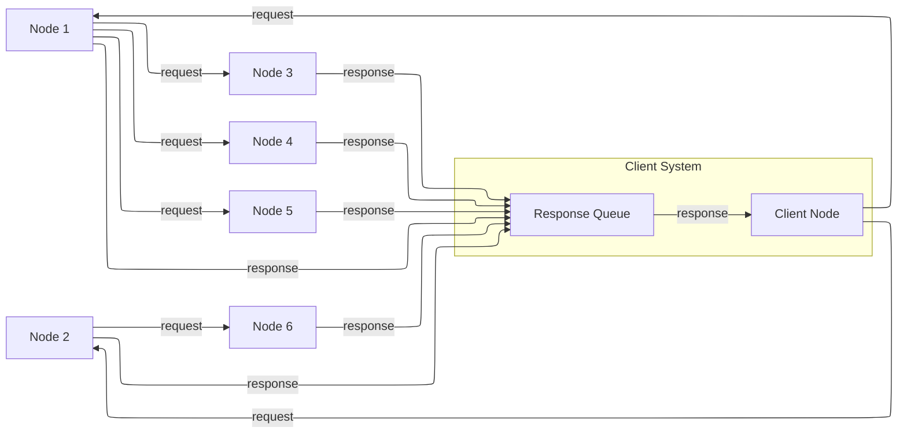
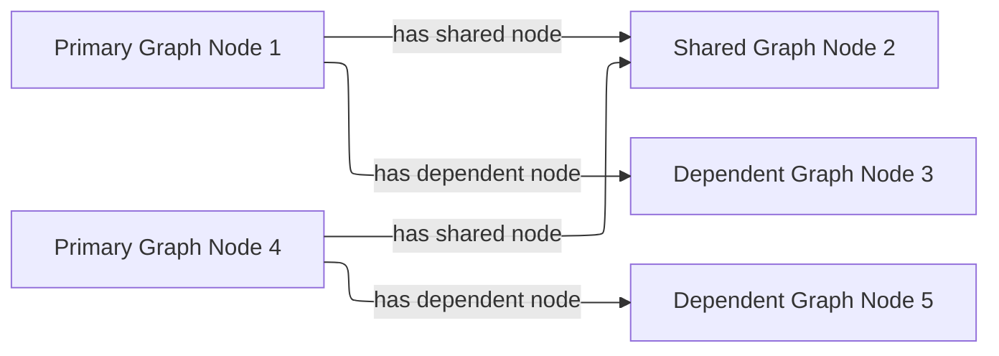

# Design of a Spatial Web Node

This section focuses primarily on the broad scope of the spatial web node system. 

A spatial web node is the abstraction of a long running application (the node daemon) that connects to other spatial web nodes to provide information about specific HSML domains or the structures that support them, communicating over the HSTP protocol. 
Like most modern web applications, a spatial web node can support both a server that maintains state of a domain graph model and provides stateful content (as HSML) and a client that can render that HSML in a form that a service or user can understand. The state of the domains is maintained within a specially design ___domain graph___ (currently built on top of a semantic RDF knowledge graph, though this likely will be hidden as an abstraction).

The node is controlled by a specific daemon (or persistant process) called the Spatial Web Node Manager (indicated by the swnode.d process). The precise implementation of the node will vary, but at least to start with, it will usually run on a specific port (or more likely sets of ports) on a given machine.

The role of the node daemon is to orchestrate the node's various activities, as shown in the following listing:



## Spatial Web Managers

### HSTP Manager

This handles message routing from both external agents (users) and from other spatial web nodes, taking in HSTP based messages carrying HSML and payloads and transmitting HSTP responses back to users or (through the onboard client) to other nodes. These messages are generally sent to the domain manager, rather than executed directly. (Note, this is different from the current implementation, though the primary change will likely just be which system handles these executions).
### Domain Manager 

The domain manager has a number of roles:
    * generates a domain thread from a domain template and populates it with appropriate agents, things and places. 
    * works with the system clock (an internal tick) to invoke the activities on that thread of the relevant agents, which in turn is used for autonomous and semi-autonomous agents working in a state graph system,
    * translates HSTP messages into UDG notifications for autonomous agents.
    * manages inter- and intra-agent communication within domains
    * determines whether the domain has reached critical states (such as an end state in a simulation)
    * communications with the node domain graph to read and update state within the graph.
    * passes relevant map responses (entity streams) back to the hstp manager.
### Graph Manager 

The graph manager is a low level service that interacts directly with the graphs within the node in order to provide an abstraction layer for graph management. It performs a number of functions.
    * Translates HSQL query requests and updates into the implementation specific requests of the current graph technology. This exists primarily to ensure that there are no explicit dependencies upon the underlying graph store.
    * Provides a mechanism to add multiple external graphs to the current graph so that they can be queried as if they were a single graph. This is what is known as a federated graph (and it is currently just specific to RDF, but that may change). Such a graph doesn't necessarily scale well towards a large number of nodes (>100), but it can be very useful when building a domain that scales across multiple machines. By separating the graph manager from the domain manager, it becomes possible for the domain manager on one machine to work with multiple nodes simultaneously without having to go across hstp.
    * Graph replication. Replicating a graph (while something of an edge case) is easy enough to accomplish at the graph layer; RDF has global identifiers, and as such a graph can be replicated by simple serialisation into any RDF format. Record deduplication is similarly straightforward, as RDF is specifically built to work on an index format such that multiple resources with the same URI automatically to the relevant ntuple index. This is one of the many reasons that RDF is recommended from the graph layer.

### HSML Manager 

HSML is used to describe the state of domains within the graph, but it is also used to indicate activities, frames of activity over time, conditional expressions and contexts, both within the domains and within HSTP messages containing relevant changes and credentials. The HSML process is used in conjunction with the domain managers to provide indications of how entities change. It is not necessarily a daemon, but instead exists primarily as an interpreter that can then pass information off toe domain manager to implement, generally through the graph manager interface.

### Agent Manager 

Things within domains are agents. An agent can be thought of as something that is capable of change within a domain, with the most prominant such change being a change of motion within some phase space, or a change of state. The agent manager performs a number of roles.
    * The domain manager typically manages the the "tick" of the system clock and its dissemination to the various agents. The agent manage is what interprets the messages of the domain to any given agent.
    * Agent may be passive (they can only be activated by activities from other agents), active (they are capable of action independent of other agents), or inactive (they do not receive messages except for messages to activate in either passive or active mode). The inactive state exists primarily to reduce the number of cycles that a given agent requires for processing if not necessary.
    * The agent manager handles moving an agent from place to place, either through linking or through replication across domains over spatial web node boundaries. If linking between such boundaries (typical, for instance, accross affiliated nodes that have similar domain constraints), then the agent manager will freeze an agent (make it inactive and hidden) on one machine, and will then replicate the agent on a different spatial web node, or updating the existing history of the agent to an existing proxy on a different node.
    * Agents maintain an internal state history, the mechanisms for which are TBD, through the interface of the agent manager (there may be a history manager that specifically handles that operation, again TBD)

### Credential Manager 

The credential manager handles the creation of SWIDs on agents, places, and domains, as well as caching credentials from external hstp invocations, in effect acting as the wallet for the various domains within the node. This will typically be a proxy for various types of accredidation and verification mechanisms. Full implementation TBD.

### Client Manager. 
This is a low level __command line interface__ for text-based communication with a spatial web node. Every node supports some kind of CLI interface and may support others (multimodal chat, 2 or 2 1/2 D maps, 3D environments, animations, and so forth).

## Distributed Graphs

There are two distinct methods that can be used for querying the state of a domain within a spatial web node: [___HSTP Node Queries___](#hstp-node-queries) and [___UDG Graph Query___](#udg-graph-queries). Both of these work on the [___Domain Graphs___](#domain-graphs) for a given node, but do so in very different ways.

### Domain Graphs

The __Domain Graph__ for a given node consists of a semantic graph that represents all of the domains along with the relevant definition files (schema files) and relevant scripts (activities and policies). This domain graph is currently represented using RDF (the Resource Description Framework), though it is possible that this may be replaced by other graph description languages in the future.

A domain is controlled by one and only one domain manager on a spatial web node, and a domain does not extend beyond that node.  This makes it possible to effectively manage containment and synchronicity, as well as to ensure that the same active agent does not appear on multiple services node servers at the same time.

### HSTP Node Queries

An HSTP Node query is typically sent from a client or another spatial node, and it usually queries the state of a given domain or set of domains (or updates that state through an interface call). Such queries represent the majority of calls in the spatial web, and are usually bounded by credentials that determine whether a given querant (an external agent) can in fact get specific information about the domain from the perspective of that domain.

Node queries are often sent to a cluster of different nodes simultaneously, where there is no guarantee that the nodes in question are even in the same network. Such queries get back maps - descriptions of a given node limited by the permission layers and scope of the querant that provide a view of relevant and available items in each domain. It should be noted that such node queries are usually expressed as HSQL, and consequently are filtered prior to being executed in the native query format of the graph.

Such queries can also be submitted to other nodes from a given node as a form of forwarding, though there is an upper bound as to how deep such queries can be, using the HSTP messaging envelope to indicated where the resulting response(s) should be sent.



In the diagram, a client node sends out a query to nodes 1 and 2, which in turn both sends a query to node 3,4,5 and 6. Each node then sends its response a response queue to the client. It should be noted that in such a query, there is no guarantee of order; the nodes return responses when they have completed the query. The response queue exists to determine whether all items have either returned a response or indicated that they have timed out, and if necessary to transform the response into a form that the client can use.

Just as every node has a client manager, every node also has a response queue, which contains response messages sent over hstp through hsml channels.

Again, it's worth stating that the HSTP Node query ONLY talks to domains within a the node, though it can parameterize requests to just get one specific agent within a domain, and it never communicates directly with the domain graph.

### UDG Graph Queries

Each domain graph contains a wealth of information, but much of it should not, for one reason or another, be directly exposed to a query. This is where graph queries come in.

A __UDG Graph Query__ is a query that is made through the graph manager, typically in the native language for that graph, and then accessible via a named query or update. This query communicates with the full graph that is accessible to the node.

The HSML for the domain includes soft links to dependent graphs, called SERVICES. A __Service__ is a graph endpoint that can be queried directly from within the graph language as if it was a specialized named graph (this is supported by most modern RDF forms). Once defined, such graphs are otherwise undistinguishable from normal queries, save that they may have intrinsic latencies. Such endpoints do not necessarily need to be spatial web nodes, they just need to be able to serialize content.

This implies that a spatial web dependent node may need to expose a graph endpoint independent of the node itself. In the current implementation, this would be a SPARQL or SPARQL Update endpoint, but this isn't necessarily a requirement.

The dependent UDF graph neighborhood, unlike the SW Node query neighborhood, is linear - you attach a dependent graph to the independent node, but it's not a multi-tier peer-to-peer network.

Additionally, there are security risks that you have working with UDG Graph Queries that you don't have working with node queries, as these DO have access to information that is not protected by credentials. As a consequence, USG Graph Queries are considered to be accessible only to the domain or node authority, but not to most users or external agents.

### Combining the Two

There is no reason why you cannot have both node queries and UDG queries in the system. For instance, you can add multiple dependent graphs to the primary graph in a given domain so that they can distributed across multiple machines. You can then perform a node domain query on the federated distributed graph, treating it as if was a single large graph that just happens to span more than one node. Moreover, there is no formal requirement that a graph extension is a spatial web node, only that it have the appropriate endpoints for graph access. 

This approach will likely actually be the norm, especially for large scale domains such as multi-user role playing games, simulations, tours, and large scale IoT systems. If there are common resources (such as schemas, taxonomies, scripts and so forth), then these might be contained in a separate graph server node that is then attached to the primary graph but used by multiple spatial web nodes at once (what's called a shared node). 


In the above illustration Node 2 is a shared node between node 1 and node 4.

Dependent nodes are also called content nodes, in that they are able to store content that may not necessarily be HSML specific. _Note that while a spatial web node can also expose a graph endpoint interface, content nodes that do not also have a node manager are not considered spatial web nodes per se._

### Registering Dependent Graph Nodes

Graph and Content Nodes can be registered in one of three ways. 

#### Static Registries
The first is a static registry, where links to the nodes (typically as html links) are stored in the active graph for the node itself. These are "permanent" graph nodes, in that they are automatically linked when the spatial web node boots up or reboots. These are typically shared nodes, graph registries, taxonomies, code modules or similar content. 

#### Domain Graphs

A domain can similarly attach an additional graph when it first starts up through the domain manager. Such graphs are only accessible within the scope of the domain, and when the domain is disinstantiated, the connection to the graph is lost. Domain graphs are especially useful when you have a lot of domain specific content in a graph, such as taxonomy information, narrative lore, and so forth. As with static registries, the connections are endpoints, meaning that he specific internal implementations are unimportant, meaning that such domain graphs could be knowledge graphs, databases, LLMS and so forth. Note that, as with static registries, write access to these resources will be system dependent.

#### Activity Graphs

An activity graph is a graph endpoint that is invoked dynamically based upon a specific algorithm, and is usually used to pass data from external processes to internal processes (though if the graph is read/write it can also be used to update external content). Activity graphs are parametrically invoked and are transient.

### Named Queries and Security Considerations

Graph extensions are, by their very nature, insecure, primarily because they exist outside of the scope of the credentialling system utilized by hstp. As a consequence, most hstp queries will likely be invoked via a particular name, with parameters passed as a dictionary to the graph manager. This will likely be passed in a manner similar to MCP or the OpenAPI format. 

At no time should HSTP directly call the system graph query language; it should always go through some kind of hosted proxy (the graph manager). There are several reasons for this:
* This provides an operational security layer, making it possible to validate an incoming request before performing the query both from a functional and permissions standpoint.
* The invocations better match the declarative visibility principle - an agent can only "see" a given activity if it has the relevant credentials to do so.
* This keeps operational and sensitive data hidden from hacking through HSTP, and it ensures that output can be transformed into "clean" versions that removes such sensitive information before it gets sent back as part of a response.

Named queries and mutations are defined within activities at various scopes. Any query on a domain, for instance, would in turn invoke a graph query that is specific to that domain, and may be customed to refer to a particular agent (or agent(s)) or place(s) in the system. It's worth noting that the domain itself has access to all aspects of the graph, including the agents and places within the domain.

### Understanding Graph Queries

Graph queries are somewhat different from traditional data structures. In a normal query, you typically pass an identifier (or some descriptive metadata), and return a document or a list of identifiers (with metadata) to documents.

In a graph query, however, there are typically two different kinds of query. The first is similar to a search result - a table consisting of fields of value. This is very much akin to a SELECT query in SQL, and this form is useful for generating reports and maps. For instance, given the current architecture, the following query retrieves a list of all of the agents in a given domain (here, a list of people in a given building)

```sparql
# Sparql

SELECT (?personLabel as ?Person) (?roomLabel as ?Room) 
WHERE {
    ?person a Class:Person .
    ?room a Class:Room.
    ?person rdfs:label ?personLabel .
    ?room rdfs:label ?roomLabel .
    ?room Place:hasAgent ?person .
    ?domain Domain:hasAgent ?person .
    ?domain Domain:hasPlace ?room . 
} order by ?Room ?Person

```

This generates a table:

| Person |  |
|--|--|
|Jane Doe|Room 101|
|Karen Free|Room 101|
|Bill Barnes|Room 103|
|Alice Nims|Room 205|
|Michel Thrush|Room 207|
|Stephen Blain|Room 302|
|Leeane Hardin|Room 302|

In this case, the select statement reads labeled properties from the WHERE statement, which in turn matches assertions in the graph, resulting in a subgraph.

```turtle
# Turtle
Agent:JaneDoe a Class:Person ;
    rdfs:label "Jane Doe" ;
    .
Place:Room101 a Class:Room ;
    rdfs:label "Room 101" ;
    Place:hasAgent Agent:JaneDoe, Agent:KarenFree ;
    . 
Place:Floor1 a Class:Floor ;
Place:contains Place:Room101, Place:Room102,
    Place:Room103, Place:Room104 .

Place:ApartmentBuilding1000 a Class:Building ;
    Place:contains Place:Floor1, Place:Floor2,
        Place:Floor3 .

Domain:ApartmentScenario_123 a Class:Domain ;
    Domain:hasAgent Agent:JaneDoe, Agent:KarenFree, ... ;
    Domain:hasPlace Place:Room101, Place:Room102,
     Place:Room103, ... ;
    .
... 
```

Construct statements can then be used with the same WHERE statement to generate the subgraphs as Turtle, RDF/XML or JSON-LD, along with additional metadata. 


```sparql
# Sparql

CONSTRUCT {
    ?person ?personP ?personO.
    ?room ?roomP ?roomO.
    ?domain ?domainP ?domainO.
}
WHERE {
    ?person a Class:Person .
    ?person ?personP ?personO.
    ?room a Class:Room.
    ?room ?roomP ?roomO.
    ?person rdfs:label ?personLabel .
    ?room rdfs:label ?roomLabel .
    ?room Place:hasAgent ?person .
    ?building a Class:Building .
    ?building Place:contains+ ?room .
    ?domain Domain:hasAgent ?person .
    ?domain Domain:hasPlace ?room .
    ?domain ?domainP ?domainO. 
} order by ?Room ?Person

```

This will give you the graphs of ALL of the domains with all of the agents in all of the places in each domain, where the agents are people, and the places are rooms.

Most SPARQL queries are constraint queries - they limit the facets so that rather than dealing with a potentially huge graph, you are dealing only with constrained subgraphs. For instance, if you only wanted rooms that are in a specific building, in a certain domain, you could parameterise the query to constrain the query. 

For instance, you can use the above query and set the variable `?building` to the IRI `<Place:ApartmentBuilding1000>`. This would give you all occupied rooms in _Apartment Building 1000_ across all domains that contain that apartment building.

The same query, however, could also take as an argument the `?person` variable with value `<Person:JaneDoe>`. Since there should only be one active agent in the spatial web with this identifier, this will also tell you what apartment building, floor, and room that particular agent is located in.

This is an important point, because it means that the results of a query will be dependent upon a linear dictionary of named variables and values passed to the query. This flexibility makes SPARQL queries much more powerful than their SQL counterparts, especially when you can also use inferencing to determine the relationships between structures.

### Named Queries and Metadata


