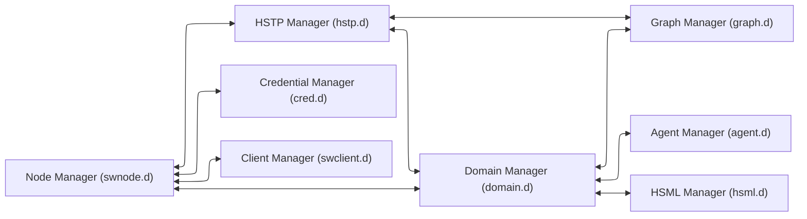
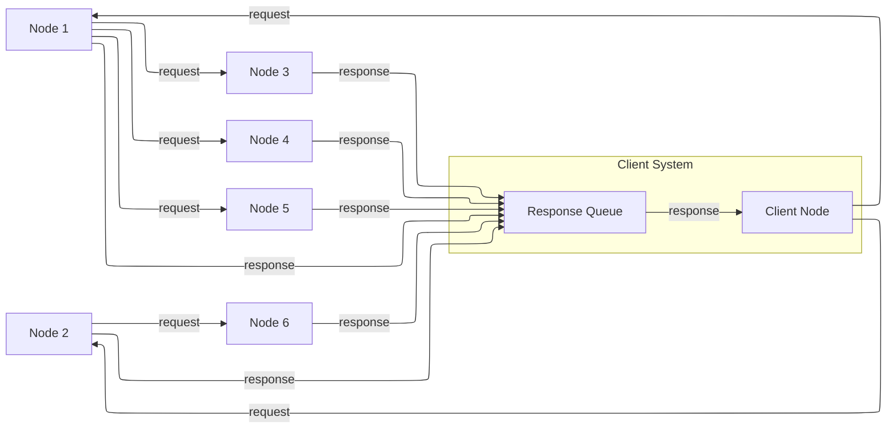
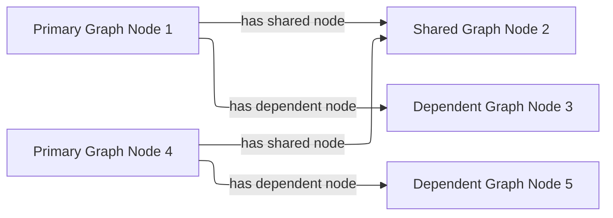
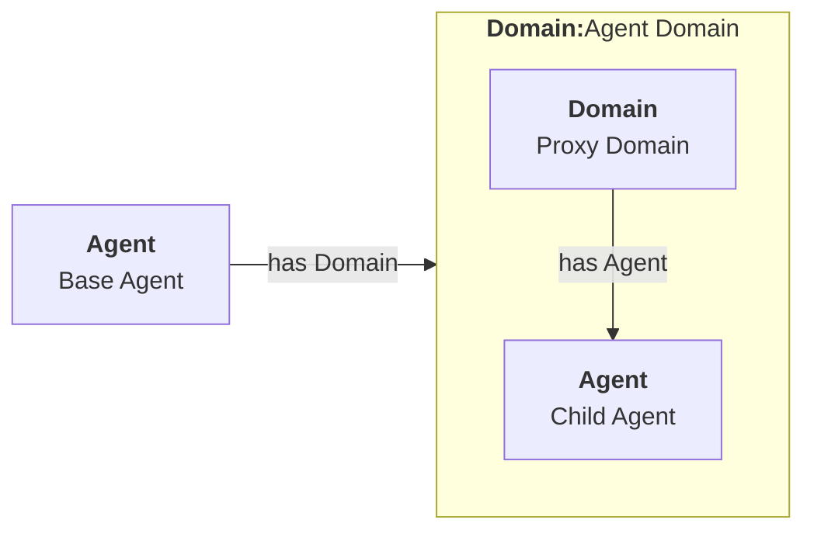
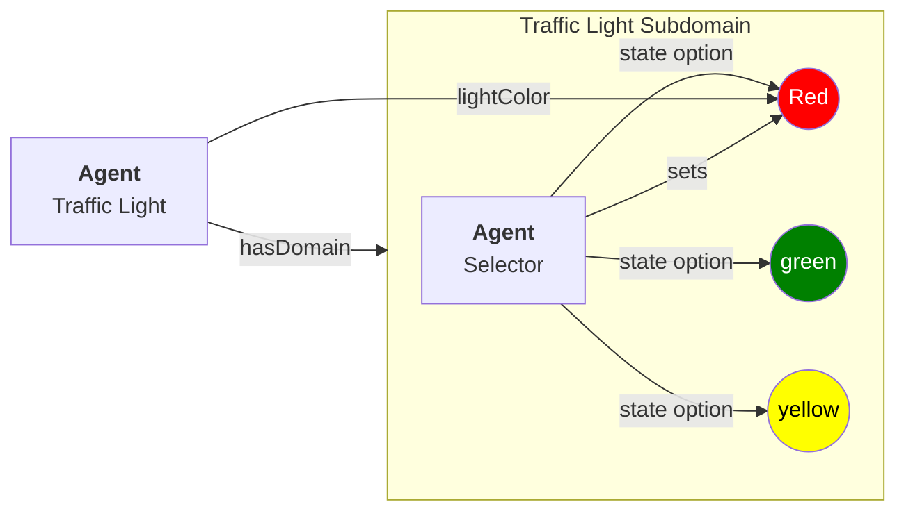
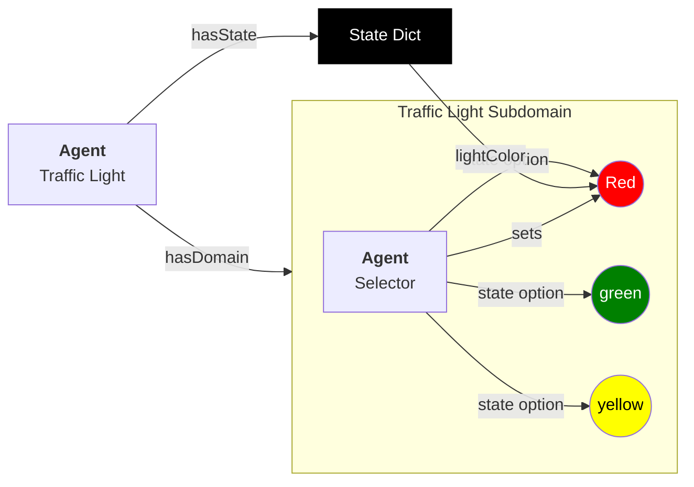
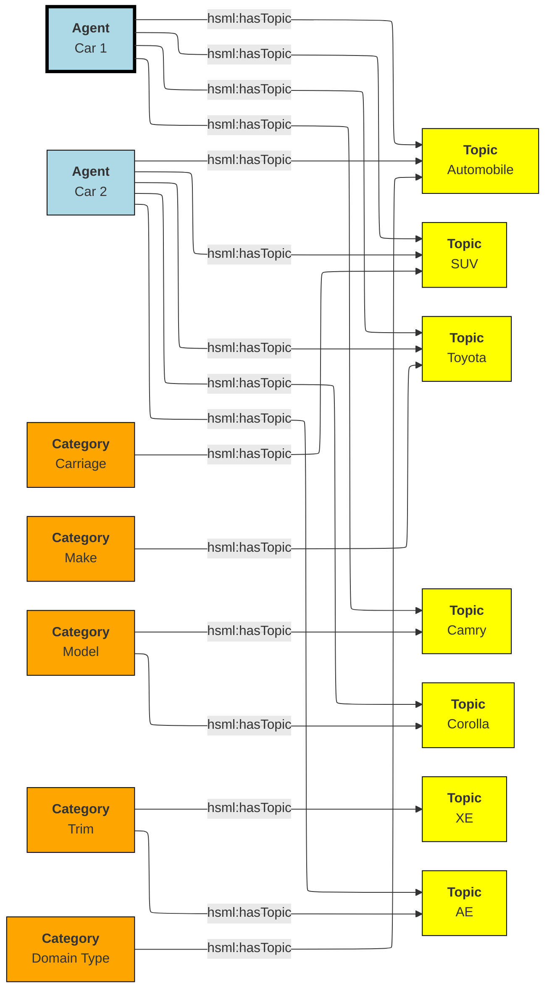
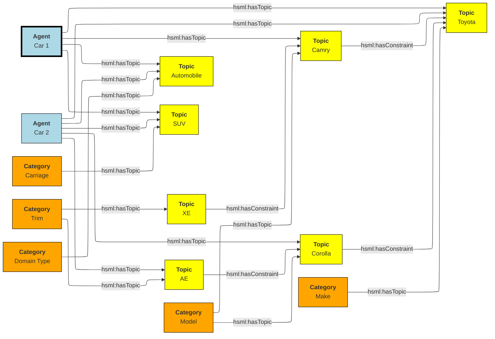
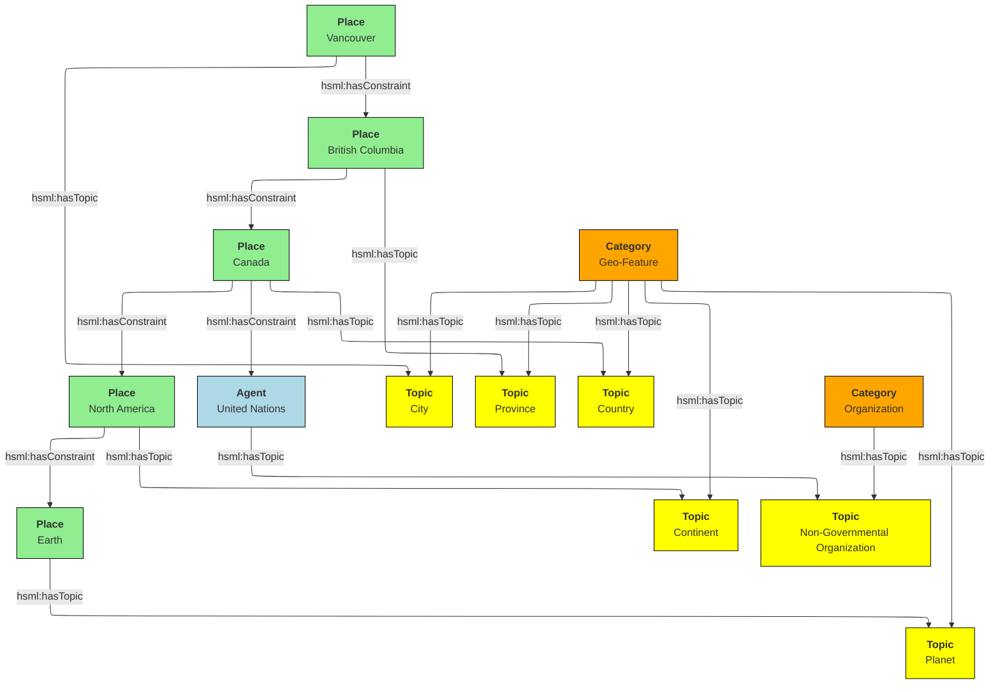
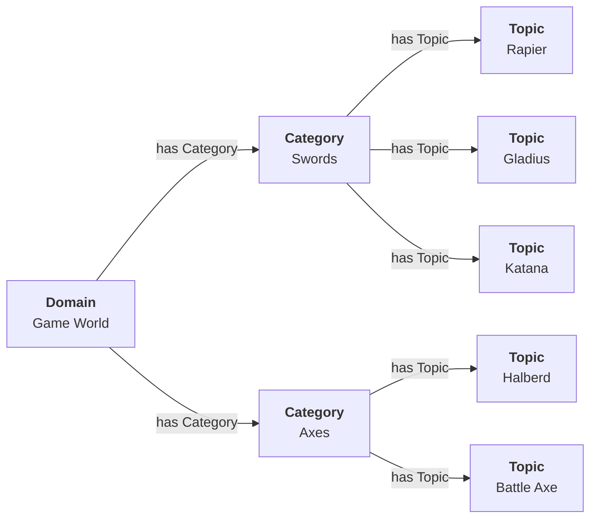

# Spatial Web Design

This section focuses primarily on the broad scope of the spatial web node system and how it interacts with the UDG. 

A spatial web node is the abstraction of a long running application (the node daemon) that connects to other spatial web nodes to provide information about specific HSML domains or the structures that support them, communicating over the HSTP protocol. 
Like most modern web applications, a spatial web node can support both a server that maintains state of a domain graph model and provides stateful content (as HSML) and a client that can render that HSML in a form that a service or user can understand. The state of the domains is maintained within a specially design ___domain graph___ (currently built on top of a semantic RDF knowledge graph, though this likely will be hidden as an abstraction).

The node is controlled by a specific daemon (or persistant process) called the Spatial Web Node Manager (indicated by the swnode.d process). The precise implementation of the node will vary, but at least to start with, it will usually run on a specific port (or more likely sets of ports) on a given machine.

The role of the node daemon is to orchestrate the node's various activities, as shown in the following listing:



## Spatial Web Managers

### HSTP Manager

This handles message routing from both external agents (users) and from other spatial web nodes, taking in HSTP based messages carrying HSML and payloads and transmitting HSTP responses back to users or (through the onboard client) to other nodes. These messages are generally sent to the domain manager, rather than executed directly. (Note, this is different from the current implementation, though the primary change will likely just be which system handles these executions).
### Domain Manager 

The domain manager has a number of roles:
    * generates a domain thread from a domain template and populates it with appropriate agents, things and places. 
    * works with the system clock (an internal tick) to invoke the activities on that thread of the relevant agents, which in turn is used for autonomous and semi-autonomous agents working in a state graph system,
    * translates HSTP messages into UDG notifications for autonomous agents.
    * manages inter- and intra-agent communication within domains
    * determines whether the domain has reached critical states (such as an end state in a simulation)
    * communications with the node domain graph to read and update state within the graph.
    * passes relevant map responses (entity streams) back to the hstp manager.
### Graph Manager 

The graph manager is a low level service that interacts directly with the graphs within the node in order to provide an abstraction layer for graph management. It performs a number of functions.
    * Translates HSQL query requests and updates into the implementation specific requests of the current graph technology. This exists primarily to ensure that there are no explicit dependencies upon the underlying graph store.
    * Provides a mechanism to add multiple external graphs to the current graph so that they can be queried as if they were a single graph. This is what is known as a federated graph (and it is currently just specific to RDF, but that may change). Such a graph doesn't necessarily scale well towards a large number of nodes (>100), but it can be very useful when building a domain that scales across multiple machines. By separating the graph manager from the domain manager, it becomes possible for the domain manager on one machine to work with multiple nodes simultaneously without having to go across hstp.
    * Graph replication. Replicating a graph (while something of an edge case) is easy enough to accomplish at the graph layer; RDF has global identifiers, and as such a graph can be replicated by simple serialisation into any RDF format. Record deduplication is similarly straightforward, as RDF is specifically built to work on an index format such that multiple resources with the same URI automatically to the relevant ntuple index. This is one of the many reasons that RDF is recommended from the graph layer.

### HSML Manager 

HSML is used to describe the state of domains within the graph, but it is also used to indicate activities, frames of activity over time, conditional expressions and contexts, both within the domains and within HSTP messages containing relevant changes and credentials. The HSML process is used in conjunction with the domain managers to provide indications of how entities change. It is not necessarily a daemon, but instead exists primarily as an interpreter that can then pass information off toe domain manager to implement, generally through the graph manager interface.

### Agent Manager 

Things within domains are agents. An agent can be thought of as something that is capable of change within a domain, with the most prominant such change being a change of motion within some phase space, or a change of state. The agent manager performs a number of roles.
    * The domain manager typically manages the the "tick" of the system clock and its dissemination to the various agents. The agent manage is what interprets the messages of the domain to any given agent.
    * Agent may be passive (they can only be activated by activities from other agents), active (they are capable of action independent of other agents), or inactive (they do not receive messages except for messages to activate in either passive or active mode). The inactive state exists primarily to reduce the number of cycles that a given agent requires for processing if not necessary.
    * The agent manager handles moving an agent from place to place, either through linking or through replication across domains over spatial web node boundaries. If linking between such boundaries (typical, for instance, accross affiliated nodes that have similar domain constraints), then the agent manager will freeze an agent (make it inactive and hidden) on one machine, and will then replicate the agent on a different spatial web node, or updating the existing history of the agent to an existing proxy on a different node.
    * Agents maintain an internal state history, the mechanisms for which are TBD, through the interface of the agent manager (there may be a history manager that specifically handles that operation, again TBD)

### Credential Manager 

The credential manager handles the creation of SWIDs on agents, places, and domains, as well as caching credentials from external hstp invocations, in effect acting as the wallet for the various domains within the node. This will typically be a proxy for various types of accredidation and verification mechanisms. Full implementation TBD.

### Client Manager. 
This is a low level __command line interface__ for text-based communication with a spatial web node. Every node supports some kind of CLI interface and may support others (multimodal chat, 2 or 2 1/2 D maps, 3D environments, animations, and so forth).

## Distributed Graphs

There are two distinct methods that can be used for querying the state of a domain within a spatial web node: [___HSTP Node Queries___](#hstp-node-queries) and [___UDG Graph Query___](#udg-graph-queries). Both of these work on the [___Domain Graphs___](#domain-graphs) for a given node, but do so in very different ways.

### Domain Graphs

The __Domain Graph__ for a given node consists of a semantic graph that represents all of the domains along with the relevant definition files (schema files) and relevant scripts (activities and policies). This domain graph is currently represented using RDF (the Resource Description Framework), though it is possible that this may be replaced by other graph description languages in the future.

A domain is controlled by one and only one domain manager on a spatial web node, and a domain does not extend beyond that node.  This makes it possible to effectively manage containment and synchronicity, as well as to ensure that the same active agent does not appear on multiple services node servers at the same time.

### HSTP Node Queries

An HSTP Node query is typically sent from a client or another spatial node, and it usually queries the state of a given domain or set of domains (or updates that state through an interface call). Such queries represent the majority of calls in the spatial web, and are usually bounded by credentials that determine whether a given querant (an external agent) can in fact get specific information about the domain from the perspective of that domain.

Node queries are often sent to a cluster of different nodes simultaneously, where there is no guarantee that the nodes in question are even in the same network. Such queries get back maps - descriptions of a given node limited by the permission layers and scope of the querant that provide a view of relevant and available items in each domain. It should be noted that such node queries are usually expressed as HSQL, and consequently are filtered prior to being executed in the native query format of the graph.

Such queries can also be submitted to other nodes from a given node as a form of forwarding, though there is an upper bound as to how deep such queries can be, using the HSTP messaging envelope to indicated where the resulting response(s) should be sent.



In the diagram, a client node sends out a query to nodes 1 and 2, which in turn both sends a query to node 3,4,5 and 6. Each node then sends its response a response queue to the client. It should be noted that in such a query, there is no guarantee of order; the nodes return responses when they have completed the query. The response queue exists to determine whether all items have either returned a response or indicated that they have timed out, and if necessary to transform the response into a form that the client can use.

Just as every node has a client manager, every node also has a response queue, which contains response messages sent over hstp through hsml channels.

Again, it's worth stating that the HSTP Node query ONLY talks to domains within a the node, though it can parameterize requests to just get one specific agent within a domain, and it never communicates directly with the domain graph.

### UDG Graph Queries

Each domain graph contains a wealth of information, but much of it should not, for one reason or another, be directly exposed to a query. This is where graph queries come in.

A __UDG Graph Query__ is a query that is made through the graph manager, typically in the native language for that graph, and then accessible via a named query or update. This query communicates with the full graph that is accessible to the node.

The HSML for the domain includes soft links to dependent graphs, called SERVICES. A __Service__ is a graph endpoint that can be queried directly from within the graph language as if it was a specialized named graph (this is supported by most modern RDF forms). Once defined, such graphs are otherwise undistinguishable from normal queries, save that they may have intrinsic latencies. Such endpoints do not necessarily need to be spatial web nodes, they just need to be able to serialize content.

This implies that a spatial web dependent node may need to expose a graph endpoint independent of the node itself. In the current implementation, this would be a SPARQL or SPARQL Update endpoint, but this isn't necessarily a requirement.

The dependent UDF graph neighborhood, unlike the SW Node query neighborhood, is linear - you attach a dependent graph to the independent node, but it's not a multi-tier peer-to-peer network.

Additionally, there are security risks that you have working with UDG Graph Queries that you don't have working with node queries, as these DO have access to information that is not protected by credentials. As a consequence, USG Graph Queries are considered to be accessible only to the domain or node authority, but not to most users or external agents.

### Combining the Two

There is no reason why you cannot have both node queries and UDG queries in the system. For instance, you can add multiple dependent graphs to the primary graph in a given domain so that they can distributed across multiple machines. You can then perform a node domain query on the federated distributed graph, treating it as if was a single large graph that just happens to span more than one node. Moreover, there is no formal requirement that a graph extension is a spatial web node, only that it have the appropriate endpoints for graph access. 

This approach will likely actually be the norm, especially for large scale domains such as multi-user role playing games, simulations, tours, and large scale IoT systems. If there are common resources (such as schemas, taxonomies, scripts and so forth), then these might be contained in a separate graph server node that is then attached to the primary graph but used by multiple spatial web nodes at once (what's called a shared node). 


In the above illustration Node 2 is a shared node between node 1 and node 4.

Dependent nodes are also called content nodes, in that they are able to store content that may not necessarily be HSML specific. _Note that while a spatial web node can also expose a graph endpoint interface, content nodes that do not also have a node manager are not considered spatial web nodes per se._

### Registering Dependent Graph Nodes

Graph and Content Nodes can be registered in one of three ways. 

#### Static Registries
The first is a static registry, where links to the nodes (typically as html links) are stored in the active graph for the node itself. These are "permanent" graph nodes, in that they are automatically linked when the spatial web node boots up or reboots. These are typically shared nodes, graph registries, taxonomies, code modules or similar content. 

#### Domain Graphs

A domain can similarly attach an additional graph when it first starts up through the domain manager. Such graphs are only accessible within the scope of the domain, and when the domain is disinstantiated, the connection to the graph is lost. Domain graphs are especially useful when you have a lot of domain specific content in a graph, such as taxonomy information, narrative lore, and so forth. As with static registries, the connections are endpoints, meaning that he specific internal implementations are unimportant, meaning that such domain graphs could be knowledge graphs, databases, LLMS and so forth. Note that, as with static registries, write access to these resources will be system dependent.

#### Activity Graphs

An activity graph is a graph endpoint that is invoked dynamically based upon a specific algorithm, and is usually used to pass data from external processes to internal processes (though if the graph is read/write it can also be used to update external content). Activity graphs are parametrically invoked and are transient.

### Named Queries and Security Considerations

Graph extensions are, by their very nature, insecure, primarily because they exist outside of the scope of the credentialling system utilized by hstp. As a consequence, most hstp queries will likely be invoked via a particular name, with parameters passed as a dictionary to the graph manager. This will likely be passed in a manner similar to MCP or the OpenAPI format. 

At no time should HSTP directly call the system graph query language; it should always go through some kind of hosted proxy (the graph manager). There are several reasons for this:
* This provides an operational security layer, making it possible to validate an incoming request before performing the query both from a functional and permissions standpoint.
* The invocations better match the declarative visibility principle - an agent can only "see" a given activity if it has the relevant credentials to do so.
* This keeps operational and sensitive data hidden from hacking through HSTP, and it ensures that output can be transformed into "clean" versions that removes such sensitive information before it gets sent back as part of a response.

Named queries and mutations are defined within activities at various scopes. Any query on a domain, for instance, would in turn invoke a graph query that is specific to that domain, and may be customed to refer to a particular agent (or agent(s)) or place(s) in the system. It's worth noting that the domain itself has access to all aspects of the graph, including the agents and places within the domain.

### Understanding Graph Queries

Graph queries are somewhat different from traditional data structures. In a normal query, you typically pass an identifier (or some descriptive metadata), and return a document or a list of identifiers (with metadata) to documents.

In a graph query, however, there are typically two different kinds of query. The first is similar to a search result - a table consisting of fields of value. This is very much akin to a SELECT query in SQL, and this form is useful for generating reports and maps. For instance, given the current architecture, the following query retrieves a list of all of the agents in a given domain (here, a list of people in a given building)

```sparql
# Sparql

SELECT (?personLabel as ?Person) (?roomLabel as ?Room) 
WHERE {
    ?person a Class:Person .
    ?room a Class:Room.
    ?person rdfs:label ?personLabel .
    ?room rdfs:label ?roomLabel .
    ?room Place:hasAgent ?person .
    ?domain Domain:hasAgent ?person .
    ?domain Domain:hasPlace ?room . 
} order by ?Room ?Person

```

This generates a table:

| Person |  |
|--|--|
|Jane Doe|Room 101|
|Karen Free|Room 101|
|Bill Barnes|Room 103|
|Alice Nims|Room 205|
|Michel Thrush|Room 207|
|Stephen Blain|Room 302|
|Leeane Hardin|Room 302|

In this case, the select statement reads labeled properties from the WHERE statement, which in turn matches assertions in the graph, resulting in a subgraph.

```turtle
# Turtle
Agent:JaneDoe a Class:Person ;
    rdfs:label "Jane Doe" ;
    .
Place:Room101 a Class:Room ;
    rdfs:label "Room 101" ;
    Place:hasAgent Agent:JaneDoe, Agent:KarenFree ;
    . 
Place:Floor1 a Class:Floor ;
Place:contains Place:Room101, Place:Room102,
    Place:Room103, Place:Room104 .

Place:ApartmentBuilding1000 a Class:Building ;
    Place:contains Place:Floor1, Place:Floor2,
        Place:Floor3 .

Domain:ApartmentScenario_123 a Class:Domain ;
    Domain:hasAgent Agent:JaneDoe, Agent:KarenFree, ... ;
    Domain:hasPlace Place:Room101, Place:Room102,
     Place:Room103, ... ;
    .
... 
```

Construct statements can then be used with the same WHERE statement to generate the subgraphs as Turtle, RDF/XML or JSON-LD, along with additional metadata. 


```sparql
# Sparql

CONSTRUCT {
    ?person ?personP ?personO.
    ?room ?roomP ?roomO.
    ?domain ?domainP ?domainO.
}
WHERE {
    ?person a Class:Person .
    ?person ?personP ?personO.
    ?room a Class:Room.
    ?room ?roomP ?roomO.
    ?person rdfs:label ?personLabel .
    ?room rdfs:label ?roomLabel .
    ?room Place:hasAgent ?person .
    ?building a Class:Building .
    ?building Place:contains+ ?room .
    ?domain Domain:hasAgent ?person .
    ?domain Domain:hasPlace ?room .
    ?domain ?domainP ?domainO. 
} order by ?Room ?Person

```

This will give you the graphs of ALL of the domains with all of the agents in all of the places in each domain, where the agents are people, and the places are rooms.

Most SPARQL queries are constraint queries - they limit the facets so that rather than dealing with a potentially huge graph, you are dealing only with constrained subgraphs. For instance, if you only wanted rooms that are in a specific building, in a certain domain, you could parameterise the query to constrain the query. 

For instance, you can use the above query and set the variable `?building` to the IRI `<Place:ApartmentBuilding1000>`. This would give you all occupied rooms in _Apartment Building 1000_ across all domains that contain that apartment building.

The same query, however, could also take as an argument the `?person` variable with value `<Person:JaneDoe>`. Since there should only be one active agent in the spatial web with this identifier, this will also tell you what apartment building, floor, and room that particular agent is located in.

This is an important point, because it means that the results of a query will be dependent upon a linear dictionary of named variables and values passed to the query. This flexibility makes SPARQL queries much more powerful than their SQL counterparts, especially when you can also use inferencing to determine the relationships between structures. This dictionary is called a ___Query Context___.

### Named Queries, Mutations, and Metadata

A SPARQL query is a script that can be stored, assigned a given name (IRI), retrieved, and evaluated wih a given context. Because the query has an IRI, it can also store metadata, including descriptions about what kind of query context it takes, taxonomy classification for identifying the utility of that query, and determination about the fitness of this query compared to others. Additionally, the script in question can be _mutational_ - it can change the state of the graph, not just for one particular entity, but all entities that satisfy the query context.

In the RDF graph description, the mutational capabilities are a part of SPARQL Update, which can update the graph dynamically. At the simplest level, this can be used to change multiple states for a given entity simultaneously, in effect locking the graph to mutational changes outside of the scope of its own graph update. This makes such updates ___transactional___ in nature, a key requirement for ___data consistency___. If an update fails, the graph is returned to its previous state.

This extends to external services as well. If an external update __service__ (such as to an IoT device) fails to complete, then this failure will propagate through the query, and any changes made by the update service will be rolled back. 

The association of metadata with a given named query or update is significant, because it plays a big role in __discovery__. The domain manager can interrogate all of the agents within its scope, checking the metadata associated with the agent, its place within the domain, and its current state. Similarly, the domain can maintain its own metadata based upon the general domain taxonomy (covered in its own section).

The specific mechanism for adding metadata to an entity is still under discussion, but likely will be of the form Entity:hasTopic.

### Directory Domain and Home Places

A spatial web node can identify a particular domain that serves as it's directory domain. If no domain is specified by an hstp request, this will be the default domain. This domain is designed to provide a directory or catalog of the domains that are accessible to a given external agent based upon their credential profile, and also provides mechanisms to "sign in" if this is required to change the domains that they see.

Similarly, within every domain, there is the option of specifying a home place. This is where agents are positioned when they first "enter" a given domain, if no domain is otherwise specified. In simple scenarios (such as the smart room scenario), there may be only one place in the domain, but in more complex scenarios (especially those representing tours or rpgs), this home place typically also serves the role of establishing context and backstory for the agent, providing instructions for interacting with the domain, and identifying pertinent "destinations". 

### Agents Are Not Domains, They Have Domains

One of the long-standing debates within the spatial web working group has been the distinction between a domain and an agent, what is frequently referred to as the holonic paradox. A smart city, for instance, is both a domain (a context in which agents interoperate) and an agent (a thing that has changeable state but can be treated as a distinct entity). 

Ultimately, this distinction can be thought of as a distinction between __external state__ - the state of an entity as perceived by the environment - vs. __internal state__, which is the state of the components that make up that thing relative to one another.

_For purposes of modeling_, all entities have external (extrinsic or percieved) state, however, not all entities necessarily have internal (or intrinsic) state, _within the model_. 

> The physical world does not, of course, have such a natural division; the viscera of a person, for instance, is still in the same "reality" as the outer form of that person, and that reality extends from the largest scales of the universe to the smallest quarks. However, the virtual world does not have that same constraint, and as such it is usually preferable to create holistically contained models that handle relevant aspects of the system in question.

What this means in practice is simple. All domains are effectively bound to agents as the "inside" of some thing is still connected to that thing. If you were to create an internal model of yourself, that domain's interactions would likely have some reflection in your external state. The boundary between external state and internal state is an interface. If you have a stomach ache, your expression (one aspect of that interface) will be sour and pained.

By this same reasoning, in the spatial web, the distinction between the domain where an entity is an agent and the domain representing the internal state of that entity is a form of link. If I have a special scanner that shows your insides, what you are seeing is a ___map___ of the "insides" domain through that link. 

> Note again that this is different from reality. An MRI uses a magnetic field sensor coupled with strong magnets to generate and interpret the internals of a person, but an endoscopy actually creates an agent (the camera end of a fiber optic cable) that invades that domain. In the virtual world, on the other hand, the camera becomes a part of the internal domain but acts as an interface to create a map or view of the internal domain to display within the context of the external domain.

This relationship can be seen as follows:



In this case, the agent has a property called `hsml:hasDomain`. This points to a named graph, with the name being the IRI for the agent's domain. Within the named graph, there exists a proxy domain (probably a blank node), that acts as the representative of the base agent within the subordinated domain graph.

The named graph represents a ___Markov Boundary___. 

One final point before digging into links. In theory, an agent can have multiple domains that represent different aspects or systems for that agent. So long as the domains are completely independent, this is an effective strategy, but if two domains are descriptive of the same system, then either these domains need to be linked together in some way or the internal domain needs to model all of these potentially interrelated subsystems.

### Spatial Web Addresses

In the Spatial Web, there is a distinction between a Spatial Web Identifier (SWID) and a Spatial Web Address (here, proposed as SWAD). The SWID provides an address to a credential that verifies the existence of that resource, but does not in fact identify where a resource is within the spatial web. This makes it far more difficult to create a linking system as such credentials are not necessarily guaranteed to be within the same indexing system.

___Addressing__ and ___credentialing__ serve two different functions. A __spatial web resource locator__ (or SWURL) identifies where a given resource is located on the spatial web. The address typically will identify a spatial node (the physical system where the resource is located) coupled with an identifier for that resource on that machine.

A SWAD does not make any guarantees by itself about the verifiability of the address (this is the role of the SWID), nor does it identify the resource semantically. Instead, the SWURL is a label that locates the resource on the web itself.

Just as a resource has a SWID, it also has a SWURL. The SWURL is a ___local name___ that is assigned to the resource in question, utilizing HTTP naming conventions. A resource may have more than one SWAD, or none. If a resource has no SWURL, then the SWURL defaults to the portion of the SWID after the "did:swid:" method. If a resource has multiple SWRLs, then any of these can be used to reference that resource.

The UGD.d resolves local SWRLs and returns the resource in question, but only after it verifies credential access for that resource via its SWID, returning an Unverified Access Error if the resource fails its credential check.

For instance, if the spatial web node has a SWURL of:

```
https://mySmartRoom.com:8200
```

with 8200 indicating the port number where the hstp.d daemon is located, then resources that are defined on that node (such as domains, agents, scripts, etc.) can be further accessed by normal http qualification methods, such as:

```
https://mySmartRoom.com:8200#agent-light-123
```

If done with a content type of `application/hsml+json`, this would retrieve an HSML description giving the relevant details of the resource in JSON-LD (not necessarily the internal one-to-one encodings - the internal graph exists not for commonality but for state management). If the content type is `text/html` then what gets returned is a summary of that resource or system in an HTML format, and so forth. 

Internally, this same entity is represented as a graph, quite possibly one given as a blank node:

```
# Turtle
prefix hsml: <http://spatialwebfoundation.org/hsml#>
prefix rdfs: <http://www.w3.org/2000/01/rdf-schema#> .
prefix swid: <did:swid:>
@base: <https://mySmartRoom.com>

[] a hsml:Agent;
    hsml:swid swid:3195A951EF1109 ;
    hsml:swrl <#agent/light-123> ;
    rdfs:label "Light 123" ;
    .

```

The notation <#agent/light-123> for the swrl is indicative that (at least in RDF) this is an IRI fragment relative to the containing spatial web node.

A __blank node__ is a node that has an IRI that is defined within a graph, but is not defined globally. This structure makes it possible within Turtle to write something like:

```
# Turtle
prefix hsml: <http://spatialwebfoundation.org/hsml#>
prefix rdfs: <http://www.w3.org/2000/01/rdf-schema#> .
prefix swid: <did:swid:>
@base: <https://mySmartRoom.com>

[] a hsml:Domain ;
    hsml:swid swid:EA519DEFFC1235 ;
    hsml:swrl <#domain/lightRoomScenario> ;
    hsml:hasAgent [
        a hsml:Agent;
        hsml:swid swid:3195A951EF1109 ;
        hsml:swrl <#agent/light-123> ;
        rdfs:label "Light 123" ;
        ]  .

```

The domain and agent SWRLs in this scenario then resolve to:

```
    # Domain SWURL
    <https://mySmartRoom.com#domain/lightRoomScenario>
    # Agent SWURL
    <https://mySmartRoom.com#agent/light-123>
```

Every spatial web node has a distinct base, and for the most part, resources are defined relative to those nodes. This is a bit of a departure from the normal best practices for the semantic web, but the distinction here is that most spatial web resources are effectively local to their nodes. Because a given resource can have multiple SWRLs, this also implies that most references will be indirect - "give me the (graph) node that has this SWURL", just as one would say "give me the (graph) node that has this SWID".

One other key point - the spatial web does not recognize URL parameters being passed as part of a GET request - if you need to pass parameters, these should be passed as the body of a POST request. 


### Links

Links are fundamental to the World Wide Web. The behavior of a link in that context is simple - it indicates a new URL (a place) that the user agent goes to in a specific domain, whereupon it retrieves the document associated with that address.

A link makes use of a SWURL. 

This behavior is not all that different with the spatial web, but such links are more complex as they are more contextual, and as such can be broken down into different types of behaviours. Some of these are given as follows:

#### Subsystem or Holonic Links

An internal state link describes the connection between an agent and its subsystem domains. Such links are usually indicated in the interface by some form of common icon or identifier, with a corresponding icon when within the subsystem indicating a link to the super-domain for that agent. As with all links, traversing the link will take you to the subdomain in question, while traversing the inverse link will take you back to the superdomain.

A ___place___ in this case is treated as an agent. That is to say, if an agent is located on a given place, and that place has a subdomain that provides a higher level of detail or a portion of the overall hyperspace of the domain, then clicking on the holonic link will take you to sub-place domain.

For instance, a given planet domain may have multiple places that represent the countries of that planet. Clicking on the country icon will change the active domain for that user to the country in question, which may then display different place markers indicating active cities or regions, and will also indicate a super-icon that will take the agent back to the relevant country. Note that the icons in question may reflect some relevant information about the country in its visualization, and the `about` display for that country can also provide summary metadata - another form of map.

This points to the fact that most links have two distinct modes - a selection mode that is used to indicate the resource is of interest (bringing up metadata), and an activate mode that causes the shift of the agent from the source to the target link. In a GUI, this may be represented as a single click vs. a double click, but these are implementation specific.

#### Portal Links

Places are agents that represent specific locations rather than people, characters, bots, etc. They are all part of the same domain and generally just handle movement within the domain. A good example of a place to place movement is in the Street View mode of Google maps, where, depending upon your orientation, you will see several icons indicating movement is possible to a different place in the same scope.

Places, consequently, can be thought of as a necessary kludge - they allow for changing perspective while still being part of the same security and activities context, and they play a significant role in tours, wizards, educational systems and other use cases.

A place link is essentially a __portal__ that will take an agent from one place to another within the domain. Such links are topological rather than topographical, in that such links are not necessarily dependent upon contiguity or geometry. 

Portals may be one, two or multi-sided, and, as with all links, access may be constrained by the requirement that the initiating agent has access to a cryptographic key in order to activate the link. Such keys may be associated with dedicated agents in a Bag relationship.

Portals can exist between places in different domains, even if those domains aren't nested. For instance, in a conquest game there are natural boundaries and fords that exist between different domains within distinct but affiliated spatial web nodes. In general, each domain will require that the agent have an affiliate key in order to enter into that domain, and the domain manager will be responsible for managing the replication (and disabling) of agents moving from one system to another across SW Node boundaries.

#### Bag Links

One common use case in the spatial web occurs when one agent (say a truck) acts as a transport for another agent (such as a package). The container in this case places the contents onto a Bag Place - part of the container's domain that can be thought of as the "Bag of Holding" for that container. The carrying capacity for that bag can be determined individually for that particular place (it may be by weight, by volume, by insurability, or by some even more exotic measure)

Each carried agent in turn has a specific credential key that can serve as a key to a portal (or other linked agent). These are connected to the carrier agent through a bag link. In effect the carrier can "borrow" the key of the carried item.

A carryable agent in that case can be "picked up" by the carrier agent and thus removed from the place within the active domain into the bag place in the carrier's domain. Even if the carrier moves to a new domain, the carried object stays associated with the carrier's internal domain "bag". The carried agent can be used by the carrier to activate a portal or similar Thing agent.

> It is worth noting here that activation of a bag item _may_ also cause the item to expire, in essence, being removed from the bag upon use. Additionally, a carried item may be transferred to another agent or "dropped" into the current place. That has obvious implications for both supply chain scenarios and e-commerce scenarios, where a specific virtual item is "sold" to another agent, and its use in role playing games should be self-evident.

#### Agent-to-Agent Links and Channels

A link can also connect two or more agents. Again in its simplest form, such a link can allow for "teleportation" of one agent to the location of the other, but outside of specialized games, this is likely an edge case. However, a much more critical use case is connecting one agent that is in effect a camera (a sensor array) with another agent that is a display or monitor. This will usually be accomplished via a channel (it is arguably whether a link and a channel are related, though there is some overlap). 

One particular mechanism that may be worth thinking about in agent-to-agent communication is the use of a filter acting on a channel to limit it to a small subset of properties on an entity's state vector. For instance, one such channel may be a message property that could be periodically polled. As this message property changes, this would be reflected across the channel to all subscribers to that channel (this may be analogous to Scott's LENS concept)

This could also be used to monitor the value of a given set of properties such as position, temperature, funds, or emotional state. Since in many cases, these values may be computed rather than intrinsic, this provides a light-weight mechanism for determining relevant state without needing to know the internal mechanisms for that agent.

#### Button or Selector Links

If no Activation handler is specified for the link, then the activity will be dependent upon the type of agent doing (and receiving the invocation). However, if an activation handler is available as part of the activations for that link, then the presented handler will be invoked first, and the option to propagate the event to its default afterwards can be controlled by the handler. These are called button or selector links, and in essence they represent a significant component in the form interface for the given entity.

#### Architecture of Links

A link transmits the following information to the domain manager:

* initiator of the link
* recipient of the link
* target of the link
* type of link (if known)
* time and place of the link
* periodicity
* duration

Once this is received by the domain manager, it uses the context determined by these parameters to determine other necessary metadata. These are then passed to the link's activation handler (or the defaults relevant by type) to perform the associated link action.

Links can be set up by the domain designer via the periodicity property as one of singleton (the link is only activated once) or periodic (the link is invoked across a given channel periodically until either the link is terminated or the channel's time-to-live (TTL) is exceeded). Once the link completes, it will either be reset (the default) or it will be expired (for links that expire upon use).

This operation is handled by the domain manager. Note that in fully autonomous operations, open links simply cause the agent to reset to the new place (and domain, if this changes, without UX involvement. However, key activation still requires the relevant credentials.


### Agent State Descriptors

> Within a given domain, all that is known about an agent is what can be determined by its external state. 

This is an important statement because it is the agentic equivalent to the principle of ___encapsulation___ in programming. The domain that an agent is in represents the environment and the space of all things that the agent can interact with. It does not, from the domain perspective, make any difference what mechanism drives the agent - whether a human being, an external AI, a chatbot, a data feed, an internal autonomous entity or even magic. All that the rest of the agents within that domain "know" is that from the outside, there is a black box controlling the agent.

This state description is fundamental to a given entity conceptually. A building and a vehicle, for instance, both have certain properties that are intrisic to existing within space (position, orientation, scale, etc.), but others which are very different (a building typically does not, or at least should not, have a velocity). The operant work here is _typically_ - a houseboat, for instance, is both a vehicle and a building. 

An object effectively is both a discrete agent and a domain of subcomponents, with the activity of each agent sending a message to the internals (the domain specific part) concerning the desired outcode of the external state of that agent. The external state also reflects changes to the internal configuration within the agent's subdomain.

This leads to an interesting conclusion. A domain does not intrinsically have a state. Rather, the (external) state of the agent that represents the domain is _calculated_ based upon the states of the sub-agents after they have performed specific activities within that agent's doimain.

For example, consider an agent that represents a room, and that room has four lights within that room. Each light can be turned on or off. The total intensity of the light within the room will then be considered to be the sum of the intensity of each light (in reality, this equation becomes considerably more complex), with the base state of the room being the illumination in the room when none of the lights are turned on.

The illumination of the room as an entity is not determined externally. Rather, it is a byproduct of the agents within the room domain.

This can be extended beyond a single numeric value. For instance, suppose that you wanted to determine the illumination at any point in the room. One possible approach to this is to perform a calculation parametrically depending upon where the "probe" agent is located. However, this approach places a great deal of onus on real time calculations, while the domain itself likely only changes when the underlying agents change in some way.

An alternate (and preferred) approach is to divide the domain into multiple places (such as square or hexagonal tiles) and for each place, determine the ambient light at that particular place. Then update the intensity field of the external state dictionary as a dictionary or similar container, with each place identifier then serving as an individual label for the intensity for that place. The higher the number of tiles, the greater the fidelity of the simulation, while at the same time, minimizing the amount of computation necessary at query time.

This approach, using the subordinate entities in the subdomain of the agent to maintain internal state, means that you should not need to maintain two separate state mechanisms. This has a lot of implications:

* You can create generic agents within a subdomain to hold and manipulate the super-agent. This is very much analogous to HTML Forms, XML Forms, and React or Vue on the web. That is to say, you may have subordinate agents that represents a position marker, a text or text block field, a selector from multiple potential values, a radio control, a gauge, tabs, and so forth.
* The advantage to this approach is that it makes generating activities fairly easy, to the extent that you can essentially shift into the subdomain to control these subcomponents (and establish computational updates of the state vector) as a way of building interfaces (this can be thought of as performing getters and setters on the model to control/query the subordinate state).
* The external state model of the agent then represents the relevant information about the agent that can be readily queried without needing to specifically understand the substructure inherent within the agent itself.
* These structures can be established via SHACL at definition time, with default configurations that can then be customized as need be.


### What Is The State Dictionary

The current convention is to call this set of states a ___hyperspace___. The recommendation here is that a hyperspace identifies the set of all valid places within a given domain, while the __state dictionary__ consists of a dictionary that identifies the relevent properties for the agent.

There are three approaches that can be taken with regard to such a dictionary, and they each have implications.

#### Subclassing of Agents

In this approach, the properties are added directly to the agents through inheritance. This makes the most sense semantically, as the sum of properties effectively define the class of the agent (for instance a Traffic Light class). Here, the properties exposed are defined in SHACL, which can also be used to then iterate over these properties. This approach works best when properties may be complex or multivalued (as the light intensity approach above illustrates).



#### Separate State Container

This approach puts the state dictionary in a separate node attached to the agent. This makes it harder to define as a SHACL node, even if it may seem a little easier conceptually to understand.



#### Feature Set

A feature set is similar to a dictionary in some respects, but very different in others, and is used primarily for machine learning processing utilizing tensor multiplication. In such a feature set, all of the potential states of a given facet make up a set of features, with a numeric float from 0 to 1 indicating both the presence of and intensity of a given fact and vacet value. For instance, the property `emotionalState` (the facet) may have potential values (facet values) indicating the extent to which the model exhibits that particular value:

| facet | facet value | intensity |
|--|--|--|
|emotional state|happy|0.3|
|emotional state|sad|0.7|
|emotional state|angry|0.75|
|emotional state|bored|0.2|
|physical state|comfortable|0.3|
|physical state|hungry|0.6|
|physical state|tired|0.7|

This approach can be thought of as similar to taking a survey where you are asked a question (the facet) that establishes a particular value (the facet value) and are asked to indicate on a scale from 1 to 10 how much you agree with this particular state. It is also something that is used in similarity analysis and machine learning, usually by indicating frequency of a particular token or set of tokens within a document or portion of a document, meaning that it works well in LLMs and vector stores.

The advantage to this approach is that you can do similarity analysis on the resulting vector, which can then be used to identify moving closer to a given endstate. The disadvantage here is that you have to compute the vectors for all potential states, meaning that if states (facets + facet values + intensities) change, you have to recompute these dynamically. Computing these also requires that you have a number of different embedding algorithms based upon what kind of information is being kept.

It's worth pointing out here, however, that a property can contain a feature set as a datacube, which is a tensor representation with associated metadata, or as a JSON representation of the same thing. In this particular case, each dimension of the datacube represents a particular facet, each facet value a property, and each feature value as a normalized scalar. From this, generating the corresponding feature set as JSON becomes trivial. This becomes true of OLAP represenations a as well.

#### Tensors, Datacubes, Time Series and Graphs

OLAP has been presented as an alernative to utilizing semantic graphs. In an OLAP approach, you create n-dimensional hypercubes, with each dimension representing a property (facet) and each value in then property representing a facet value. In a relatively high dimensional OLAP cube, you can consequently represent different "slices" of the information space.

At a basic level, a graph can be represented as an OLAP cube with relatively sparse dataset values. This makes joins relatively efficient, but it doesn't necessarily work well once you need to do things with those joins. This means that if you have a graph that is predominantly read only and static, storing it an OLAP cube may be more efficient, but for updates or complex queries, it is dramatically less efficient. Given that the spatial web is constantly being updated, this means that OLAP cubes by themselves are not all that well suited for use within the spatial web, though they may be used as a mechanism for certain types of graph containers.

However, there are ample cases where a property of a given agent may hold a datacube, which is a representation of a complex data set that may be the result of a computation or data access from an external resource. This can be stored using the W3C datacube specification or some other similar specification, and may very well represent time series or other independent tensors. These are not, technically, a part of HSML, though datacubes can be defined for work using SHACL.

#### Symbolic Active Inferencing, Factor Graphs and Reification

Active Inferencing makes use of factor graphs that determine probabilistic weights of action based upon Bayesian analysis, and plays a significant role in Agent systems.

A factor graph can be seen as a transition across a state diagram. For instance, in a traffic light scenario, one property that will be present in the domain is the traffic density. When the density is heavy in both directions (assuming an intersection), then the interval and timing of each red and green state will be approximately the same, but if the density in one direction is significantly higher than it is in the other, then the traffic light will change the frequency of the light in either direction, giving more preference to the heavy roadway. In the case where there is no traffic in one direction, then the light never turns green for the opposite route.

These can be represented as Bayesians, with behavior determined largely upon a decision tree that's dynamically weighted. The weightings for this can be set up by the use of either modeling or, more likely through rdf-star based reification. A reification is a statement about a statement, and in this particular case can be used to establish a context in which a given set of conditions are true. This is one potential implementation of a Factor Graph. 

In this particular case, multiple reifications on the property sets of a particular agent with weightings can be set up in the graph, that can then be evaluated through a query mechanism on the reified graph to determine the best course of action given a starting scenario (state dictionary). This can in turn generate a working named graph that can walk through successive states to achieve a specific objective, using the principle of minimization of free energy to determine fitness.

This section to be expanded in future releases.

## The UDG Taxonomy

The __UDG Taxonomy__ is a taxonomy designed to augment discovery within the spatial web by providing common concepts and definitions for agents and, by extensions, domains.

### The hsml:hasTopic property

The UDG Taxonomy can be thought of as the thesaurus for the Spatial Web. Each term in that thesaurus provides an adjective or noun that identifies some characteristic of a given agent.

 For instance, an agent that is intended to be a proxy for a car in a smart city scenario may be identified by a number of such characteristics: the vehicle's _make_, _model_, and _trim_, its _carriage designation_ (a sedan, sports car, SUV, light truck), its _primary and secondary external and internal colors_, its _engine type_ (internal combustion engine, diesel, electric, hybrid, hydrogen-powered) and so forth. A building may be classified by _purpose_, _construction method_, _zone classification_, etc. A robot may be given by its _purpose_, _ambulatory status_, _activation level_, etc.

Each of these terms are used primarily as mechanisms for classification, and are considered as __categories__, with each particular enumeration in turn considered a __topic__. The `hsml:hasTopic`, `Place:hasTopic` and `hsml:hasTopic` properties in HSML takes zero or more topics as arguments.



The power of the UDG taxonomy is in its ability to cluster agents by topic, mediated by category. For instance, car 1 and car 2 are both of the same make (Toyota) but of different models (Camry vs. Corolla) and trims. They are also of the same "domain Type" of automobile. Note that domain type here is not privileged, it is simply one more category that agents can be in, though a fairly broad category.

### The `hsml:hasConstraint` Property

Some times there are interdependencies between topics. For instance, the Corolla and the Camry are two different models produced by Toyota, and another car company will not produce those same models. Similarly trim provides variants for a given car model.

These relationships are called __constraints_, which is a relationship indicating that one topic is dependent upon another. This changes the diagram somewhat:



### Places with `hsml:hasTopic` and `hsml:hasConstraint`

Places can be defined in a similar manner. For instance, a place may be a country, city, planet, river, lake, sea, township, etc., Each of these are `geoFeature` topics, though these may be subclassed.

For instance, Vancouver, British Columbia, Canada, and North America are all places, they are connected as follows:


In this case, while these are all geoFeatures, Vancouver is a city while Canada is a country. Significantly, the implicit structuring (Vancouver is a part of Canada) becomes simply a constraint relationship here, albeit one that can be exploited for reasoning purposes. Furthermore, Canada might also be in another constraint relationships with an organization of countries (such as NAFTA or the United Nations), so the hierarchy here is a hierarchy of topics, and is actually more mereological than strictly hierarchical.

### Domains with `hsml:hasTopic` and `hsml:hasConstraint`

The topics and constraints of a domain are the same as the topics and constraints of the associated super-agent that binds that domain. 

### Topics vs. States

At first glance, topics and state properties would appear to be similar - one could express topics as states, though they serve somewhat different purposes. A state typically associates a facet value with a normalized value indicating the strength of that value, while a topic typically is a binary relationship used for classification exclusively (you could say that a state property is a topic with a value of either 0 or 1, not something in between).

Moreover, topics tend to be relatively stable once assigned to an agent or place. This makes them useful for classification, and discovery. For instance, while it is possible to identify the state of a traffic light as being red or green, this value is likely to change regularly between queries. However, it's designation as a traffic light is very much unlikely to change. meaning that if you look for traffic lights on a given node, you will likely get all such agents.

Discovery on a given spatial web node then becomes a matter of querying the node for desired topics. Note that the topics can include synonyms (analogous to `skos:altLabel`) that can be compared to the base topic labels for mapping to the respective node. Moreover, multiple language versions of the same topic can be provided in order to match in different languages.

Note that topics can be used for state variables. In that particular case, however, they won't necessarily participate in search unless they are also incorporated as hsml:hasTopic objects.

### Taxonomies and Schemas with Domains

A taxonomy is a data structure that defines the topics that are relevant to that domain. The predicate `hsml:hasCategory` identifies the categories that are defined within the domain (and is a property of the hsml:Domain class). Each category in turn identifies one or more topics that are associated with that category. Because domains are named graphs, the categories defined are local to that domain.



The predicate `hsml:importDomain` is an instruction to add the graph of the indicated domain as part of the graph search, and is applied to the hsml:Domain object. This makes it possible to import external taxonomies and schemas into an existing domain. This has a lot of utility, in that it means that a domain can be defined that contains common taxonomy and schema definitions which can then be used within another domain.

The argument of `hsml:importDomain` can either be a URL for a domain.


