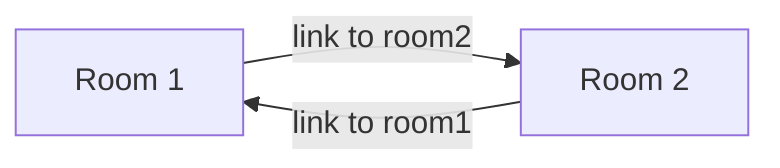
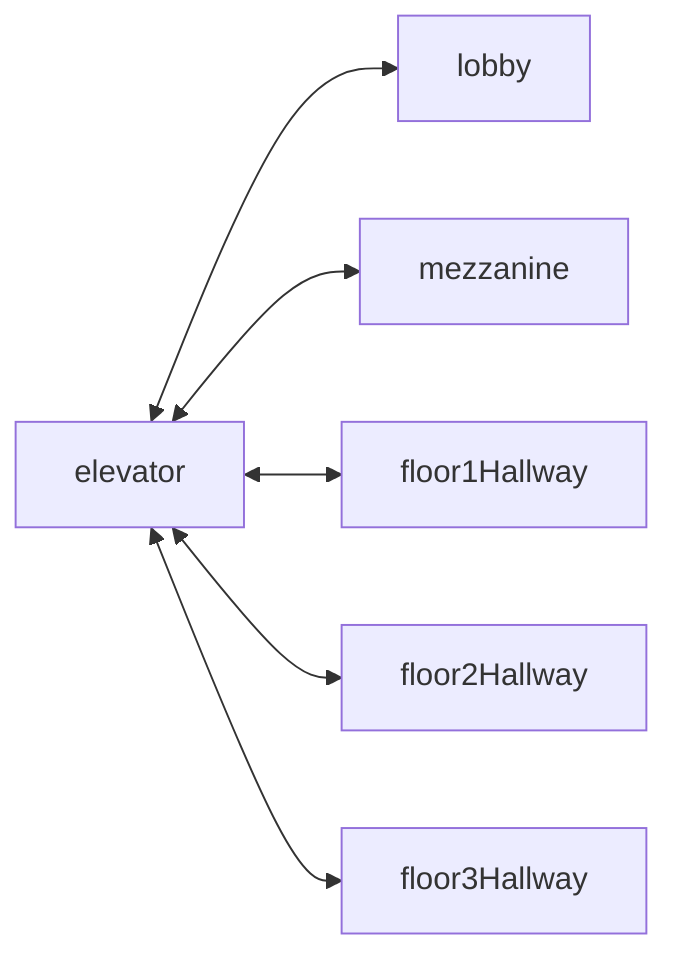

# Links

A link is a mechanism for moving both between places or other entities within a domain (local links) and to places or other entities within an external domain (external links).

A link uses the [SWID](swids.md) of an entity as its target. When activated (through a specific activation activity), the controlling daemon will move the activator (typically an [agent](agents.md)) into the [domain](domain.md) of the target (typically a [place](places.md)) at the target's location. If only a domain is given, then the domain's [landing place](places.md#landing-places) within the domain will be targeted.

If the link's target is not a place but some other form of entity, then the activiting agent will be placed at the [location of that entity within the domain](places.md#entities-as-places).

## Taking a RISK

For example, in a RISK game, there is a global RISK map domain that consists of multiple "countries".

.

Each country (a place) has an associated link to the domain for that country. When that link is activated by an agent (a particular player's general in the game) the agent is moved to the domain of that link, typically at the landing place for that domain.

Note that there are two distinct actions that can be taken, selection and link traversal. If a place can be __selected__, it identifies that place as being part of an active set of places. If it is __activated__, then the link is traversed as described above.

## Link Challenges and Keys

A link may be associated with a challenge query. This query must be satisfied before the link is activated. Think of this as a lock on the link. The agent must have and apply an associated key for that lock before the agent can traverse the link. This metaphor is so persistent that it is easy to think of the entity containing the relevant link as a portal or door of some sort, though in general it is the link that powers this door.

another analogy may be a turnstile for a subway station. In order to transition from the domain of the lobby to the domain of the station itself, you need to have a token or card. Without that token, you cannot make that transition - the turnstile won't turn.

To carry forward with that metaphor, when boarding the train at the station, an agent has to wait until the train door opens before boarding. This is an example of a temporal link - it can only be traversed if a specific condition is met (the train is in the station and is at a complete stop, and is only open for a specific interval).

Note that the hosting entity of the link can query the state of that link, and present a representation of that link's status to the corresponding agent. This is different from the way that HTTP links work.

## One Way and Bidirectional links

There are no true bidirectional links within the spatial web. Instead, all links are unidirectional (one way), but there may be analogous entities (portals) for each link that provide the corresponding link back to the original place or entity.



### Neighborhoods

The __neighborhood__ of a place is the set of all places that can be reached via links from that place. Note that they do not need to be contiguous (or even in the same domain), but they do have to be reachable via links. For instance, an elevator can be thought of as a place that connects multiple rooms, each on different floors.



Here, the lobby, mezzanine, each floor's hallways are all part of the neighborhood for the elevator.

The specific mechanism for choosing from a set of links is dependent upon the affordances offered by the reference place (or any entity located at that reference place). To facilitate this, each link has an optional order property that is used to indicate the order in which that link is presented.

```
Place:Elevator a Class:Place ;
    Place:hasLink [
        Link:hasPlace Place:Lobby ;
        Link:order 1 ;
    ],
    Place:hasLink [
        Link:hasPlace Place:Mezzanine ;
        Link:order 2 ;
    ],
    Place:hasLink [
        Link:hasPlace Place:Floor1Hallway ;
        Link:order 3 ;
    ],
    Place:hasLink [
        Link:hasPlace Place:Floor2Hallway ;
        Link:order 4 ;
    ],
    Place:hasLink [
        Link:hasPlace Place:Floor3Hallway ;
        Link:order 5 ;
    ].
```

Again, it is worth emphasizing here that this is a topologically, rather than physical, view of a particular space. Each of these places may be in their own separate closed domains, or they can be part of the same domain, but the effect is the same - it causes the agent to move through the topological graph of the places within that domain.

## Links as Movement

This topological perspect presents some challenges that help to differentiate a Spatial Web domain from a web page document. The first is that there is no intrinsic "direction" within the Spatial Web, as compared to a document, which has a specific "reading order". To go from one place to another, your agents has to traverse a link.

