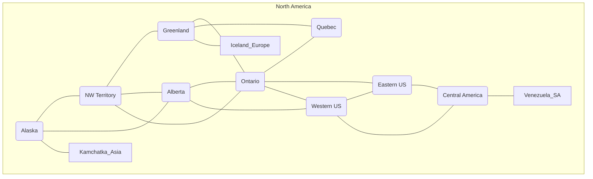
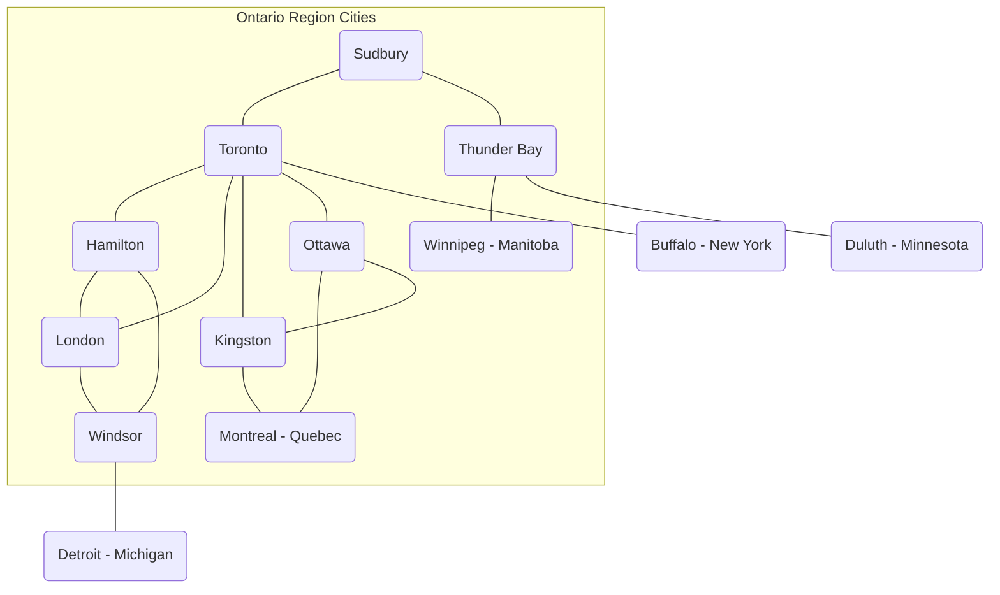

## Places

In the Spatial Web, places, not surprisingly have the position of prominance. It is defined as follows:

> A __place__ within a domain is a *__unique__*, *__addressable__* state from the set of all possible states (a *__hyperspace__*) for that domain.

The definition of a place may sound rather formal and non-intuitive, but it comes about because of the mandate concerning the role of the spatial web as a way of describing both physical and conceptual spaces.

> A place is __unique__ within a given domain if there are no other domains which have the same hyperspace configuration.

> A place is __addressable__ within a given domain if there is a specific set of keys or identifiers that collectively are also unique within that domain.

> A __hyperspace__ consists of the set of all valid places within a domain.

To make this definition clearer, consider a domain that represents a game (an instance) of _chess_. There are 66 potential _places_ where a given piece can be located - the 64 squares that make up an 8x8 chessboard, and two cache areas, one for each player, where pieces that are removed are located.

.

This [board nomenclature](https://en.wikipedia.org/wiki/Algebraic_notation_%28chess%29) is considered canonical by [FIDE, the International Chess Federation](https://en.wikipedia.org/wiki/FIDE).

Each of these places has a distinct identifier that makes up its address, and, within the scope of a particular game of chess, is considered unique. Note that the places here are not globally unique - the same position may be used across multiple games across multiple servers - but within the context of its domain, it IS unique.

We can also make up notations for each of the two caches - White Cache (WC) and Black Cache (BC) for pieces that are outside the formal scope of the board but nonetheless represent the location of a specific piece (agent). If I move the White Queen (WQ) to e4, then that agent is now located in the place 4 units up from the White queen's side of the board and five units (e) from the left edge of the board.

It is worth noting that the hyperspace here is ONLY these particular squares (or caches). You cannot go to position j17, because such a position, while plausable, does not exist within the set of all permissible places in the hyperspace.

It is also worth noting that movement from place to place within a domain does not have to follow contiguity rules. The knight in particular is very constrained in where it can go (if the knight is on e4, than it can go to d6, f6, c3, c5, g3, g5, d2 or f2, but it cannot go to d4 or f4, which are contiguous to it ), but can also move over other pieces so long as the target place is not occupied by a piece of their own color. 

This is worth reiterating - a spatial web domain is not a perfect reproduction of the real world. The knight cannot move within its square (place) in this particular domain (though a representation could move within that square, it's not something that is considered in the model).

To extend this, you can consider a hexagonal tiling of a space, as may be considered by a table top war game. The addressing in this space is more complex, because each hexagon has a particular index (address) that can be derived from some particular algorithm. The [H3 System](https://h3geo.org) system used by Uber is an illustration of such a tiling system on a sphere. 

A place can also be defined in terms of an array of such tiling indices. These can in turn be hashed in some fashion to am irregular polygon. For instance, in the game of Risk, you can create such polygon that describe each of the "countries" in the game. Note that what is important in Risk is the movement from country (say Kamchatka) to country (Alaska).

In this particular map, the specific boundaries or definitions as geometries are less important than the underlying topology of the map (shown here specifically for North America)

This notion of identifying the places within a domain is useful in a number of ways because it forces thinking in terms of topology, rather than geography. There are ways of specifying the extents of particular place entities from a rendering standpoint (typically as sheets of polygons) but in most domains, dealing with the conceptual representation of a place is often far more important than dealing with a precise geographical distribution.

In a topological view, places are connected via internal links (roughly analogous to the hypertext anchors or __&lt;a href="#foo"&gt;__ tags) to local links __&lt;a name="foo"&gt;__. These represent permissible states that a given agent can move to from a given place, absent any other constraining information. For instance, from Ontario, one can go to the Eastern or Western United States, Greenland, Quebec or Alberta, but you cannot go to Central America or Iceland directly without passing through an intervening country.

Note that such a topological view also illustrates why places are entities. In this mode, a place is an entity that has some form of interaction. A place can be a hyperlink to another domain. For instance, one can imaging a scaled up version of Risk where different regions within the Ontario "country" have their own version of Risk. The game may be a subgame (a subdomain) of the current game, but the places involved are different. 

This is a critical distinction between place and domain. The domain contains all of the potential place objects within a graph, but each place object may include a link to a domain that shows a deeper level of resolution. This is a pattern that occurs all the time, and is again illustrative of one of the central adages of the Spatial Web:

> The map is not the territory. -- Alfred Korzybski

> .. but it would like to be. -- Kurt Cagle

This topological equivalency comes into play whenever there is a need to talk about routes, legs, river segments or similar things. It is intuitive to talk about a graph in which you have airports connected by routes, but the same graph can be inverted to talk about routes connected by airports. For instance, you can talk about the Seattle-San Francisco air route (which we can designate as SEA-SFO) and the San Francisco - Los Angeles route (SFO-LAX). SFO is a connection (a link) for the SEA-SFO and SFO-LAX routes.

In this respect, routes and airports are both places - they represent specific states in a hyperspace, and as a consequence, their characteristics can be identified by the relevant properties for their specializization. An entity that is on a route domain, for instance, can talk about a location that's addressable as a distance indicator or time or percentage completed within the context, with a plane on that route able to determine its address relative to the path. Addresses do not need to be discrete, though it is frequently useful to do so especially when dealing with an observation based system.

In the same vein, one can talk about places in street address notation. I have a house in Seattle, that house has a particular street address that can be decomposed into a set of related places because of composition, but the address space here is finite (if fairly large). Again, if the domain is a neighborhood, then the address space of the house places represents a typically small hyperspace, the set of all house places within the domain

We tend to nest domain for organizational purposes (and a domain is as much an organizational structure as it is a physical space). For instance, is I have a domain of a city that is broken down into separate neighborhoods, the domain likely tells us nothing about the individual houses in those neighborhoods. You have to drill into the domain of a given neighborhood to get that level of information, with the neighborhood places in the city map then acting as hyperlinks to the respective subdomains.

_Note that this model is somewhat different from other specific geospatial reference systems, in a few key ways. First is the fact that the address state space may have different reference coordinate equivalencies (H3, WGS-84-reference spheroid, relative coordinates and so forth), but these coordinates are only significant if the topological connections are insufficent. 

On a Risk game board, for instance, the hyperspace may be defined relative to a unit square, with each country then being given an position relative to the representation of that country's extent on the board. This may affect the user interface, but from the game's perspective, the position of the corresponding overlays is material only in that it correlates with the topological representations not the geometric one.

This approach requires a certain degree of pre-planning. One reason that games are used as a metaphor is that they often allow for a significant reduction in the number of dimensions necessarily to capture a model. They also make goal achievement more feasible, because the agent or thing in the system can identify a goal and work with the information inherent in the topology rather than trying to intrinsically capture the specifics of how to achieve these goals.

One additional note - topologies also work in higher dimensions and non-geospatial contexts. If you have an assembly line, for instance, the actual position of an object becomes secondary to where it is in terms of station and process. This is a key point, because once you move into a topological description of place, you can connect places via workflows (or even talk about conceptual stations that represent a place where you gain more information or perform specific actions), without having to deal with physical proximity as well.

For instance, a physical description of the body can be rendered in one of three ways: the physical, using a tranverse plane coordinate system, can be helpful for developing models, but because bodies can be wildly different from individual to individual, most doctors make use of a taxonomic approach for describing the various systems - skeletal, musculature, pulminary, vascular, etc, then using relational maps and juncture points to indicate the specific connections. This anatomical hyperspace can identify not only location but also body system, and can be tied into diagnostics and drug pathway interaction graphs. Similarly, voxel type systems can be used to identify (with CRT partitioning) specific entities as aggregates of voxels, just as you would use hex tiling to do the same thing in two dimensions.

This has one other consequence. One of the central challenges in building a domain is identifying boundaries. Fully contained boundaries can often be modeled as distinct domains, but even there, the shape of a given space is best identified by providing either a list of relevant tokens or a perimeter that can be used to identify containment.

## Landing Places

A landing place is a place within a domain that is used to indicate where a given agent is placed (lands) when entering a domain without an explicit link to a place. This can be thought of as the "home" of the domain, and is indicated as a property of the domain. This corresponds roughly with the #top of an HTML page when it is rendered. Cf [Domains](domains.md) for more details.

## Entities As Places

Typically links will take you from a place to another place, but it is possible to link to other entities. Such links will take you to the location of that entity. For instance, if you wanted to join a party (an [aggregation](aggregations.md)), then you could use the SWID of that aggregation to take you to where that party is located, even if that party moves around. See [links](links.md) for more details.

## Summary

Places are a fundamental component of domains, but the two should not be confused. A domain is a context, a way of organizing information, and because this is the spatial web, a domain is frequently (but not always) associated with a place.

ONe of the most important principles of working with places is in the recognition that topological relationships will likely be more important than direct geospatial relationships. The exact mechanism to determine how best to balance these two concerns is still TBD.