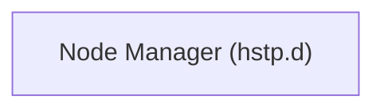

# Spatial Web Architecture

This section focuses primarily on the broad scope of the spatial web node system. 

## Design of a Spatial Web Node

A spatial web node is the abstraction of a long running application (the node daemon) that connects to other spatial web nodes to provide information about specific HSML domains or the structures that support them, communicating over the HSTP protocol. 
Like most modern web applications, a spatial web node can support both a server that maintains state of a domain graph model and provides stateful content (as HSML) and a client that can render that HSML in a form that a service or user can understand. The state of the domains is maintained within a specially design ___domain graph___ (currently built on top of a semantic RDF knowledge graph, though this likely will be hidden as an abstraction). 

