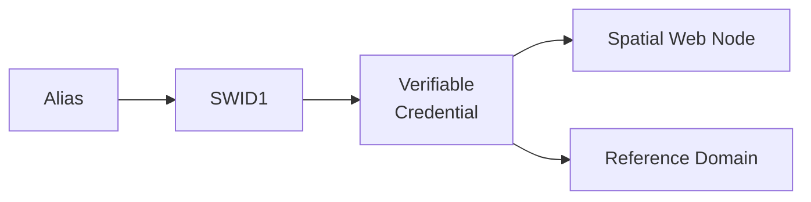

# UDG SWIDs

## UDG and SWIDs

All resources within th Universal Domain Graph have some form of a __Spatial Web Identifier__ also known as a __SWID__. The SWID serves a number of purposes:

* A SWID is a __W3C Decentralized Identifier__ (__DiD__), and is used as a mechanism to make claims (assertions) about specific facts with a form of verification backing up those claims. This is known as a __Verifiable Credential__ or (__VC__).
* The SWID identifies the resource uniquely within the spatial web network. In this regard, the SWID acts as an (indirect) IRI.
* SWIDs are also used to establish links between resources. Because the VC for the SWID can hold multiple potential values, such links typically are used to combine SW Node information with Domain and Entity resolution.
* SWIDs are also used to resolve __nodelink__ connections between different nodes in the SW Node Graph, making it possible to bind together nodes in networks. In this case, the __nodelink document__ identifies both authentication and address information for different nodes within the spatial web. 

It should be noted that such SWIDs are not directly Uniform Resource Locators (URLs) in the WWW sense. In the Spatial Web, one or more *__aliases__* can be assigned to a SWID that is intended to locate a resource, but the actual "physical" address for the resource is contained within the SWID certificate. In effect, the alias is analogous to a HTTP domain name mapping to an IPV6 address, but in this case the "domain name" alias maps to a SWID, which then maps to the corresponding IPV6.

One key difference between HTTP and HSTP is that there is no GET parameterization on SWIDs. An alias could have such a paremeterization of course, but it becomes the role of the alias resolver to convert this into a corresponding HSML message, which then gets passed as an HSTP post message.

