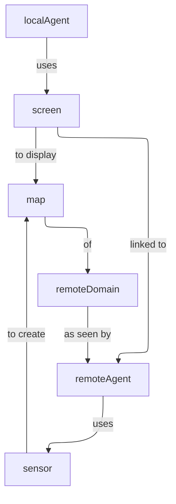
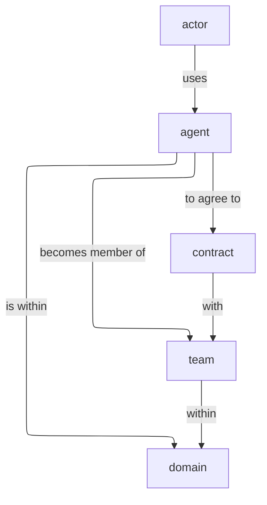
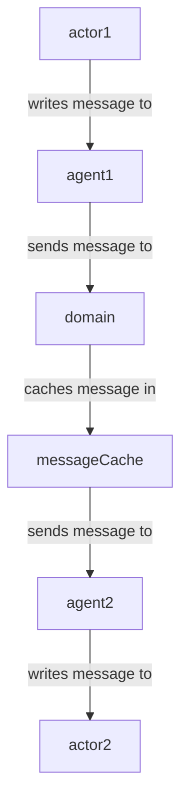

# Use Cases

## 5.3.5. Cultural Location Tourism

There are a number of different potential scenarios with the UDG for the D3.3.1 specification 5.3.5. 

### 5.3.5.1. A Virtual Tour

#### Scenario

Jane is interested in getting a virtual tour of the Smithsonian Institute's Natural History Museum (SI-NHM) through her laptop, in preparation for physically touring the museum. She goes to the SI-NHM's Tour Domain, looks at the map showing an exploded view of the museum, then clicks on the first exhibit she wants to see (the Gem Room), which then takes her to this room, where she can go from station to station (place to place). 

At each exhibit, she can see photographs, 3D renderings or movies showing the content, along with a detailed synopsis (card) of the exhibit's history. She can continue "walking" through the exhibits, walk to the next room, or can search to find exhibits on topics that she's interested in (which she can also bookmark). She can continue in this manner until she leaves. Once she's done, she can ask the spatial web server to calculate the best tour that she can take to hit the exhibits of most interest to her. As Jane moves through the museum, she can add comments (annotations) on each place that she's in. 

#### What Does This Test?

* Placement of agent within a domain
* Generation of a map
* Navigation within a domain
* Retrieval of Content Metadata
* Retrieval of Media
* Optimization of Paths
* Persistence of Domain Data
* Presentation through Devices (VR glasses or smart phones)

#### Requirements

* Each gallery within the museum can be modeled as a place.
* Each station within a gallery can also be modeled as a place within a holonic link to the associated gallery. 
* Each station in a gallery has a thing (a kiosk) which displays information about the station's topic. The information can either be stored within a <hsml:Content> node or can be referenced via an external API (same element, but with an external href). Syntax TBD.
* Each place has a link to each of its neighbors. These links are contextual (the agent's permissions may determine whether a link is visible or active, for instance).
* Motion is tracked via historical Events that get persisted when a particular place is visited or activity is undertaken.
* The Agent in this case represents the actor (Jane) within the context of the domain.
* Annotations can be bound to either the historical log or the place.
* The museum domain has a home place that would correspond to the entryway into the museum, and each gallery would have a home place that would indicate the first kiosk "seen" by the agent when entering the agent.
* The default map function on the museum domain would show each gallery, while the default map function on each gallery domain would show the kiosks within that gallery. 
* A map function can also pass a level of detail (LOD) parameter that would indication how many levels deep the map response whould discover. Thus, an LOD of 2 would show each gallery and each station in the gallery, along with all agents within the relevant domain at that level, depending upon agent access privileges.
* The data feeds for the kiosks are language sensitive. This means that the agent can set the language for output (or at least select from a list of available languages).

#### Observations

* The tour is one of the most prevalent paradigms of the spatial web. Almost every scenario involves either requesting a map, moving through that map via links, or interacting with a thing within that domain as part of that tour. 
* In this respect, you can think of one of the roles of an agent is to act as the focus of intent within a given domain. 
* This museum is a single agent instance of a SI-NHM museum domain template. It will stay active until either an end condition is met (even if that is simply terminating the instance). As such domains are kind of like virtual machines - they can be paused to retain their state, or they can be deleted when no longer needed.

### 5.3.5.2. An XR Experience

This is a similar scenario to 5.3.5.1, with the following differences:

#### Scenario

Jane goes to the museum, with her trusty VR glasses perched on her nose, synched to the museum's instance. As she enters the front entrance, the spatial web sensors correlate the position (via GPS or other positional sensor tech) to a given place, as defined by its H3 tile(s). If she is within the relevant tile, the spatial web glasses indicate that there is additional relevant metadata in the place, which can be activated to show the relevant media (videos, perhaps).

Jane summons up a map to see what is available, and starts to move, and as she leaves a given region and moves into another, the old billboard goes away to be replaced by a new map or billboard icon (possibly both) that can then be expanded.

At some point, she gets hungry, and wants to know how to get to the cafeteria. She asks for the cafeteria and either an arrow will pop up in front of her indicating the direction to follow or a map will appear with a path to that area. 

As she eats, Jane decides that she wants to go from a visual to a light visual + audio display. From then on, instead of billboards, a running commentary comes through her earbuds, with directions, recommendations, and warnings being spoken rather than displayed as imagery or text video.

At the end of her tour, she can ask for an itinerary and transcription, which reproduces critical information that can then be transmitted as compressed HSML and saved for later review.

#### What Does This Test?

* Everything in 5.3.5.1
* Geopositioning with external environment synching.
* Search
* Modalities of perception
* Path negotiation and optimization
* History and Transcription

#### Requirements

* Positioning Sensors
* Search Capabilities
* Modality Control
* History of Events

#### Observations
* Sensors within the client device can provide mapping to a spatial position, which can then be transformed into a tile position, correlating with a given place within the model. Note that if somehow the actor ends up outside of defined tiles, then an algorithm can be used to determine the closest place within the domain, which can be correlated to suggest directions. 
* Search is a query against places, things and agents respectively that will suggest candidates that most closely match the query parameters. This will generally be displayed as a list, and can be filtered by type. Search is sensitive to agent permissions.
* Modality may be a function of the client or the node, but will typically work by transforming a map in RDF into some other form (an image, a diagram, audio, a movie, 3d environment, etc.) that can be consequently rendered by the client. The exact mechanism for performing this is TBD. 
* As an agent moves through a domain, that agent creates a history correlated to the agent and the domain that can be persisted, then transformed into various forms, such as a transcript or summary. The exact mechanism for creating a history of events is still TBD. 
* Note here the symmetry between actor (Jane) and her agent (Jane_Agent). Jane moves through the physical world, with sensors indicating a geospatial position. Jane_Agent moves through an abstract conceptual world from Place to Place, correlating with the physical to a certain degree. In effect, Jane_Agent is the digital twin of Jane within the domain of the museum.
* The terms ___billboard___, ___screen___, and ___kiosk___ are used to describe Things in the virtual world. A __billboard__ can be thought of as a read-only interface or display, and is usually fully visible when an agent moves within the Place where a billboard is resident. It can have any representation (it is not limited to being a billboard in the physical sense) but generally provides external information in various formats that the user has no immediate control over.
* A __screen__ is a ___billboard___ that specifically displays a dynamic ___map___ of another domain, where a __map__ is a representation (an image, 3d rendering, video, text description, RDF, etc.) of a domain. It could be visualized as a screen showing the projection taken by a camera of another area, a glass plane showing what's in the next gallery,an aural representation where the voices from somewhere else can be heard as if through a mic, a structured HSML representation of the domain, and so forth. The ___map___ is the representation of a domain, the ___screen___ is the presentation (or medium) of that representation in the current domain of the agent.
* Note also that a ___map___ is in effect the view as seen by a separate agent within a remote domain. The remote agent here is acting in the role of a camera. A __kiosk__ is a Thing that combines a ___screen___ with a control mechanism for that remote agent. For instance, an agent (a drone operator, for instance), uses another agent (the drone) in a different domain to "see" that remote domain from the perspective of the drone. The drone operator agent interacts with the remote drone agent via a virtual ___kiosk___.
* These agent chains are very common in most video games, particularly when dealing with IoT devices (especially cameras). A camera is a specialized form of ___sensor___, a device that creates a representation (___map___) from the perspective of a given agent or thing. Screens are ___linked___ to agents, and a screen can consequently target different agents to see different perspectives of the domain.

<caption><b>Maps and Screens</b></caption>

### 5.3.5.3. Multi-Agent XR

This builds on 5.3.5.2, with the following differences:

#### Scenario

Jane joins a tour group of other actors (with no distinction about whether those actors are human or AI based). They are led by a spatial web mediated tour guide, and each agent can ask questions of other agents or the tour guide.  

The tour guide will periodically ask questions of the various tour members. If they answer the question correctly, they get a special token which they can accumulate. At the end of the tour, each agent can exchange tokens as discounts on the price of items in the gift shop.

This scenario is like 5.3.5.1 in that it is mediated over the spatial web client, rather than in person, but could be supported IRL as well.

#### What Does This Test?
* Registering Agents and forming Teams
* Direct Communication between agents
* Granting or Exchanging Certs
* Agent/Actor Interactions
* E-Commerce Fundamentals

#### Observations

* When a domain is created from a domain template, the domain goes through a provisioning phase.In this phase, one or more autonomous agents wait until a minimum condition is met (here, both a minimum number of people and a set period of time). This set of agents becomes known as a __Team__. Teams can be thought of as neighborhoods of agents. A given agent may also be part of more than one team.
* From a design standpoint, it is often preferable to talk about a team with only one member, also known as a singleton team.  For instance, in Chess, you effectively have two singleton teams - a white piece team and a black piece team.
* This notion of teams is an important one, because team members often have a much higher need to communicate with one another, and benefit far more from that interaction. Moreover, teams have identities (and histories) that individual agents don't, and frequently have needs for permissions (credentials) that two random people don't. 
* In this use case, the tour group is a team. Each team member registers with the team (here, they would pay the price for the guided tour), and they share in a communication channel that is consequently privileged. The exact nature of that chennel (point-to-point, broadcast, narrowcast, etc.) would be spelled out in the ___contract___ that the actors agree to through their agent proxies when they register with the team. This also suggests that __registration__ is the process of an actor (through the agent) accepting a ___contract___ issued by the domain that encapsulates these ___policies___.
* Please note that registration is a domain scope activity. When the registration is complete, the ___agent___ then belongs to a ___team___ within the domain.

* Channel communication: A __communication channnel__ is a ___channel___ specifically for text communication between ___agents___ and/or ___teams___. It passes an HSML message (structure TBD) from the sender to the recipient using the following workflow:

* The __MessageCache__ is a stack within the UDG.d for passing messages between entities. It works at the domain level rather than direct point-to-point primarily because messages will still need to be logged as part of the history stream and because any form of broadcast ultimately will need to be transmitted to some or all of the participants in a domain, which can best be done through a centralization mechanism.
* There is a question concerning whether internal communication and messaging channels are part of the external hstp __channels__ architecture or are different. Certainly, _actor1_ and _actor2_ communication with their respective agents are handled via the former. This is one of those areas that still requires a certain amount of discussion.
* __E-Commerce, Contracts, and Tokens__. The assumption being made in the architecture is that an ___e-commerce layer___ will likely be a later module that lays on top of the UDG, and more than likely will be mediated via a services layer with external financial networks, in much the same way that e-commerce systems in the modern web are generally not considered a core part of HTML/HTTP. The one caveat on this is that, because of the use of SWIDs to manage credentialling, verification, validation, and authentication, the ecommerce architecture will likely utilize DID-based encryption vs. the HTTPS secure architecture used for the web.
* One additional caveat is that in general, assets (specializations of THINGs) will be represented as encrypted key entities that can consequently be transferred to the wallet of the client controlling the respective agent of a given actor. For instance, in the gift shop example given in this use case, Jane can be awarded a magic shell (a ___token___) from the tour guide for answering a question correctly. The exact representation of the token will obvious vary from domain to domain (as will it's value), but it clearly represents an asset that can be assessed within some e-commerce system. 
A __token__ in this case can be thought of as a specific store of value within the spatial web. The ___actor___ authorizes the ___agent___ to spend tokens within the ___domain___ in order to fulfill the terms of a ___contract___, and correspondingly retrieves tokens when the conditions for fulfilling a clause of the contract have happened. _It is still TBD whether or not tokens issues within one domain are fungible within other domains._

### Design Considerations on 5.3.5

* The model presented here within the UDG looks at the environment of a Spatial Web Node as being a collection of applications built around domains, supported by secondary components, with this particular application being an example of what the author would consider an ___Exploration___ pattern. 
* __Exploration Pattern.__ This pattern works on the assumption that one or more agents, acting as proxies for various external actors, are navigating a space (geophysical, conceptual, organizational, etc.), retrieving information, interacting with other agents and things within the system, and gaining respective keys (tokens) that can be used both for "unlocking" specific places within the system and for exchanging as stores of value inside and outside the system.
* __Maps and Properties.__ What is most significant here is that the spatial web uses a knowledge graph as its store (and for now is assumed to query and update through a KG layer) but that it's not really a graph in the traditional sense. When you want to ___query___ the property of a given thing or agent in the system, what you are doing is retrieving a map of the thing within one or more domains, expressed in RDF (as JSON-LD, most likely), that will retrieve a representation of the object containing just _that_ property, more than likely as a time-series unless you specify a temporal constraint. For instance, you can get a map of the museum domain showing each of the exhibits, or only those exhibits focused on animals, or the exhibits within a gallery, and so forth.
* __Maps as Data Structures.__ Maps are data structures first - they can be rendered into other forms, but every map is at its core a query against the UDG graph to retrieve representations of entities within the context of a given domain. It should also be noted that a map can be tabularized (this is what the SELECT statement in both SQL and SPARQL do) to provide a slice of this information in tabular form, but even so, the underlying query will be retrieving the subgraph containing relevant entities before applying this transformation to a table. 
* __ 
